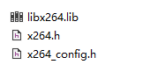
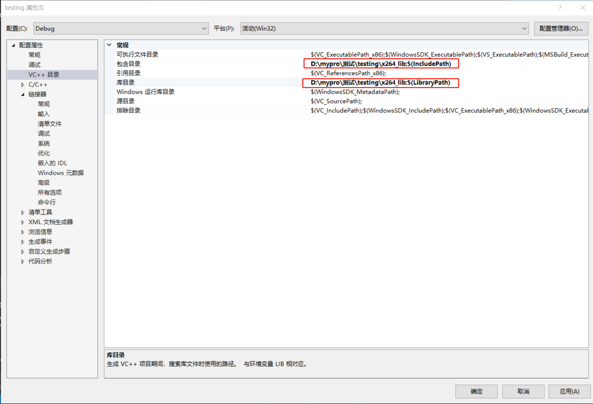
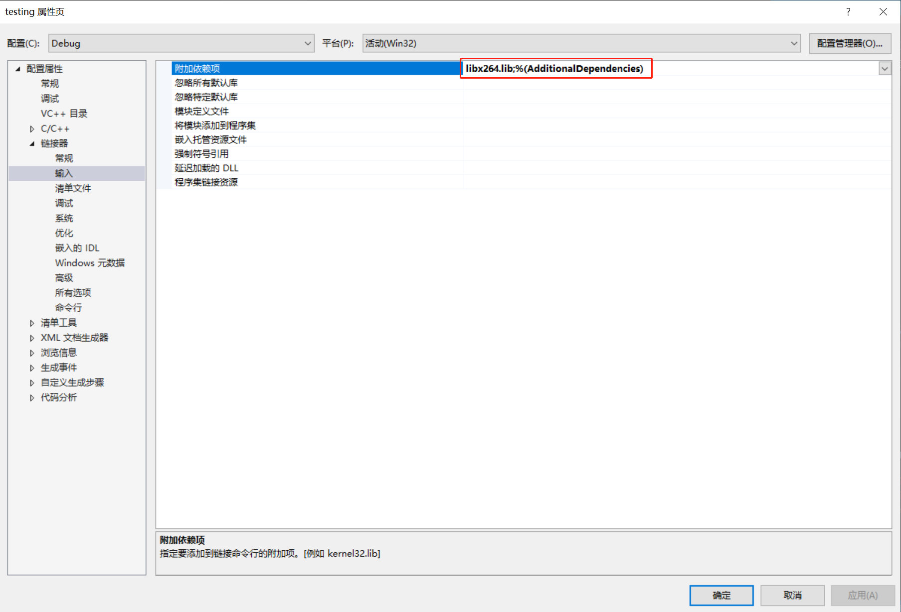

## X264使用

x264的使用比较简单，这里以Windows为例

需要依赖x264三个文件，两个头文件x264.h、x264_config.h和一个库文件libx264.lib




包含两个头文件和静态库，为了方便我将3个文件放在同一个文件夹下面






**编写代码**


```c++
#include <iostream>
#include "x264.h"
using namespace std;

int main() {
    FILE* fp_src = fopen("D:/素材集/视频/640x360.yuv", "rb");
    FILE* fp_dst = fopen("D:/素材集/视频/640x360.h264", "wb");

    //Check
    if (fp_src == nullptr || fp_dst == nullptr) {
        printf("Error open files.\n");
        return -1;
    }


    int csp = X264_CSP_I420;
    int width = 640;
    int height = 360;
    int fps = 15;


    x264_t* pHandle = nullptr;
    x264_picture_t pPic_in;
    x264_picture_t pPic_out;
    x264_param_t pParam;
    x264_picture_init(&pPic_out);


    x264_param_default(&pParam); // 初始化pParam
    x264_param_default_preset(&pParam, "fast", "zerolatency"); // 设置preset
    x264_param_apply_profile(&pParam, "high"); // 设置profile

    pParam.b_annexb = 1;
    pParam.i_threads = 1;     // 单线程编码
    pParam.i_csp = X264_CSP_I420; // 输入的YUV格式是I420
    pParam.i_width = width;  
    pParam.i_height = height;
    pParam.i_fps_num = fps;
    pParam.i_fps_den = 1;
    pParam.i_keyint_max = 5 * fps;  // 最大关键帧间隔
    pParam.i_keyint_min = fps;
    pParam.i_log_level = X264_LOG_INFO; // 日志等级
    pParam.rc.i_rc_method = X264_RC_CRF; // 码控方式
    pParam.rc.f_rf_constant = 24;  // RF值

    x264_picture_alloc(&pPic_in, csp, pParam.i_width, pParam.i_height);

    // 打开编码器
    pHandle = x264_encoder_open(&pParam);

    int y_size = width * height;
    int pts= 0;
    //Loop to Encode
    while (!feof(fp_src)) {

        printf("Put a frame \n");
        memset(&pPic_out, 0, sizeof(pPic_out));

        // 读取数据到pPic_in中
        fread(pPic_in.img.plane[0], y_size, 1, fp_src);         //Y
        fread(pPic_in.img.plane[1], y_size / 4, 1, fp_src);     //U
        fread(pPic_in.img.plane[2], y_size / 4, 1, fp_src);     //V

        pPic_in.i_pts = pts++;

        int iNal = 0;
        x264_nal_t* pNals = nullptr;

        int ret = x264_encoder_encode(pHandle, &pNals, &iNal, &pPic_in, &pPic_out);
        if (ret < 0) {
            return -1;
        }

        if (ret > 0) {
            int frame_size = 0;
            for (int j = 0; j < iNal; ++j) {
                frame_size += pNals[j].i_payload;
                fwrite(pNals[j].p_payload, 1, pNals[j].i_payload, fp_dst);
                fflush(fp_dst);
            }
            printf("Get a frame, size: %d \n",  frame_size);
        }
    }

    x264_encoder_close(pHandle);
    pHandle = nullptr;

    fclose(fp_src);
    fclose(fp_dst);

    return 0;
}

```

