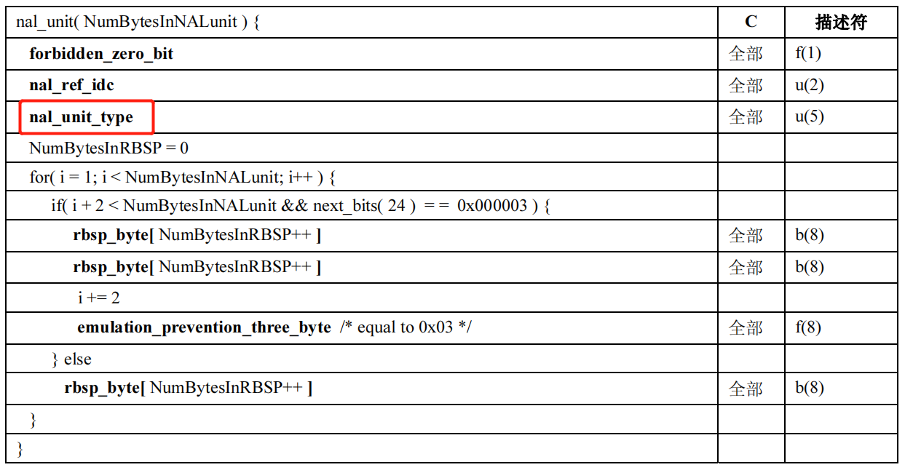
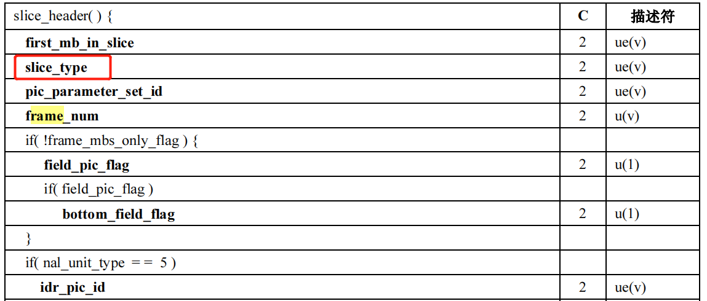
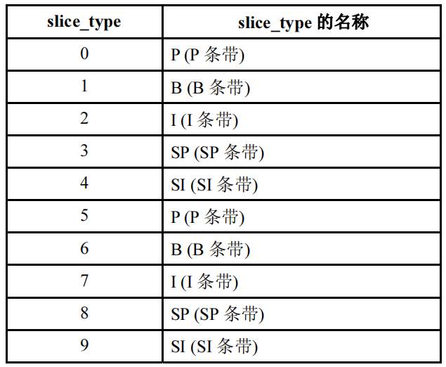

## 帧类型

大体上帧分为以下几种

- **IDR帧**：关键帧，不依赖其他帧，**解码器的首帧一定得是IDR帧**，解码器收到IDR帧后会清空前向、后向参考帧队列，IDR后续的帧不能参考IDR之前的帧，属于Close GOP
- **I帧**：关键帧，不依赖其他帧。I帧后面的帧可以参考I帧之前的帧，属于Open GOP
- **P帧**：需要前向依赖
- **B帧**：需要前后向依赖

**如何区分帧类型呢？**

可以根据H264的中**NaluType**和**SliceType**两个字段进行判断






可以根据nal_unit_type的类型来区分IDR帧和非IDR，**IDR的nal_unit_type为5，非IDR帧(I/P/B帧)的nal_unit_type为1**

需要通过Slice_type进一步区分I/P/B帧，下图是slice_type对应的条带类型(**这里暂不区分条带和帧，就简单认为条带就是帧**)




### 宏块类型

根据编码类型，划分方式等宏块(子宏块)可以大致分为以下几种类型：

- I类型宏块：I_16x16、 I_8x8、 I_4x4、I_PCM
- P类型宏块：p16x16、p16x8、p8x16、p8x8、p8x4、p4x8、p4x4、pskip
- B类型宏块：B16x16、B16x8、B8x16、B8x8、B8x4、B4x8、B4x4、BSkip、BDirect

**对于IDR/I帧只能包含I宏块，P帧可以同时包含I宏块和P宏块**


## 帧类型决策 & 场景切换检测

顾名思义，帧类型决策就是决策当前帧的类型，可以是IDR、I、P、B的其中一种。

而在x264里面有**场景切换检测**的功能，对于前后两帧发生场景切换时，将后一帧置成IDR/I帧

首先需要明确一点，**场景切换检测**并不是H264标准的一部分，有很多编码器没有这一功能(如Intel Media SDK)，但x264支持，场景切换检测其中一个作用是为了**节省编码时间**， 当然此功能也可以关掉详细见命令行配置参数--scenecut。 

> **怎么做到节省编码时间呢？**
>
> x264在进行宏块类型分析时会遍历计算当前宏块以I16x16 or I8x8 or I4x4 or P16x16 or P16X8 or P8x16.....等宏块类型进行编码所需要**花费的开销cost**， 选择一个cost最小的对应的宏块类型作为当前宏块的类型。由于I宏块只会遍历计算I16x16、I8x8、I4x4、I_PCM四种方式的开销，而P宏块需要同时遍历计算I类型和P类型种类更多所以时间花费往往会更大。因此前后两帧画面如果变化比较大，那么后一帧图像可以直接决策为IDR/I帧，只进行I宏块的编码节省编码时间


### 流程分析

整个“帧类型决策 & 场景切换检测”大致的函数调用栈如下：

**1、x264_lookahead_get_frames**

调用x264_slicetype_decide函数，以及更新一些状态、缓存信息


**2、x264_slicetype_decide**

如果开启了“场景切换检测”则调用x264_slicetype_analyse进行帧类型决策，初步得到当前帧的类型，之后会根据GOP Size、Open GOP、B-Ref等情况修正上述的帧类型。 *例如x264_slicetype_analyse计算得到当前帧的类型为P帧，但已经超过了最大GOP Size时，当前帧的帧类型会被修正为IDR帧......*


**3、x264_slicetype_analyse**

如果开启了“场景切换检测”功能则调用scenecut函数检测当前场景是否发生切换，同时也会根据GOP Size、open gop等情况修正帧类型


**4、scenecut**

此函数比较简单，主要就是调用scenecut_internal函数


**5、scenecut_internal**

调用slicetype_frame_cost函数预估(计算)出当前帧进行“帧内编码”和“帧间编码”所需要花费的开销(**编码代价**)，得到icost(帧内编码的代价)、pcoost(帧间编码的代价)，比较两者pcost 与 x *  icost的大小，如果pcost更大则认为当前帧编码为IDR/I帧更值得(**此时就认为发生场景切换了**)，反之如果x * icost更大的话则认为编码为P帧更值(**未发生场景切换**)。 *同时可以控制x的大小来控制发生场景切换的概率，x越大越不容易发生场景切换*


**6、slicetype_frame_cost**

顾名思义，此函数是为了计算当前帧的编码代价，但函数里面并没有计算编码代价的代码，只是调用了slicetype_slice_cost函数，将工作交交给它


**7、slicetype_slice_cost**

遍历当前帧的所有宏块，每个宏块都调用一次slicetype_mb_cost计算当前宏块的编码代价，因此真正计算编码代价的代码在slicetype_mb_cost里面进行。 所有宏块的编码代价合在一起就是当前帧的编码代价


**8、slicetype_mb_cost**

此函数是用于计算宏块的编码代价的，此过程与“帧内编码”、“帧间编码”过程类似，只是做了简化很多操作(例如没有亚像素搜索、没有进行过多的宏块划分)。同时为了进一步节省“计算编码代价”的时间开销，真正操作的宏块尺寸并不是16x16的，而是经过原图下采样得到的图像(宽高都为原来的1/2)的8x8宏块，*这样理论上的时间开销将会是原图的1/4* 。

这里可能会有个疑问：这个cost是怎么计算的，x264提供两种方式，一种是sad（将两个宏块按像素直接做差值，将所有差值累加起来就是当前的cost），另一种是satd（将得到的sad进行hadama变换后的累加值就是当前cost），具体使用哪种方式由参数i_subpel_refine的大小决定，i_subpel_refine > 1则使用satd否则用sad(此处就不展开将sad和satd的区别，详细见另一章节)


### 源码分析

**// x264_lookahead_get_frames**

```c++
void x264_lookahead_get_frames( x264_t *h )
{
    if( h->param.i_sync_lookahead )
    {   /* We have a lookahead thread, so get frames from there */
        x264_pthread_mutex_lock( &h->lookahead->ofbuf.mutex );
        while( !h->lookahead->ofbuf.i_size && h->lookahead->b_thread_active )
            x264_pthread_cond_wait( &h->lookahead->ofbuf.cv_fill, &h->lookahead->ofbuf.mutex );
        lookahead_encoder_shift( h );
        x264_pthread_mutex_unlock( &h->lookahead->ofbuf.mutex );
    }
    else
    {   /* We are not running a lookahead thread, so perform all the slicetype decide on the fly */

        if( h->frames.current[0] || !h->lookahead->next.i_size )
            return;
        // 帧类型决策主要函数x264_slicetype_decide
        x264_slicetype_decide( h );
        lookahead_update_last_nonb( h, h->lookahead->next.list[0] );
        int shift_frames = h->lookahead->next.list[0]->i_bframes + 1;
        lookahead_shift( &h->lookahead->ofbuf, &h->lookahead->next, shift_frames );

        /* For MB-tree and VBV lookahead, we have to perform propagation analysis on I-frames too. */
        if( h->lookahead->b_analyse_keyframe && IS_X264_TYPE_I( h->lookahead->last_nonb->i_type ) )
            x264_slicetype_analyse( h, shift_frames );

        lookahead_encoder_shift( h );
    }
}
```


**// x264_slicetype_decide**

```c++
void x264_slicetype_decide( x264_t *h )
{
    x264_frame_t *frames[X264_BFRAME_MAX+2];
    x264_frame_t *frm;
    int bframes;
    int brefs;

    if( !h->lookahead->next.i_size )
        return;

    int lookahead_size = h->lookahead->next.i_size;

    for( int i = 0; i < h->lookahead->next.i_size; i++ )
    {
        // 一些与时间相关变量的更新
        if( h->param.b_vfr_input )
        {
            if( lookahead_size-- > 1 )
                h->lookahead->next.list[i]->i_duration = 2 * (h->lookahead->next.list[i+1]->i_pts - h->lookahead->next.list[i]->i_pts);
            else
                h->lookahead->next.list[i]->i_duration = h->i_prev_duration;
        }
        else
            h->lookahead->next.list[i]->i_duration = delta_tfi_divisor[h->lookahead->next.list[i]->i_pic_struct];
        h->i_prev_duration = h->lookahead->next.list[i]->i_duration;
        h->lookahead->next.list[i]->f_duration = (double)h->lookahead->next.list[i]->i_duration
                                               * h->sps->vui.i_num_units_in_tick
                                               / h->sps->vui.i_time_scale;

        if( h->lookahead->next.list[i]->i_frame > h->i_disp_fields_last_frame && lookahead_size > 0 )
        {
            h->lookahead->next.list[i]->i_field_cnt = h->i_disp_fields;
            h->i_disp_fields += h->lookahead->next.list[i]->i_duration;
            h->i_disp_fields_last_frame = h->lookahead->next.list[i]->i_frame;
        }
        else if( lookahead_size == 0 )
        {
            h->lookahead->next.list[i]->i_field_cnt = h->i_disp_fields;
            h->lookahead->next.list[i]->i_duration = h->i_prev_duration;
        }
    }

    if( h->param.rc.b_stat_read )
    {
        // 读取外部文件进行分析，一般很少用
        /* Use the frame types from the first pass */
        for( int i = 0; i < h->lookahead->next.i_size; i++ )
            h->lookahead->next.list[i]->i_type =
                x264_ratecontrol_slice_type( h, h->lookahead->next.list[i]->i_frame );
    }
    else if( (h->param.i_bframe && h->param.i_bframe_adaptive)
             || h->param.i_scenecut_threshold
             || h->param.rc.b_mb_tree
             || (h->param.rc.i_vbv_buffer_size && h->param.rc.i_lookahead) )
        x264_slicetype_analyse( h, 0 );  // 如果开启场景切换检测会进入到此函数，初步决策出当前帧的帧类型

    /* 下面的代码会根据gop size、open gop、 b-ref等情况修正当前帧类型 */
    for( bframes = 0, brefs = 0;; bframes++ )
    {
        frm = h->lookahead->next.list[bframes];

        if( frm->i_forced_type != X264_TYPE_AUTO && frm->i_type != frm->i_forced_type &&
            !(frm->i_forced_type == X264_TYPE_KEYFRAME && IS_X264_TYPE_I( frm->i_type )) )
        {
            x264_log( h, X264_LOG_WARNING, "forced frame type (%d) at %d was changed to frame type (%d)\n",
                      frm->i_forced_type, frm->i_frame, frm->i_type );
        }

        if( frm->i_type == X264_TYPE_BREF && h->param.i_bframe_pyramid < X264_B_PYRAMID_NORMAL &&
            brefs == h->param.i_bframe_pyramid )
        {
            frm->i_type = X264_TYPE_B;
            x264_log( h, X264_LOG_WARNING, "B-ref at frame %d incompatible with B-pyramid %s \n",
                      frm->i_frame, x264_b_pyramid_names[h->param.i_bframe_pyramid] );
        }
        /* pyramid with multiple B-refs needs a big enough dpb that the preceding P-frame stays available.
           smaller dpb could be supported by smart enough use of mmco, but it's easier just to forbid it. */
        else if( frm->i_type == X264_TYPE_BREF && h->param.i_bframe_pyramid == X264_B_PYRAMID_NORMAL &&
            brefs && h->param.i_frame_reference <= (brefs+3) )
        {
            frm->i_type = X264_TYPE_B;
            x264_log( h, X264_LOG_WARNING, "B-ref at frame %d incompatible with B-pyramid %s and %d reference frames\n",
                      frm->i_frame, x264_b_pyramid_names[h->param.i_bframe_pyramid], h->param.i_frame_reference );
        }

        if( frm->i_type == X264_TYPE_KEYFRAME )
            frm->i_type = h->param.b_open_gop ? X264_TYPE_I : X264_TYPE_IDR;

        /* Limit GOP size */
        if( (!h->param.b_intra_refresh || frm->i_frame == 0) && frm->i_frame - h->lookahead->i_last_keyframe >= h->param.i_keyint_max )
        {
            if( frm->i_type == X264_TYPE_AUTO || frm->i_type == X264_TYPE_I )
                frm->i_type = h->param.b_open_gop && h->lookahead->i_last_keyframe >= 0 ? X264_TYPE_I : X264_TYPE_IDR;
            int warn = frm->i_type != X264_TYPE_IDR;
            if( warn && h->param.b_open_gop )
                warn &= frm->i_type != X264_TYPE_I;
            if( warn )
            {
                x264_log( h, X264_LOG_WARNING, "specified frame type (%d) at %d is not compatible with keyframe interval\n", frm->i_type, frm->i_frame );
                frm->i_type = h->param.b_open_gop && h->lookahead->i_last_keyframe >= 0 ? X264_TYPE_I : X264_TYPE_IDR;
            }
        }
        if( frm->i_type == X264_TYPE_I && frm->i_frame - h->lookahead->i_last_keyframe >= h->param.i_keyint_min )
        {
            if( h->param.b_open_gop )
            {
                h->lookahead->i_cache_last_keyframe = h->lookahead->i_last_keyframe;
                h->lookahead->i_last_keyframe = frm->i_frame; // Use display order
                if( h->param.b_bluray_compat )
                    h->lookahead->i_last_keyframe -= bframes; // Use bluray order
                frm->b_keyframe = 1;
            }
            else
                frm->i_type = X264_TYPE_IDR;
        }
        if( frm->i_type == X264_TYPE_IDR )
        {
            /* Close GOP */
            h->lookahead->i_cache_last_keyframe = h->lookahead->i_last_keyframe;
            h->lookahead->i_last_keyframe = frm->i_frame;
            frm->b_keyframe = 1;
            if( bframes > 0 )
            {
                bframes--;
                h->lookahead->next.list[bframes]->i_type = X264_TYPE_P;
            }
        }

        if( bframes == h->param.i_bframe ||
            !h->lookahead->next.list[bframes+1] )
        {
            if( IS_X264_TYPE_B( frm->i_type ) )
                x264_log( h, X264_LOG_WARNING, "specified frame type is not compatible with max B-frames\n" );
            if( frm->i_type == X264_TYPE_AUTO
                || IS_X264_TYPE_B( frm->i_type ) )
                frm->i_type = X264_TYPE_P;
        }

        if( frm->i_type == X264_TYPE_BREF )
            brefs++;

        if( frm->i_type == X264_TYPE_AUTO )
            frm->i_type = X264_TYPE_B;

        else if( !IS_X264_TYPE_B( frm->i_type ) ) break;
    }

    if( bframes )
        h->lookahead->next.list[bframes-1]->b_last_minigop_bframe = 1;
    h->lookahead->next.list[bframes]->i_bframes = bframes;

    /* insert a bref into the sequence */
    if( h->param.i_bframe_pyramid && bframes > 1 && !brefs )
    {
        h->lookahead->next.list[(bframes-1)/2]->i_type = X264_TYPE_BREF;
        brefs++;
    }

    /* calculate the frame costs ahead of time for x264_rc_analyse_slice while we still have lowres */
    if( h->param.rc.i_rc_method != X264_RC_CQP )
    {
        /* 如果当前的码率控制方式不是CQP的话(是CRF或者ABR)，会进入此条件中，调用slicetype_frame_cost
         * 计算当前帧“帧内编码”、“帧间编码”的编码代价，这些代价在后续的码率控制模块会被使用到(详细见4.码率控制章节)
         * 
         * 疑问1: 由上文我们可以知道计算编码代价在x264_slicetype_analyse函数中已经有了，这里为什么还要重复计算呢？
         * 答1: x264_slicetype_analyse函数在一定条件下(如开启“场景切换检测”等)才会被调用
         * 如果x264_slicetype_analyse没被调用编码代码会在此处调用slicetype_frame_cost进行计算
         * 如果x264_slicetype_analyse之前调用过了,那么此处在slicetype_frame_cost函数中会return，不会重复计算的
         * 
         * 疑问2: 为什么只有非CQP才进入此条件中呢？
         * 答2: 因为CQP是x264中最简单、最直接的码控方式，在码控模块中并不涉及到“图像复杂度”等操作，不需要用到编码代价等
         * (详细可见4.码率控制章节)
         */
        x264_mb_analysis_t a;
        int p0, p1, b;
        p1 = b = bframes + 1;

        lowres_context_init( h, &a );

        frames[0] = h->lookahead->last_nonb;
        memcpy( &frames[1], h->lookahead->next.list, (bframes+1) * sizeof(x264_frame_t*) );
        if( IS_X264_TYPE_I( h->lookahead->next.list[bframes]->i_type ) )
            p0 = bframes + 1;
        else // P
            p0 = 0;
        // 计算当前帧的编码代价(如果之前已经计算过了，不会重复计算)
        slicetype_frame_cost( h, &a, frames, p0, p1, b );

        if( (p0 != p1 || bframes) && h->param.rc.i_vbv_buffer_size )
        {
            /* We need the intra costs for row SATDs. */
            slicetype_frame_cost( h, &a, frames, b, b, b );

            /* We need B-frame costs for row SATDs. */
            p0 = 0;
            for( b = 1; b <= bframes; b++ )
            {
                if( frames[b]->i_type == X264_TYPE_B )
                    for( p1 = b; frames[p1]->i_type == X264_TYPE_B; )
                        p1++;
                else
                    p1 = bframes + 1;
                slicetype_frame_cost( h, &a, frames, p0, p1, b );
                if( frames[b]->i_type == X264_TYPE_BREF )
                    p0 = b;
            }
        }
    }

    /* Analyse for weighted P frames */
    if( !h->param.rc.b_stat_read && h->lookahead->next.list[bframes]->i_type == X264_TYPE_P
        && h->param.analyse.i_weighted_pred >= X264_WEIGHTP_SIMPLE )
    {
        x264_emms();
        x264_weights_analyse( h, h->lookahead->next.list[bframes], h->lookahead->last_nonb, 0 );
    }

    /* shift sequence to coded order.
       use a small temporary list to avoid shifting the entire next buffer around */
    int i_coded = h->lookahead->next.list[0]->i_frame;
    if( bframes )
    {
        int idx_list[] = { brefs+1, 1 };
        for( int i = 0; i < bframes; i++ )
        {
            int idx = idx_list[h->lookahead->next.list[i]->i_type == X264_TYPE_BREF]++;
            frames[idx] = h->lookahead->next.list[i];
            frames[idx]->i_reordered_pts = h->lookahead->next.list[idx]->i_pts;
        }
        frames[0] = h->lookahead->next.list[bframes];
        frames[0]->i_reordered_pts = h->lookahead->next.list[0]->i_pts;
        memcpy( h->lookahead->next.list, frames, (bframes+1) * sizeof(x264_frame_t*) );
    }

    for( int i = 0; i <= bframes; i++ )
    {
        h->lookahead->next.list[i]->i_coded = i_coded++;
        if( i )
        {
            calculate_durations( h, h->lookahead->next.list[i], h->lookahead->next.list[i-1], &h->i_cpb_delay, &h->i_coded_fields );
            h->lookahead->next.list[0]->f_planned_cpb_duration[i-1] = (double)h->lookahead->next.list[i]->i_cpb_duration *
                                                                      h->sps->vui.i_num_units_in_tick / h->sps->vui.i_time_scale;
        }
        else
            calculate_durations( h, h->lookahead->next.list[i], NULL, &h->i_cpb_delay, &h->i_coded_fields );
    }
}
```


**// x264_slicetype_analyse**

```c++
void x264_slicetype_analyse( x264_t *h, int intra_minigop )
{
    x264_mb_analysis_t a;
    x264_frame_t *frames[X264_LOOKAHEAD_MAX+3] = { NULL, };
    int num_frames, orig_num_frames, keyint_limit, framecnt;
    int i_max_search = X264_MIN( h->lookahead->next.i_size, X264_LOOKAHEAD_MAX );
    int b_vbv_lookahead = h->param.rc.i_vbv_buffer_size && h->param.rc.i_lookahead;
    /* For determinism we should limit the search to the number of frames lookahead has for sure
     * in h->lookahead->next.list buffer, except at the end of stream.
     * For normal calls with (intra_minigop == 0) that is h->lookahead->i_slicetype_length + 1 frames.
     * And for I-frame calls (intra_minigop != 0) we already removed intra_minigop frames from there. */
    if( h->param.b_deterministic )
        i_max_search = X264_MIN( i_max_search, h->lookahead->i_slicetype_length + 1 - intra_minigop );
    int keyframe = !!intra_minigop;

    assert( h->frames.b_have_lowres );

    if( !h->lookahead->last_nonb )
        return;
    frames[0] = h->lookahead->last_nonb; // 获取上一帧编码的帧
    for( framecnt = 0; framecnt < i_max_search; framecnt++ )
        frames[framecnt+1] = h->lookahead->next.list[framecnt];  //将当前准备进行类型决策的帧放到frames[]中
	
    // 初始化相关工作
    lowres_context_init( h, &a );

    if( !framecnt )
    {
        // 如果当前lookahead->next中没有帧则return
        if( h->param.rc.b_mb_tree )
            macroblock_tree( h, &a, frames, 0, keyframe );
        return;
    }

    /*
     * h->param.i_keyint_max表示最大的关键帧间隔，frames[0]->i_frame当前帧的i_frame，h->lookahead->u)last_keyframe上一个关键帧的i_frame
     * 因此keyint_limit可以认为强制关键帧的剩余大小
     */
    keyint_limit = h->param.i_keyint_max - frames[0]->i_frame + h->lookahead->i_last_keyframe - 1;
    // orig_num_frames当前待预测的帧的数量
    orig_num_frames = num_frames = h->param.b_intra_refresh ? framecnt : X264_MIN( framecnt, keyint_limit );

    /* This is important psy-wise: if we have a non-scenecut keyframe,
     * there will be significant visual artifacts if the frames just before
     * go down in quality due to being referenced less, despite it being
     * more RD-optimal. */
    if( (h->param.analyse.b_psy && h->param.rc.b_mb_tree) || b_vbv_lookahead )
        num_frames = framecnt;
    else if( h->param.b_open_gop && num_frames < framecnt )
        num_frames++;
    else if( num_frames == 0 )
    {
        frames[1]->i_type = X264_TYPE_I;
        return;
    }
    
    /* 如果开启了scenecut功能，调用scenecut进行场景切换检测 */
    if( IS_X264_TYPE_AUTO_OR_I( frames[1]->i_type ) &&
        h->param.i_scenecut_threshold && scenecut( h, &a, frames, 0, 1, 1, orig_num_frames, i_max_search ) )
    {
        if( frames[1]->i_type == X264_TYPE_AUTO )
            frames[1]->i_type = X264_TYPE_I;
        return;
    }

#if HAVE_OPENCL
    x264_opencl_slicetype_prep( h, frames, num_frames, a.i_lambda );
#endif

    /* Replace forced keyframes with I/IDR-frames */
    for( int j = 1; j <= num_frames; j++ )
    {
        // 根据是否开启open gop决定使用I帧还是IDR帧
        if( frames[j]->i_type == X264_TYPE_KEYFRAME )
            frames[j]->i_type = h->param.b_open_gop ? X264_TYPE_I : X264_TYPE_IDR;
    }

    /* Close GOP at IDR-frames */
    for( int j = 2; j <= num_frames; j++ )
    {
        // 如果当前帧是IDR帧，那么前面一帧如果是B帧则重新置为P帧
        if( frames[j]->i_type == X264_TYPE_IDR && IS_X264_TYPE_AUTO_OR_B( frames[j-1]->i_type ) )
            frames[j-1]->i_type = X264_TYPE_P;
    }

    int num_analysed_frames = num_frames;
    int reset_start;

    if( h->param.i_bframe )
    {
        // B帧相关的处理
        if( h->param.i_bframe_adaptive == X264_B_ADAPT_TRELLIS )
        {
            if( num_frames > 1 )
            {
                char best_paths[X264_BFRAME_MAX+1][X264_LOOKAHEAD_MAX+1] = {"","P"};
                int best_path_index = num_frames % (X264_BFRAME_MAX+1);

                /* Perform the frametype analysis. */
                for( int j = 2; j <= num_frames; j++ )
                    slicetype_path( h, &a, frames, j, best_paths );

                /* Load the results of the analysis into the frame types. */
                for( int j = 1; j < num_frames; j++ )
                {
                    if( best_paths[best_path_index][j-1] != 'B' )
                    {
                        if( IS_X264_TYPE_AUTO_OR_B( frames[j]->i_type ) )
                            frames[j]->i_type = X264_TYPE_P;
                    }
                    else
                    {
                        if( frames[j]->i_type == X264_TYPE_AUTO )
                            frames[j]->i_type = X264_TYPE_B;
                    }
                }
            }
        }
        else if( h->param.i_bframe_adaptive == X264_B_ADAPT_FAST )
        {
            int last_nonb = 0;
            int num_bframes = h->param.i_bframe;
            char path[X264_LOOKAHEAD_MAX+1];
            for( int j = 1; j < num_frames; j++ )
            {
                if( j-1 > 0 && IS_X264_TYPE_B( frames[j-1]->i_type ) )
                    num_bframes--;
                else
                {
                    last_nonb = j-1;
                    num_bframes = h->param.i_bframe;
                }
                if( !num_bframes )
                {
                    if( IS_X264_TYPE_AUTO_OR_B( frames[j]->i_type ) )
                        frames[j]->i_type = X264_TYPE_P;
                    continue;
                }

                if( frames[j]->i_type != X264_TYPE_AUTO )
                    continue;

                if( IS_X264_TYPE_B( frames[j+1]->i_type ) )
                {
                    frames[j]->i_type = X264_TYPE_P;
                    continue;
                }

                int bframes = j - last_nonb - 1;
                memset( path, 'B', bframes );
                strcpy( path+bframes, "PP" );
                uint64_t cost_p = slicetype_path_cost( h, &a, frames+last_nonb, path, COST_MAX64 );
                strcpy( path+bframes, "BP" );
                uint64_t cost_b = slicetype_path_cost( h, &a, frames+last_nonb, path, cost_p );

                if( cost_b < cost_p )
                    frames[j]->i_type = X264_TYPE_B;
                else
                    frames[j]->i_type = X264_TYPE_P;
            }
        }
        else
        {
            int num_bframes = h->param.i_bframe;
            for( int j = 1; j < num_frames; j++ )
            {
                if( !num_bframes )
                {
                    if( IS_X264_TYPE_AUTO_OR_B( frames[j]->i_type ) )
                        frames[j]->i_type = X264_TYPE_P;
                }
                else if( frames[j]->i_type == X264_TYPE_AUTO )
                {
                    if( IS_X264_TYPE_B( frames[j+1]->i_type ) )
                        frames[j]->i_type = X264_TYPE_P;
                    else
                        frames[j]->i_type = X264_TYPE_B;
                }
                if( IS_X264_TYPE_B( frames[j]->i_type ) )
                    num_bframes--;
                else
                    num_bframes = h->param.i_bframe;
            }
        }
        if( IS_X264_TYPE_AUTO_OR_B( frames[num_frames]->i_type ) )
            frames[num_frames]->i_type = X264_TYPE_P;

        int num_bframes = 0;
        while( num_bframes < num_frames && IS_X264_TYPE_B( frames[num_bframes+1]->i_type ) )
            num_bframes++;

        /* Check scenecut on the first minigop. */
        for( int j = 1; j < num_bframes+1; j++ )
        {
            if( frames[j]->i_forced_type == X264_TYPE_AUTO && IS_X264_TYPE_AUTO_OR_I( frames[j+1]->i_forced_type ) &&
                h->param.i_scenecut_threshold && scenecut( h, &a, frames, j, j+1, 0, orig_num_frames, i_max_search ) )
            {
                frames[j]->i_type = X264_TYPE_P;
                num_analysed_frames = j;
                break;
            }
        }

        reset_start = keyframe ? 1 : X264_MIN( num_bframes+2, num_analysed_frames+1 );
    }
    else
    {
        // 如果禁用B帧，需要重新设置一下帧类型
        for( int j = 1; j <= num_frames; j++ )
            if( IS_X264_TYPE_AUTO_OR_B( frames[j]->i_type ) )
                frames[j]->i_type = X264_TYPE_P;
        reset_start = !keyframe + 1;
    }

    /* Perform the actual macroblock tree analysis.
     * Don't go farther than the maximum keyframe interval; this helps in short GOPs. */
    if( h->param.rc.b_mb_tree ) // 宏块树
        macroblock_tree( h, &a, frames, X264_MIN(num_frames, h->param.i_keyint_max), keyframe );

    /* Enforce keyframe limit. */
    if( !h->param.b_intra_refresh )
    {
        int last_keyframe = h->lookahead->i_last_keyframe;
        int last_possible = 0;
        for( int j = 1; j <= num_frames; j++ )
        {
            x264_frame_t *frm = frames[j];
            int keyframe_dist = frm->i_frame - last_keyframe; // 计算当前帧与上一个关键帧的距离

            if( IS_X264_TYPE_AUTO_OR_I( frm->i_forced_type ) )
            {
                if( h->param.b_open_gop || !IS_X264_TYPE_B( frames[j-1]->i_forced_type ) )
                    last_possible = j;
            }
            if( keyframe_dist >= h->param.i_keyint_max )
            {
                // 如果距离大于等于最大关键帧间隔(i_keyint_max)当前帧强制设置为关键帧
                if( last_possible != 0 && last_possible != j )
                {
                    j = last_possible;
                    frm = frames[j];
                    keyframe_dist = frm->i_frame - last_keyframe;
                }
                last_possible = 0;
                if( frm->i_type != X264_TYPE_IDR )
                    frm->i_type = h->param.b_open_gop ? X264_TYPE_I : X264_TYPE_IDR;
            }
            if( frm->i_type == X264_TYPE_I && keyframe_dist >= h->param.i_keyint_min )
            {
                if( h->param.b_open_gop )
                {
                    last_keyframe = frm->i_frame;
                    if( h->param.b_bluray_compat )
                    {
                        // Use bluray order
                        int bframes = 0;
                        while( bframes < j-1 && IS_X264_TYPE_B( frames[j-1-bframes]->i_type ) )
                            bframes++;
                        last_keyframe -= bframes;
                    }
                }
                else if( frm->i_forced_type != X264_TYPE_I )
                    frm->i_type = X264_TYPE_IDR;
            }
            if( frm->i_type == X264_TYPE_IDR )
            {
                last_keyframe = frm->i_frame;
                if( j > 1 && IS_X264_TYPE_B( frames[j-1]->i_type ) )
                    frames[j-1]->i_type = X264_TYPE_P;
            }
        }
    }

    if( b_vbv_lookahead )
        vbv_lookahead( h, &a, frames, num_frames, keyframe );

    /* Restore frametypes for all frames that haven't actually been decided yet. */
    for( int j = reset_start; j <= num_frames; j++ )
        frames[j]->i_type = frames[j]->i_forced_type;

#if HAVE_OPENCL
    x264_opencl_slicetype_end( h );
#endif
}
```


**// scenecut**

```c++
// 调用scenecut_internal函数， 详细见scenecut_internal函数
static int scenecut( x264_t *h, x264_mb_analysis_t *a, x264_frame_t **frames, int p0, int p1, int real_scenecut, int num_frames, int i_max_search )
{
    /* Only do analysis during a normal scenecut check. */
    if( real_scenecut && h->param.i_bframe )
    {
        int origmaxp1 = p0 + 1;
        /* Look ahead to avoid coding short flashes as scenecuts. */
        if( h->param.i_bframe_adaptive == X264_B_ADAPT_TRELLIS )
            /* Don't analyse any more frames than the trellis would have covered. */
            origmaxp1 += h->param.i_bframe;
        else
            origmaxp1++;
        int maxp1 = X264_MIN( origmaxp1, num_frames );

        /* Where A and B are scenes: AAAAAABBBAAAAAA
         * If BBB is shorter than (maxp1-p0), it is detected as a flash
         * and not considered a scenecut. */
        for( int curp1 = p1; curp1 <= maxp1; curp1++ )
            if( !scenecut_internal( h, a, frames, p0, curp1, 0 ) )
                /* Any frame in between p0 and cur_p1 cannot be a real scenecut. */
                for( int i = curp1; i > p0; i-- )
                    frames[i]->b_scenecut = 0;

        /* Where A-F are scenes: AAAAABBCCDDEEFFFFFF
         * If each of BB ... EE are shorter than (maxp1-p0), they are
         * detected as flashes and not considered scenecuts.
         * Instead, the first F frame becomes a scenecut.
         * If the video ends before F, no frame becomes a scenecut. */
        for( int curp0 = p0; curp0 <= maxp1; curp0++ )
            if( origmaxp1 > i_max_search || (curp0 < maxp1 && scenecut_internal( h, a, frames, curp0, maxp1, 0 )) )
                /* If cur_p0 is the p0 of a scenecut, it cannot be the p1 of a scenecut. */
                    frames[curp0]->b_scenecut = 0;
    }

    /* Ignore frames that are part of a flash, i.e. cannot be real scenecuts. */
    if( !frames[p1]->b_scenecut )
        return 0;
    return scenecut_internal( h, a, frames, p0, p1, real_scenecut );
}
```


**// scenecut_internal**

```c++
/*
 *  此函数为场景切换检测的函数，实际上此功能已经包含的帧“代价预估”的功能，因为场景检测需要依托于预估出来的编码代价
 */
static int scenecut_internal( x264_t *h, x264_mb_analysis_t *a, x264_frame_t **frames, int p0, int p1, int real_scenecut )
{
    x264_frame_t *frame = frames[p1];  // 获取当前待检测的帧

    /* Don't do scenecuts on the right view of a frame-packed video. */
    if( real_scenecut && h->param.i_frame_packing == 5 && (frame->i_frame&1) )
        return 0;
    
	// 粗略计算当前帧进行“帧内编码” or “帧间编码”所需要的开销(代价)
    slicetype_frame_cost( h, a, frames, p0, p1, p1 );

    int icost = frame->i_cost_est[0][0];  // 当前帧进行帧内编码时需要的开销(代价)
    int pcost = frame->i_cost_est[p1-p0][0]; // 进行帧间编码时需要的开销（代价）
    float f_bias;
    int i_gop_size = frame->i_frame - h->lookahead->i_last_keyframe;  // 当前帧离上一个关键帧的距离
    
    // h->param.i_scenecut_threshold为场景切换使用到的参数，此参数越大越容易检测到场景切换(即越容易将当前帧置为IDR/I帧)
    float f_thresh_max = h->param.i_scenecut_threshold / 100.0;  
    /* magic numbers pulled out of thin air */
    float f_thresh_min = f_thresh_max * 0.25;
    int res;

    if( h->param.i_keyint_min == h->param.i_keyint_max )
        f_thresh_min = f_thresh_max;
    /*
     *  下面部分的if elseif主要为了控制不要让关键帧出现太频繁，通过控制f_bias的大小来实现，f_bias越小越不容易置为IDR/I帧 
     */
    if( i_gop_size <= h->param.i_keyint_min / 4 || h->param.b_intra_refresh )
        f_bias = f_thresh_min / 4;
    else if( i_gop_size <= h->param.i_keyint_min )
        f_bias = f_thresh_min * i_gop_size / h->param.i_keyint_min;
    else
    {
        f_bias = f_thresh_min
                 + ( f_thresh_max - f_thresh_min )
                 * ( i_gop_size - h->param.i_keyint_min )
                 / ( h->param.i_keyint_max - h->param.i_keyint_min );
    }

    /*
     *  对比pcost，icost的大小，如果res为true，则发生场景切换(认为当前帧编码为IDR/I帧更实惠点)，反之未发生场景切换
     */
    res = pcost >= (1.0 - f_bias) * icost; 
    if( res && real_scenecut )
    {
        int imb = frame->i_intra_mbs[p1-p0];
        int pmb = NUM_MBS - imb;
        x264_log( h, X264_LOG_DEBUG, "scene cut at %d Icost:%d Pcost:%d ratio:%.4f bias:%.4f gop:%d (imb:%d pmb:%d)\n",
                  frame->i_frame,
                  icost, pcost, 1. - (double)pcost / icost,
                  f_bias, i_gop_size, imb, pmb );
    }
    return res;
}

```


**// slicetype_frame_cost**

```c++
/*
 * 此函数会调用slicetype_slice_cost，计算当前帧的编码代价 
 */
static int slicetype_frame_cost( x264_t *h, x264_mb_analysis_t *a,
                                 x264_frame_t **frames, int p0, int p1, int b )
{
    int i_score = 0;
    int do_search[2];
    const x264_weight_t *w = x264_weight_none;
    x264_frame_t *fenc = frames[b];  // 获取当前待检测的帧

    /* Check whether we already evaluated this frame
     * If we have tried this frame as P, then we have also tried
     * the preceding frames as B. (is this still true?) */
    /* Also check that we already calculated the row SATDs for the current frame. */
    if( fenc->i_cost_est[b-p0][p1-b] >= 0 && (!h->param.rc.i_vbv_buffer_size || fenc->i_row_satds[b-p0][p1-b][0] != -1) )
        i_score = fenc->i_cost_est[b-p0][p1-b]; // 如果之前计算过了就不需要重复计算
    else
    {
        int dist_scale_factor = 128;

        /* For each list, check to see whether we have lowres motion-searched this reference frame before. */
        do_search[0] = b != p0 && fenc->lowres_mvs[0][b-p0-1][0][0] == 0x7FFF;  // 是否进行前向队列的搜索(P帧)
        do_search[1] = b != p1 && fenc->lowres_mvs[1][p1-b-1][0][0] == 0x7FFF;  // 是否进行后向队列的搜索(B帧)
        if( do_search[0] )
        {
            if( h->param.analyse.i_weighted_pred && b == p1 )
            {
                x264_emms();
                x264_weights_analyse( h, fenc, frames[p0], 1 );
                w = fenc->weight[0];
            }
            fenc->lowres_mvs[0][b-p0-1][0][0] = 0;
        }
        if( do_search[1] ) fenc->lowres_mvs[1][p1-b-1][0][0] = 0;

        if( p1 != p0 )
            dist_scale_factor = ( ((b-p0) << 8) + ((p1-p0) >> 1) ) / (p1-p0);

        int output_buf_size = h->mb.i_mb_height + (NUM_INTS + PAD_SIZE) * h->param.i_lookahead_threads;
        // 这里先创建两块空间output_inter和output_intra用于存储计算的开销，具体的计算在slicetype_slice_cost函数中
        int *output_inter[X264_LOOKAHEAD_THREAD_MAX+1]; // 用于存储帧间编码需要花费的开销cost
        int *output_intra[X264_LOOKAHEAD_THREAD_MAX+1]; // 用于存储帧内编码需要花费的开销cost
        output_inter[0] = h->scratch_buffer2;
        output_intra[0] = output_inter[0] + output_buf_size;

#if HAVE_OPENCL
        if( h->param.b_opencl )
        {
            x264_opencl_lowres_init(h, fenc, a->i_lambda );
            if( do_search[0] )
            {
                x264_opencl_lowres_init( h, frames[p0], a->i_lambda );
                x264_opencl_motionsearch( h, frames, b, p0, 0, a->i_lambda, w );
            }
            if( do_search[1] )
            {
                x264_opencl_lowres_init( h, frames[p1], a->i_lambda );
                x264_opencl_motionsearch( h, frames, b, p1, 1, a->i_lambda, NULL );
            }
            if( b != p0 )
                x264_opencl_finalize_cost( h, a->i_lambda, frames, p0, p1, b, dist_scale_factor );
            x264_opencl_flush( h );

            i_score = fenc->i_cost_est[b-p0][p1-b];
        }
        else
#endif
        {
            if( h->param.i_lookahead_threads > 1 )
            {
                // 如果开启lookahead多线程进入到此处
                x264_slicetype_slice_t s[X264_LOOKAHEAD_THREAD_MAX];

                for( int i = 0; i < h->param.i_lookahead_threads; i++ )
                {
                    // 一些变量的初始化工作
                    x264_t *t = h->lookahead_thread[i];

                    /* FIXME move this somewhere else */
                    t->mb.i_me_method = h->mb.i_me_method;
                    t->mb.i_subpel_refine = h->mb.i_subpel_refine;
                    t->mb.b_chroma_me = h->mb.b_chroma_me;

                    s[i] = (x264_slicetype_slice_t){ t, a, frames, p0, p1, b, dist_scale_factor, do_search, w,
                        output_inter[i], output_intra[i] };

                    t->i_threadslice_start = ((h->mb.i_mb_height *  i    + h->param.i_lookahead_threads/2) / h->param.i_lookahead_threads);
                    t->i_threadslice_end   = ((h->mb.i_mb_height * (i+1) + h->param.i_lookahead_threads/2) / h->param.i_lookahead_threads);

                    int thread_height = t->i_threadslice_end - t->i_threadslice_start;
                    int thread_output_size = thread_height + NUM_INTS;
                    memset( output_inter[i], 0, thread_output_size * sizeof(int) );
                    memset( output_intra[i], 0, thread_output_size * sizeof(int) );
                    output_inter[i][NUM_ROWS] = output_intra[i][NUM_ROWS] = thread_height;

                    output_inter[i+1] = output_inter[i] + thread_output_size + PAD_SIZE;
                    output_intra[i+1] = output_intra[i] + thread_output_size + PAD_SIZE;
					
                    // 调用slicetype_slice_cost计算开销
                    x264_threadpool_run( h->lookaheadpool, (void*)slicetype_slice_cost, &s[i] );
                }
                //阻塞等待上面所有线程执行完slicetype_slice_cost
                for( int i = 0; i < h->param.i_lookahead_threads; i++ )
                    x264_threadpool_wait( h->lookaheadpool, &s[i] );
            }
            else
            {
                // 如果没有使用lookahead多线程进入到此处，进行一些变量的初始化，最终调用slicetype_slice_cost
                h->i_threadslice_start = 0;
                h->i_threadslice_end = h->mb.i_mb_height;
                memset( output_inter[0], 0, (output_buf_size - PAD_SIZE) * sizeof(int) );
                memset( output_intra[0], 0, (output_buf_size - PAD_SIZE) * sizeof(int) );
                output_inter[0][NUM_ROWS] = output_intra[0][NUM_ROWS] = h->mb.i_mb_height;
                x264_slicetype_slice_t s = (x264_slicetype_slice_t){ h, a, frames, p0, p1, b, dist_scale_factor, do_search, w,
                    output_inter[0], output_intra[0] };
                slicetype_slice_cost( &s );
            }
			
            /* 下面这部分代码主要就是一些赋值操作，将skucetype_slice_cost计算得到的output_inter、output_intra保存起来 */
            /* Sum up accumulators */
            if( b == p1 )
                fenc->i_intra_mbs[b-p0] = 0;
            if( !fenc->b_intra_calculated )
            {
                fenc->i_cost_est[0][0] = 0;
                fenc->i_cost_est_aq[0][0] = 0;
            }
            fenc->i_cost_est[b-p0][p1-b] = 0;
            fenc->i_cost_est_aq[b-p0][p1-b] = 0;

            int *row_satd_inter = fenc->i_row_satds[b-p0][p1-b];
            int *row_satd_intra = fenc->i_row_satds[0][0];
            for( int i = 0; i < h->param.i_lookahead_threads; i++ )
            {
                if( b == p1 )
                    fenc->i_intra_mbs[b-p0] += output_inter[i][INTRA_MBS];
                if( !fenc->b_intra_calculated )
                {
                    // 保存帧内编码的开销
                    fenc->i_cost_est[0][0] += output_intra[i][COST_EST];
                    fenc->i_cost_est_aq[0][0] += output_intra[i][COST_EST_AQ];
                }
				// 保存帧间编码的开销
                fenc->i_cost_est[b-p0][p1-b] += output_inter[i][COST_EST];
                fenc->i_cost_est_aq[b-p0][p1-b] += output_inter[i][COST_EST_AQ];

                if( h->param.rc.i_vbv_buffer_size )
                {
                    int row_count = output_inter[i][NUM_ROWS];
                    memcpy( row_satd_inter, output_inter[i] + NUM_INTS, row_count * sizeof(int) );
                    if( !fenc->b_intra_calculated )
                        memcpy( row_satd_intra, output_intra[i] + NUM_INTS, row_count * sizeof(int) );
                    row_satd_inter += row_count;
                    row_satd_intra += row_count;
                }
            }

            i_score = fenc->i_cost_est[b-p0][p1-b];
            if( b != p1 )
                i_score = (uint64_t)i_score * 100 / (120 + h->param.i_bframe_bias);
            else
                fenc->b_intra_calculated = 1;

            fenc->i_cost_est[b-p0][p1-b] = i_score;
            x264_emms();
        }
    }

    return i_score;
}

```


**// slicetype_slice_cost**

```c++
static void slicetype_slice_cost( x264_slicetype_slice_t *s )
{
    x264_t *h = s->h;

    /* Lowres lookahead goes backwards because the MVs are used as predictors in the main encode.
     * This considerably improves MV prediction overall. */

    /* The edge mbs seem to reduce the predictive quality of the
     * whole frame's score, but are needed for a spatial distribution. */
    int do_edges = h->param.rc.b_mb_tree || h->param.rc.i_vbv_buffer_size || h->mb.i_mb_width <= 2 || h->mb.i_mb_height <= 2;

    int start_y = X264_MIN( h->i_threadslice_end - 1, h->mb.i_mb_height - 2 + do_edges );
    int end_y = X264_MAX( h->i_threadslice_start, 1 - do_edges );
    int start_x = h->mb.i_mb_width - 2 + do_edges;
    int end_x = 1 - do_edges;
    /* 遍历所有宏块，i_mb_y/i_mb_x是以16x16宏块为单位的（从0开始计算）
     * 对于1920x1088的图像，i_mb_y = 1088/16 - 1 = 67;  i_mb_x = 1920/16 - 1 = 119;
     */
    for( h->mb.i_mb_y = start_y; h->mb.i_mb_y >= end_y; h->mb.i_mb_y-- )
        for( h->mb.i_mb_x = start_x; h->mb.i_mb_x >= end_x; h->mb.i_mb_x-- )
            slicetype_mb_cost( h, s->a, s->frames, s->p0, s->p1, s->b, s->dist_scale_factor,
                               s->do_search, s->w, s->output_inter, s->output_intra );
}
```


**// slicetype_mb_cost**

```c++
static void slicetype_mb_cost( x264_t *h, x264_mb_analysis_t *a,
                               x264_frame_t **frames, int p0, int p1, int b,
                               int dist_scale_factor, int do_search[2], const x264_weight_t *w,
                               int *output_inter, int *output_intra )
{
    /* 
     * frames[p0]、frames[p1]、frames[b]三个帧可以是不一样的，也可以是相同帧，主要看p0/p1/b三个数值是多少。
     * 对于编码器的首帧调用此看函数p0 = p1 = b = 1，此时fref0、fref1、fenc都指向待类型检测的帧
     * 而非编码器首帧一些情况是p0 = 0，p1 = b = 1，此时fref0指向上一帧已编码的帧，fref1/fenc指向当前待检测的帧
     *
     * 如果p0 = p1 = b为不参考
     * 如果p0 < b = p1为前向参考
     * 如果p0 < b < p1为双向参考
     */
    x264_frame_t *fref0 = frames[p0];  
    x264_frame_t *fref1 = frames[p1];
    x264_frame_t *fenc  = frames[b];
    const int b_bidir = (b < p1);
    const int i_mb_x = h->mb.i_mb_x; // 当前准备进行cost计算的宏块的坐标x
    const int i_mb_y = h->mb.i_mb_y; // 当前准备进行cost计算的宏块的坐标y
    const int i_mb_stride = h->mb.i_mb_width;
    const int i_mb_xy = i_mb_x + i_mb_y * i_mb_stride;
    const int i_stride = fenc->i_stride_lowres;
    const int i_pel_offset = 8 * (i_mb_x + i_mb_y * i_stride);
    const int i_bipred_weight = h->param.analyse.b_weighted_bipred ? 64 - (dist_scale_factor>>2) : 32;
    int16_t (*fenc_mvs[2])[2] = { b != p0 ? &fenc->lowres_mvs[0][b-p0-1][i_mb_xy] : NULL, b != p1 ? &fenc->lowres_mvs[1][p1-b-1][i_mb_xy] : NULL };
    int (*fenc_costs[2]) = { b != p0 ? &fenc->lowres_mv_costs[0][b-p0-1][i_mb_xy] : NULL, b != p1 ? &fenc->lowres_mv_costs[1][p1-b-1][i_mb_xy] : NULL };
    int b_frame_score_mb = (i_mb_x > 0 && i_mb_x < h->mb.i_mb_width - 1 &&
                            i_mb_y > 0 && i_mb_y < h->mb.i_mb_height - 1) ||
                            h->mb.i_mb_width <= 2 || h->mb.i_mb_height <= 2;

    ALIGNED_ARRAY_16( pixel, pix1,[9*FDEC_STRIDE] );
    pixel *pix2 = pix1+8;
    x264_me_t m[2];
    int i_bcost = COST_MAX;
    int list_used = 0;
    /* A small, arbitrary bias to avoid VBV problems caused by zero-residual lookahead blocks. */
    int lowres_penalty = 4;

    h->mb.pic.p_fenc[0] = h->mb.pic.fenc_buf;
    /* 
     * 拷贝lowres中的像素到 h->mb.pic.p_fenc[0]中，lowers存储的是半像素(宽高为原来图像的一半)
     * 因为（场景切换检测 & 代价预估）只是编码过程中其中一个流程，不要花太多编码时间在此处
     * 代价预估其实也需要进行“帧内编码”“运动搜索”等比较耗时的操作，因此将原图下采样成宽高为一半的图像进行代价预估
     * 这样理论上消耗的时间是原图的1/4，且准确度不会相差太大
     */
    h->mc.copy[PIXEL_8x8]( h->mb.pic.p_fenc[0], FENC_STRIDE, &fenc->lowres[0][i_pel_offset], i_stride, 8 );

    if( p0 == p1 ) // 如果p0 == p1则没有参考帧，直接goto lowers_intra_mb进行计算帧内编码的代价即可
        goto lowres_intra_mb;

    int mv_range = 2 * h->param.analyse.i_mv_range;
    // no need for h->mb.mv_min[]
    /*
     * 确定运动搜索最大的范围区间
     * 疑问：mv_min_spel的计算为什么会乘上-8/8而不是-16/16呢？
     * 答：因为上面说了i_mb_x是以16x16为宏块的，但由于当前检测的图像是下采样后的图像，实际上的单个宏块占用的像素点变为8x8个了，因此乘上8表示实际的像素位置
     * 疑问：mv_min_spel的计算为什么会再乘上4呢？
     * 因为mv_min_spel、mv_max_spel属于1/4像素点，(-8*h->mb.i_mb_x - 12)得到的是整像素点，需要乘上4才能表示1/4像素点，同理将因为mv_min_spel
     * 除以4也能得到对应的整像素点
     */
    h->mb.mv_min_spel[0] = X264_MAX( 4*(-8*h->mb.i_mb_x - 12), -mv_range );  // 确定运动搜索最大区间的最小X坐标
    h->mb.mv_max_spel[0] = X264_MIN( 4*(8*(h->mb.i_mb_width - h->mb.i_mb_x - 1) + 12), mv_range-1 );//确定运动搜索最大区间的最大X坐标
    h->mb.mv_limit_fpel[0][0] = h->mb.mv_min_spel[0] >> 2;  // 整像素点的最小X(将mv_min_spel除以4即可)
    h->mb.mv_limit_fpel[1][0] = h->mb.mv_max_spel[0] >> 2;  // 整像素点的最大X(将mv_max_sped除以4即可)
    if( h->mb.i_mb_x >= h->mb.i_mb_width - 2 )
    {
        h->mb.mv_min_spel[1] = X264_MAX( 4*(-8*h->mb.i_mb_y - 12), -mv_range ); // 确定运动搜索最大区间的最小y坐标
        h->mb.mv_max_spel[1] = X264_MIN( 4*(8*( h->mb.i_mb_height - h->mb.i_mb_y - 1) + 12), mv_range-1 );// 确定最大y坐标
        h->mb.mv_limit_fpel[0][1] = h->mb.mv_min_spel[1] >> 2;  // 整像素点的最小y坐标
        h->mb.mv_limit_fpel[1][1] = h->mb.mv_max_spel[1] >> 2;  // 整像素点的最大y坐标
    }

#define LOAD_HPELS_LUMA(dst, src) \
    { \
        (dst)[0] = &(src)[0][i_pel_offset]; \
        (dst)[1] = &(src)[1][i_pel_offset]; \
        (dst)[2] = &(src)[2][i_pel_offset]; \
        (dst)[3] = &(src)[3][i_pel_offset]; \
    }
#define LOAD_WPELS_LUMA(dst,src) \
    (dst) = &(src)[i_pel_offset];

#define CLIP_MV( mv ) \
    { \
        mv[0] = x264_clip3( mv[0], h->mb.mv_min_spel[0], h->mb.mv_max_spel[0] ); \
        mv[1] = x264_clip3( mv[1], h->mb.mv_min_spel[1], h->mb.mv_max_spel[1] ); \
    }
#define TRY_BIDIR( mv0, mv1, penalty ) \
    { \
        int i_cost; \
        if( h->param.analyse.i_subpel_refine <= 1 ) \
        { \
            int hpel_idx1 = (((mv0)[0]&2)>>1) + ((mv0)[1]&2); \
            int hpel_idx2 = (((mv1)[0]&2)>>1) + ((mv1)[1]&2); \
            pixel *src1 = m[0].p_fref[hpel_idx1] + ((mv0)[0]>>2) + ((mv0)[1]>>2) * m[0].i_stride[0]; \
            pixel *src2 = m[1].p_fref[hpel_idx2] + ((mv1)[0]>>2) + ((mv1)[1]>>2) * m[1].i_stride[0]; \
            h->mc.avg[PIXEL_8x8]( pix1, 16, src1, m[0].i_stride[0], src2, m[1].i_stride[0], i_bipred_weight ); \
        } \
        else \
        { \
            intptr_t stride1 = 16, stride2 = 16; \
            pixel *src1, *src2; \
            src1 = h->mc.get_ref( pix1, &stride1, m[0].p_fref, m[0].i_stride[0], \
                                  (mv0)[0], (mv0)[1], 8, 8, w ); \
            src2 = h->mc.get_ref( pix2, &stride2, m[1].p_fref, m[1].i_stride[0], \
                                  (mv1)[0], (mv1)[1], 8, 8, w ); \
            h->mc.avg[PIXEL_8x8]( pix1, 16, src1, stride1, src2, stride2, i_bipred_weight ); \
        } \
        i_cost = penalty * a->i_lambda + h->pixf.mbcmp[PIXEL_8x8]( \
                           m[0].p_fenc[0], FENC_STRIDE, pix1, 16 ); \
        COPY2_IF_LT( i_bcost, i_cost, list_used, 3 ); \
    }

    m[0].i_pixel = PIXEL_8x8;
    m[0].p_cost_mv = a->p_cost_mv;
    m[0].i_stride[0] = i_stride;
    m[0].p_fenc[0] = h->mb.pic.p_fenc[0];
    m[0].weight = w;
    m[0].i_ref = 0;
    LOAD_HPELS_LUMA( m[0].p_fref, fref0->lowres );
    m[0].p_fref_w = m[0].p_fref[0];
    if( w[0].weightfn )
        LOAD_WPELS_LUMA( m[0].p_fref_w, fenc->weighted[0] );

    if( b_bidir ) // 如果b_bidir为true为双向参考
    {
        ALIGNED_ARRAY_8( int16_t, dmv,[2],[2] );

        m[1].i_pixel = PIXEL_8x8;
        m[1].p_cost_mv = a->p_cost_mv;
        m[1].i_stride[0] = i_stride;
        m[1].p_fenc[0] = h->mb.pic.p_fenc[0];
        m[1].i_ref = 0;
        m[1].weight = x264_weight_none;
        LOAD_HPELS_LUMA( m[1].p_fref, fref1->lowres );
        m[1].p_fref_w = m[1].p_fref[0];

        if( fref1->lowres_mvs[0][p1-p0-1][0][0] != 0x7FFF )
        {
            int16_t *mvr = fref1->lowres_mvs[0][p1-p0-1][i_mb_xy];
            dmv[0][0] = ( mvr[0] * dist_scale_factor + 128 ) >> 8;
            dmv[0][1] = ( mvr[1] * dist_scale_factor + 128 ) >> 8;
            dmv[1][0] = dmv[0][0] - mvr[0];
            dmv[1][1] = dmv[0][1] - mvr[1];
            CLIP_MV( dmv[0] );
            CLIP_MV( dmv[1] );
            if( h->param.analyse.i_subpel_refine <= 1 )
                M64( dmv ) &= ~0x0001000100010001ULL; /* mv & ~1 */
        }
        else
            M64( dmv ) = 0;

        TRY_BIDIR( dmv[0], dmv[1], 0 );
        if( M64( dmv ) )
        {
            int i_cost;
            h->mc.avg[PIXEL_8x8]( pix1, 16, m[0].p_fref[0], m[0].i_stride[0], m[1].p_fref[0], m[1].i_stride[0], i_bipred_weight );
            i_cost = h->pixf.mbcmp[PIXEL_8x8]( m[0].p_fenc[0], FENC_STRIDE, pix1, 16 );
            COPY2_IF_LT( i_bcost, i_cost, list_used, 3 );
        }
    }

    for( int l = 0; l < 1 + b_bidir; l++ )
    {
        if( do_search[l] )
        {
            int i_mvc = 0;
            int16_t (*fenc_mv)[2] = fenc_mvs[l];
            ALIGNED_ARRAY_8( int16_t, mvc,[4],[2] );

            /* Reverse-order MV prediction. */
            /* 下面十几行代码是为了获取当前宏块的预测运动矢量 */
            M32( mvc[0] ) = 0;
            M32( mvc[2] ) = 0;
#define MVC(mv) { CP32( mvc[i_mvc], mv ); i_mvc++; }
            if( i_mb_x < h->mb.i_mb_width - 1 )
                MVC( fenc_mv[1] ); // 左边宏块的运动矢量MV
            if( i_mb_y < h->i_threadslice_end - 1 )
            {
                MVC( fenc_mv[i_mb_stride] ); // 正上边宏块的运动矢量MV
                if( i_mb_x > 0 )
                    MVC( fenc_mv[i_mb_stride-1] );  // 左上方宏块的MV
                if( i_mb_x < h->mb.i_mb_width - 1 )
                    MVC( fenc_mv[i_mb_stride+1] );  // 右上方宏块的MV
            }
#undef MVC
            if( i_mvc <= 1 )
                CP32( m[l].mvp, mvc[0] );  //如果四个方向只有一个方向的MV是有效的，将其作为当前宏块的预测MV
            else
                x264_median_mv( m[l].mvp, mvc[0], mvc[1], mvc[2] );  // 三者取中值作为当前宏块的预测MV(mvp)

            /* Fast skip for cases of near-zero residual.  Shortcut: don't bother except in the mv0 case,
             * since anything else is likely to have enough residual to not trigger the skip. */
            if( !M32( m[l].mvp ) ) // 如果当前宏块的mvp为0
            {
                // 计算当前宏块与参考帧相同位置宏块的像素差值(sad/satd)
                m[l].cost = h->pixf.mbcmp[PIXEL_8x8]( m[l].p_fenc[0], FENC_STRIDE, m[l].p_fref[0], m[l].i_stride[0] );
                if( m[l].cost < 64 )
                {
                    // 如果差值小于64，可以认为参考帧相同位置的宏块已经与当前宏块很相似了，不再需要进行运动搜索了，相当于skip模式
                    M32( m[l].mv ) = 0;
                    goto skip_motionest;
                }
            }
            // 进行运动搜索
            x264_me_search( h, &m[l], mvc, i_mvc );
            m[l].cost -= a->p_cost_mv[0]; // remove mvcost from skip mbs
            if( M32( m[l].mv ) )
                m[l].cost += 5 * a->i_lambda;

skip_motionest:
            CP32( fenc_mvs[l], m[l].mv );
            *fenc_costs[l] = m[l].cost;
        }
        else
        {
            CP32( m[l].mv, fenc_mvs[l] );
            m[l].cost = *fenc_costs[l];
        }
        COPY2_IF_LT( i_bcost, m[l].cost, list_used, l+1 );
    }

    if( b_bidir && ( M32( m[0].mv ) || M32( m[1].mv ) ) )
        TRY_BIDIR( m[0].mv, m[1].mv, 5 );

lowres_intra_mb:
    if( !fenc->b_intra_calculated )
    {
        ALIGNED_ARRAY_16( pixel, edge,[36] );
        pixel *pix = &pix1[8+FDEC_STRIDE];
        pixel *src = &fenc->lowres[0][i_pel_offset];
        const int intra_penalty = 5 * a->i_lambda;
        int satds[3];
        int pixoff = 4 / SIZEOF_PIXEL;

        /* Avoid store forwarding stalls by writing larger chunks */
        /* 获取当前待检测宏块的相邻像素 */
        memcpy( pix-FDEC_STRIDE, src-i_stride, 16 * SIZEOF_PIXEL ); //正上方
        for( int i = -1; i < 8; i++ )
            M32( &pix[i*FDEC_STRIDE-pixoff] ) = M32( &src[i*i_stride-pixoff] ); // 左方

        h->pixf.intra_mbcmp_x3_8x8c( h->mb.pic.p_fenc[0], pix, satds ); // 进行帧内预测，得到不同预测模式下的代价保存到satds中
        int i_icost = X264_MIN3( satds[0], satds[1], satds[2] ); // 获取3者中最小的一个

        if( h->param.analyse.i_subpel_refine > 1 )
        {
            // 如果i_subpel_refine > 1在进行一次类似I_8X8的帧内预测
            h->predict_8x8c[I_PRED_CHROMA_P]( pix );
            int satd = h->pixf.mbcmp[PIXEL_8x8]( h->mb.pic.p_fenc[0], FENC_STRIDE, pix, FDEC_STRIDE );
            i_icost = X264_MIN( i_icost, satd );
            h->predict_8x8_filter( pix, edge, ALL_NEIGHBORS, ALL_NEIGHBORS );
            for( int i = 3; i < 9; i++ )
            {
                h->predict_8x8[i]( pix, edge );
                satd = h->pixf.mbcmp[PIXEL_8x8]( h->mb.pic.p_fenc[0], FENC_STRIDE, pix, FDEC_STRIDE );
                i_icost = X264_MIN( i_icost, satd );
            }
        }

        i_icost = ((i_icost + intra_penalty) >> (BIT_DEPTH - 8)) + lowres_penalty;
        fenc->i_intra_cost[i_mb_xy] = i_icost;
        int i_icost_aq = i_icost;
        if( h->param.rc.i_aq_mode )
            i_icost_aq = (i_icost_aq * fenc->i_inv_qscale_factor[i_mb_xy] + 128) >> 8;
        output_intra[ROW_SATD] += i_icost_aq;
        if( b_frame_score_mb )
        {
            output_intra[COST_EST] += i_icost;
            output_intra[COST_EST_AQ] += i_icost_aq;
        }
    }
    i_bcost = (i_bcost >> (BIT_DEPTH - 8)) + lowres_penalty;

    /* forbid intra-mbs in B-frames, because it's rare and not worth checking */
    /* FIXME: Should we still forbid them now that we cache intra scores? */
    if( !b_bidir )
    {
        int i_icost = fenc->i_intra_cost[i_mb_xy];
        int b_intra = i_icost < i_bcost;
        if( b_intra )
        {
            i_bcost = i_icost;
            list_used = 0;
        }
        if( b_frame_score_mb )
            output_inter[INTRA_MBS] += b_intra;
    }

    /* In an I-frame, we've already added the results above in the intra section. */
    if( p0 != p1 )
    {
        int i_bcost_aq = i_bcost;
        if( h->param.rc.i_aq_mode )
            i_bcost_aq = (i_bcost_aq * fenc->i_inv_qscale_factor[i_mb_xy] + 128) >> 8;
        output_inter[ROW_SATD] += i_bcost_aq;
        if( b_frame_score_mb )
        {
            /* Don't use AQ-weighted costs for slicetype decision, only for ratecontrol. */
            output_inter[COST_EST] += i_bcost;
            output_inter[COST_EST_AQ] += i_bcost_aq;
        }
    }

    fenc->lowres_costs[b-p0][p1-b][i_mb_xy] = X264_MIN( i_bcost, LOWRES_COST_MASK ) + (list_used << LOWRES_COST_SHIFT);
}
```


### 总结

帧类型决策可以认为是整个编码流程中“第一个环节”，用于决策当前帧的帧类型，以及会为后续码控模块做一些前置工作(如计算编码代价等)


### 参考引用

🐱‍🏍https://github.com/mirror/x264
