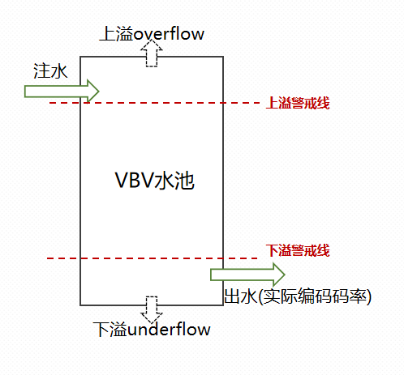

## 前言

码率控制模块是编码器内部很重要的一个模块。在x264中码率控制分为**帧级码控**和**行级码控**(*x264中还有一些功能会影响到宏块的QP，例如AQ、MB-Tree、RDO等，但严格上讲这些不属于码率控制部分的功能，因为它们并没有起到一个“控”的作用*)，分为两个章节进行介绍，本章节主要介绍的**x264的帧级码控**


## 码控方式

x264显示提供三种码率控制的方法：**CQP、CRF、ABR**

- CQP固定QP的意思，即使用固定的帧级QP进行量化。CQP码控主要是为了保证编码质量，并不care编码码率
- CRF，固定码率因子，是x264默认的码控方式，CRF会根据当前图像的复杂度动态调节帧级QP，同等码率下CRF的编码质量会比CQP更高。 与CQP类似，CRF主要也是保证编码质量，都由于其会动态调节QP的特性，所以也会稍微兼顾编码码率
- ABR，平均编码码率，即让实际的编码码率能够满足期望的编码码率，此码控方式会更偏重保证码率，当然这也会牺牲一定的编码质量

由于CQP的方式比较简单，除了实验研究外实际使用得并不多，所以本章节就不对其进行过多介绍(在下文的<u>源码解析</u>部分会稍微说一下)，所以**本章节主要介绍CRF、ABR两种码控方式**


## 码控原理分析

#### 基本公式

- qscale = 0.85 * 2^((QP - 12)  / 6)
- QP = 12 + 6 * log2(qscale/0.85)
- QStep = 2^((QP - 4)/6)
- QP = 6 * log2(QStep) + 4

由上述可以看出qscale与QP呈正相关，QP与QStep呈正相关


#### 条件假设

假设当前图像实际的编码比特数为bits，当前图像的复杂度为complexity，当前的量化等级为qscale

当量化等级qscale不变时，complexity越大，bits越大

当complexity不变，qscale越大，bits越小

因此我们可以得到一条结论：**实际编码比特数与复杂度成正比，与qscale成反比**

x264的码率控制就是基于上述这条结论(*虽然不是很准确，中间的影响因素会比较多，但是我们姑且认为就是这样吧*)

------


x264 中，首先根据每帧的复杂度，在帧与帧之间分配码率比例。然后根据码率预算，将每帧缩放到合适大小。这个缩放系数称为 ratefactor 。

然后 **qscale = f(complexity) / ratefactor** 

所谓 crf (constant ratefactor) 模式，就是固定ratefactor 参数， 码率分配由复杂度决定。
而abr模式，会根据当前的实际编码码率与目标编码码率的偏差情况动态调节ratefactor，从而保证编码码率的稳定。

相同f(complexity)下，ratefactor越小，qscale越大，编码质量越低；反之则越高

注意**qscale = f(complexity) / ratefactor** 这条公式，complexity会经过f()运算，此f()函数就是**感知编码优化函数**


**什么是感知编码优化？**

首先我们先抛出一个问题，“假设帧a的复杂度为X，计算得到的qscale为Y，帧b的复杂度为2*X，如果没有感知编码优化的话计算得到的qscale为2Y，此时以2Y的qscale对帧b进行编码能否保证帧b的质量跟帧a的质量差距？”，答案是不能保证两者的质量差距，就是由于“复杂度与qscale线性关系”的弊端，x264引入了感知编码优化，对complexity进行**非线性处理**，从而保证即使是高complexity得到的qscale也不会与低complexity的qscale相差太大，这就是f()函数的作用。

**recq = f(complexity) = complexity^(1-qcomp)**   qcomp∈[0,1] ；  recq就是压缩后的图像复杂度，是码率分配的依据

可见f()就是个指数函数，qcomp越小，complexity对qscale影响的比重就越大，反之则越小

qcomp = 0时，f(complexity) = complexity，则qscale 与复杂度成正比，分配给平缓的帧和复杂的帧的比特是一样的

qcomp = 1时，f(complexity) = 1， qscale 与复杂度无关，相当于关闭了感知编码优化

------


**如何知道图像模糊复杂度complexity？**

这里先看部分x264的源码

```c++
rcc->last_satd = x264_rc_analyse_slice( h );
rcc->short_term_cplxsum *= 0.5;
rcc->short_term_cplxcount *= 0.5;
rcc->short_term_cplxsum += rcc->last_satd / (CLIP_DURATION(h->fenc->f_duration) / BASE_FRAME_DURATION);
rcc->short_term_cplxcount ++;

rce.tex_bits = rcc->last_satd;
rce.blurred_complexity = rcc->short_term_cplxsum / rcc->short_term_cplxcount;
```

*blurred_complexity的计算公式如下：*
$$
Blurcplx = \frac{Cplxsum}{Cplxcount}
$$
*short_term_cplxsum、short_term_cplxcount的计算公式如下：*
$$
\begin{cases} Cplxsum[i] = {Cplxsum[i-1] * 0.5} + satd \\ Cplxcount[i] = {Cplxcount[i-1] * 0.5} + 1\end{cases}
$$
其中satd = x264_rc_analyse_slice(h);  此处就是获取当前帧的编码代价保存到satd中，此代价在帧类型决策的时候已经计算得到了(详细可参考"帧类型决策&场景切换检测"章节)

由上述两个公式可以看出，**当前图像的模糊复杂度与历史帧的模糊复杂度以及当前帧的satd有关**

------


**ratefactor码率因子**

通过上面的介绍已经能够知道当前图像经过感知编码优化后的图像复杂度了，计算当前的qscale还需要确定ratefactor。

对于CRF模式，ratefactor的值是固定的，代码如下

```c++
if( h->param.rc.i_rc_method == X264_RC_CRF )
{
        /* Arbitrary rescaling to make CRF somewhat similar to QP.
         * Try to compensate for MB-tree's effects as well. */
        double base_cplx = h->mb.i_mb_count * (h->param.i_bframe ? 120 : 80);
        double mbtree_offset = h->param.rc.b_mb_tree ? (1.0-h->param.rc.f_qcompress)*13.5 : 0;
        rc->rate_factor_constant = pow( base_cplx, 1 - rc->qcompress )
                                 / qp2qscale( h->param.rc.f_rf_constant + mbtree_offset + QP_BD_OFFSET );
}

// ---------

if( h->param.rc.i_rc_method == X264_RC_CRF )
{
    // 参数二为上文介绍的ratefactor
    q = get_qscale( h, &rce, rcc->rate_factor_constant, h->fenc->i_frame );
}
```

而对于ABR模式，会根据当前期望编码码率和实际码率的偏差动态调整ratecontrol，这里也直接贴代码看

```c++
if( h->param.rc.i_rc_method == X264_RC_CRF )
{
    q = get_qscale( h, &rce, rcc->rate_factor_constant, h->fenc->i_frame );
}
else
{
    // ABR模式，参数二为ratefactor
    q = get_qscale( h, &rce, rcc->wanted_bits_window / rcc->cplxr_sum, h->fenc->i_frame );
}
```

由代码可知，ABR模式的**ratefactor = wanted_bits_window / cplxr_sum**

wanted_bits_window 的初始值1.0 * rc->bitrate / rc->fps，即目标码率/目标帧率，就是目标平均单帧的比特数

cplxr_sum的初始值是.01 * pow( 7.0e5, rc->qcompress ) * pow( h->mb.i_mb_count, 0.5 )。 qcompress是上文说到的感知编码系数，i_mb_count是宏块总数量

wanted_bits_window 和 cplxr_sum在每一帧编码完成之后都会进行更新，公式如下：

- wanted_bits_window = (wanted_bits_window +  f_duration * bitrate) * cbr_decay；  // f_duration为帧率的倒数，bitrate为目标码率，cbr_decay是一个衰减系数
- cplxr_sum = (cplxr_sum + bits * qscale / rceq) * cbr_decay； // bits为实际的编码比特数，qscale为平均宏块的qscale， recq为感知编码优化后的图像复杂度,  cbr_decay是一个衰减系数主要为了降低历史帧的影响

由上述两个公式可以看出，wanted_bits_window表示期望增长的比特数，cplxt_sum表示实际增长的比特数

如果当前帧实际编码的比特数大于期望的比特数时，那么编码结束更新cplxr_sum后的值会更大一点，所以在编码下一帧计算ratefactor = wanted_bits_window / cplxr_sum时，得到的ratefactor会更小一点，qscale更大，编码的比特数更少一点，从而均衡一下上一帧“超编”的情况。  反之，如果当前帧实际比特数小于期望比特数，那么下一帧得到的ratefactor会更大，qscale更小，编码比特数会更多，利用上一帧“未编满”的情况


#### 小总结

一帧图像根据当前的编码代价satd、以及历史帧的编码代价，加权计算得到complexity作为当前帧的模糊复杂度，将complexity进行感知编码优化，得到优化后的图像复杂度rcep，然后qscale = rcep / ratefactor计算得到qscale作为当前帧的编码qscale。

CRF模式，会固定此ratefactor；ABR模式会根据期望码率和实际码率的偏差动态调节ratefactor值。


## VBV调控

经过“码控原理分析”的几步流程后已经能够获取qscale，将qscale做限幅处理[minQscale, maxQscale]再转成QP，就能作为当前帧的帧级QP。

但是x264还提供另一种工具，VBV，用于进一步调节上面步骤得到的qscale


#### 1、什么是VBV？

VBV全程为Video Buffer Verifier（视频缓冲区校验器）。 可以将VBV当做一个容量受限的管道，有一个上限容量值和下限容量值，在经过此管道的调节之后能限制编码码率在上限容量值和下限容量值之前。**一句话就是为了进一步保证编码码率的稳定**

#### 2、VBV是否是必须的？

VBV不是必须的，可以打开也可以关闭。CRF、ABR模式都可以使用VBV，使用VBV能进一步保证的编码码率的稳定


#### 3、ABR模式下已经有了动态调节ratefactor的功能，x264为什么还要设计vbv？

这个答案比较简单，因为动态调节ratefactor功能对于控制码率上不是很准确


#### 4、VBV如何实现码率调节的？

*我们先来看一幅图*



VBV可以理解为一个水池，水池存在有限的容量大小，且有一个**注水口**和一个**出水口**， **每编码一帧后都会往水池里面注入一部分水，同时也会流出一部分水**。**注入的水量为单帧的期望比特数，流出的水量为实际的编码比特数。**

如果注水量大于出水量**即实际编码码率低于目标码率**，那么水池的水会持续上涨，直至向上溢出(**称之为VBV上溢出overflow**)； 如果注水量小于出水量即**实际编码码率高于目标码率**，那么水池的水会持续下降，直至水流光(称之为VBV下溢出underflow)；

为了保证实际码率等于目标码率，我们尽量要保证VBV不出现**上溢**或者**下溢**，因此给水池设置两条警戒线，**上溢警戒线和下溢警戒线**。 当水池中的水量超过上溢警戒线时为了预防出现上溢，需要适当降低当前帧的qscale，让水量在编码后能够稍微下降；反之如果水量低于下溢警戒线时为了预防出现下溢，需要适当增大当前帧的qscale，让水量在编码后能够稍微上升。

这就是VBV的原理，详细介绍见下面的“源码解析”


## 源码解析

在“x264整体流程分析”章节已经介绍了，**x264_ratecontrol_start**是帧级码控的函数，经过x264_ratecontrol_start计算后能够确定当前帧的帧级QP，这里对此函数进行分析


```c++
// 函数位置在encoder/ratecontrol.c
/* Before encoding a frame, choose a QP for it */
void x264_ratecontrol_start( x264_t *h, int i_force_qp, int overhead )
{
    x264_ratecontrol_t *rc = h->rc;
    ratecontrol_entry_t *rce = NULL;
    x264_zone_t *zone = get_zone( h, h->fenc->i_frame );
    float q;  // 当前的帧级QP

    x264_emms();

    if( h->param.rc.b_stat_read )
    {
        // 如果从外部文件读取码控信息才会进入到这里
        int frame = h->fenc->i_frame;
        assert( frame >= 0 && frame < rc->num_entries );
        rce = rc->rce = &rc->entry[frame];

        if( h->sh.i_type == SLICE_TYPE_B
            && h->param.analyse.i_direct_mv_pred == X264_DIRECT_PRED_AUTO )
        {
            h->sh.b_direct_spatial_mv_pred = ( rce->direct_mode == 's' );
            h->mb.b_direct_auto_read = ( rce->direct_mode == 's' || rce->direct_mode == 't' );
        }
    }

    if( rc->b_vbv )
    {
        // 如果开启了VBV会进入到此处，进行一些初始化的工作
        memset( h->fdec->i_row_bits, 0, h->mb.i_mb_height * sizeof(int) );
        memset( h->fdec->f_row_qp, 0, h->mb.i_mb_height * sizeof(float) );
        memset( h->fdec->f_row_qscale, 0, h->mb.i_mb_height * sizeof(float) );
        rc->row_pred = rc->row_preds[h->sh.i_type];
        rc->buffer_rate = h->fenc->i_cpb_duration * rc->vbv_max_rate * h->sps->vui.i_num_units_in_tick / h->sps->vui.i_time_scale;
        update_vbv_plan( h, overhead );

        const x264_level_t *l = x264_levels;
        while( l->level_idc != 0 && l->level_idc != h->param.i_level_idc )
            l++;

        int mincr = l->mincr;

        if( h->param.b_bluray_compat )
            mincr = 4;

        /* Profiles above High don't require minCR, so just set the maximum to a large value. */
        if( h->sps->i_profile_idc > PROFILE_HIGH )
            rc->frame_size_maximum = 1e9;
        else
        {
            /* The spec has a bizarre special case for the first frame. */
            if( h->i_frame == 0 )
            {
                //384 * ( Max( PicSizeInMbs, fR * MaxMBPS ) + MaxMBPS * ( tr( 0 ) - tr,n( 0 ) ) ) / MinCR
                double fr = 1. / (h->param.i_level_idc >= 60 ? 300 : 172);
                int pic_size_in_mbs = h->mb.i_mb_width * h->mb.i_mb_height;
                rc->frame_size_maximum = 384 * BIT_DEPTH * X264_MAX( pic_size_in_mbs, fr*l->mbps ) / mincr;
            }
            else
            {
                //384 * MaxMBPS * ( tr( n ) - tr( n - 1 ) ) / MinCR
                rc->frame_size_maximum = 384 * BIT_DEPTH * ((double)h->fenc->i_cpb_duration * h->sps->vui.i_num_units_in_tick / h->sps->vui.i_time_scale) * l->mbps / mincr;
            }
        }
    }

    if( h->sh.i_type != SLICE_TYPE_B )
        rc->bframes = h->fenc->i_bframes;

    if( rc->b_abr )
    {
        // ABR、CRF码控方式会进入到此条件下，计算得到帧级QP赋值给q
        q = qscale2qp( rate_estimate_qscale( h ) );
    }
    else if( rc->b_2pass )
    {
        // 2pass 编码
        rce->new_qscale = rate_estimate_qscale( h );
        q = qscale2qp( rce->new_qscale );
    }
    else /* CQP */
    {
        // CQP的码控会进入到此条件中，根据当前的帧类型以及qp_constant得到一个固定的QP值
        if( h->sh.i_type == SLICE_TYPE_B && h->fdec->b_kept_as_ref )
            q = ( rc->qp_constant[ SLICE_TYPE_B ] + rc->qp_constant[ SLICE_TYPE_P ] ) / 2;
        else
            q = rc->qp_constant[ h->sh.i_type ];

        if( zone )
        {
            if( zone->b_force_qp )
                q += zone->i_qp - rc->qp_constant[SLICE_TYPE_P];
            else
                q -= 6*log2f( zone->f_bitrate_factor );
        }
    }
    if( i_force_qp != X264_QP_AUTO )
        q = i_force_qp - 1;

    // 限幅在[h->param.rc.i_qp_min，h->param.rc.i_qp_max]
    q = x264_clip3f( q, h->param.rc.i_qp_min, h->param.rc.i_qp_max );

    rc->qpa_rc = rc->qpa_rc_prev =
    rc->qpa_aq = rc->qpa_aq_prev = 0;
    h->fdec->f_qp_avg_rc =
    h->fdec->f_qp_avg_aq =
    rc->qpm = q; // 保存当前的qp
    if( rce )
        rce->new_qp = q;
	
    // 更新accum_p_qp和accum_p_norm
    accum_p_qp_update( h, rc->qpm );

    if( h->sh.i_type != SLICE_TYPE_B )
        rc->last_non_b_pict_type = h->sh.i_type;
}
```


```c++
/* qscale转qp的函数 */
static inline float qscale2qp( float qscale )
{
    // 参考“基本公式”
    return (12.0f + QP_BD_OFFSET) + 6.0f * log2f( qscale/0.85f );
}
```


```c++
/* 更新accum_p_qp和accum_p_norm */
static void accum_p_qp_update( x264_t *h, float qp ){
    // accum_p_qp是一个历史帧qp的累加值。如果某一帧是IDR/I帧时可以通过accum_p_qp去调整IDR/I帧的qp，避免其过大或者过小
    x264_ratecontrol_t *rc = h->rc;
    rc->accum_p_qp   *= .95;
    rc->accum_p_norm *= .95;
    rc->accum_p_norm += 1;
    if( h->sh.i_type == SLICE_TYPE_I )
        rc->accum_p_qp += qp + rc->ip_offset;
    else
        rc->accum_p_qp += qp;
}
```


```c++
/* 计算当前帧的qscale */
static float rate_estimate_qscale( x264_t *h )
{
    float q;
    x264_ratecontrol_t *rcc = h->rc;
    ratecontrol_entry_t rce = {0};
    int pict_type = h->sh.i_type;
    /* 获取所有已经编码帧的总大小(不算filter填充的数量) */
    int64_t total_bits = 8*(h->stat.i_frame_size[SLICE_TYPE_I]
                          + h->stat.i_frame_size[SLICE_TYPE_P]
                          + h->stat.i_frame_size[SLICE_TYPE_B])
                       - rcc->filler_bits_sum;

    if( rcc->b_2pass )
    {
        // 2pass
        rce = *rcc->rce;
        if( pict_type != rce.pict_type )
        {
            x264_log( h, X264_LOG_ERROR, "slice=%c but 2pass stats say %c\n",
                      slice_type_to_char[pict_type], slice_type_to_char[rce.pict_type] );
        }
    }

    if( pict_type == SLICE_TYPE_B )
    {
        /* B-frames don't have independent ratecontrol, but rather get the
         * average QP of the two adjacent P-frames + an offset */

        int i0 = IS_X264_TYPE_I(h->fref_nearest[0]->i_type);
        int i1 = IS_X264_TYPE_I(h->fref_nearest[1]->i_type);
        int dt0 = abs(h->fenc->i_poc - h->fref_nearest[0]->i_poc); // 与前向队列中最近一帧参考帧的距离
        int dt1 = abs(h->fenc->i_poc - h->fref_nearest[1]->i_poc); // 与后向队列中最近一帧参考帧的距离
        float q0 = h->fref_nearest[0]->f_qp_avg_rc; // 前向最近一帧参考帧的平均宏块QP
        float q1 = h->fref_nearest[1]->f_qp_avg_rc; // 后向最近一帧参考帧的平均宏块QP

        // 如果最近一帧参考帧的B-REF，q0/q1减去一个偏移值
        if( h->fref_nearest[0]->i_type == X264_TYPE_BREF )
            q0 -= rcc->pb_offset/2;
        if( h->fref_nearest[1]->i_type == X264_TYPE_BREF )
            q1 -= rcc->pb_offset/2;
		
        // 根据前向、后向最近一帧参考帧的帧类型确定当前q值
        if( i0 && i1 )
            q = (q0 + q1) / 2 + rcc->ip_offset;
        else if( i0 )
            q = q1;
        else if( i1 )
            q = q0;
        else
            q = (q0*dt1 + q1*dt0) / (dt0 + dt1);
		
        // 当前帧是否可以作为参考帧，q加上不同的偏移值
        if( h->fenc->b_kept_as_ref )
            q += rcc->pb_offset/2;
        else
            q += rcc->pb_offset;

        rcc->qp_novbv = q;
        q = qp2qscale( q );
        if( rcc->b_2pass )
            rcc->frame_size_planned = qscale2bits( &rce, q );
        else
            rcc->frame_size_planned = predict_size( rcc->pred_b_from_p, q, h->fref[1][h->i_ref[1]-1]->i_satd );
        /* Limit planned size by MinCR */
        if( rcc->b_vbv )
            rcc->frame_size_planned = X264_MIN( rcc->frame_size_planned, rcc->frame_size_maximum );
        rcc->frame_size_estimated = rcc->frame_size_planned;

        /* For row SATDs */
        if( rcc->b_vbv )
            rcc->last_satd = x264_rc_analyse_slice( h );
        return q;
    }
    else
    {
        double abr_buffer = 2 * rcc->rate_tolerance * rcc->bitrate;
        double predicted_bits = total_bits;
        if( h->i_thread_frames > 1 )
        {
            int j = rcc - h->thread[0]->rc;
            for( int i = 1; i < h->i_thread_frames; i++ )
            {
                x264_t *t = h->thread[(j+i) % h->i_thread_frames];
                double bits = t->rc->frame_size_planned;
                if( !t->b_thread_active )
                    continue;
                bits = X264_MAX(bits, t->rc->frame_size_estimated);
                predicted_bits += bits;
            }
        }

        if( rcc->b_2pass )
        {
            // 2pass
            double lmin = rcc->lmin[pict_type];
            double lmax = rcc->lmax[pict_type];
            double diff;

            /* Adjust ABR buffer based on distance to the end of the video. */
            if( rcc->num_entries > h->i_frame )
            {
                double final_bits = rcc->entry_out[rcc->num_entries-1]->expected_bits;
                double video_pos = rce.expected_bits / final_bits;
                double scale_factor = sqrt( (1 - video_pos) * rcc->num_entries );
                abr_buffer *= 0.5 * X264_MAX( scale_factor, 0.5 );
            }

            diff = predicted_bits - rce.expected_bits;
            q = rce.new_qscale;
            q /= x264_clip3f((abr_buffer - diff) / abr_buffer, .5, 2);
            if( h->i_frame >= rcc->fps && rcc->expected_bits_sum >= 1 )
            {
                /* Adjust quant based on the difference between
                 * achieved and expected bitrate so far */
                double cur_time = (double)h->i_frame / rcc->num_entries;
                double w = x264_clip3f( cur_time*100, 0.0, 1.0 );
                q *= pow( (double)total_bits / rcc->expected_bits_sum, w );
            }
            rcc->qp_novbv = qscale2qp( q );
            if( rcc->b_vbv )
            {
                /* Do not overflow vbv */
                double expected_size = qscale2bits( &rce, q );
                double expected_vbv = rcc->buffer_fill + rcc->buffer_rate - expected_size;
                double expected_fullness = rce.expected_vbv / rcc->buffer_size;
                double qmax = q*(2 - expected_fullness);
                double size_constraint = 1 + expected_fullness;
                qmax = X264_MAX( qmax, rce.new_qscale );
                if( expected_fullness < .05 )
                    qmax = lmax;
                qmax = X264_MIN(qmax, lmax);
                while( ((expected_vbv < rce.expected_vbv/size_constraint) && (q < qmax)) ||
                        ((expected_vbv < 0) && (q < lmax)))
                {
                    q *= 1.05;
                    expected_size = qscale2bits(&rce, q);
                    expected_vbv = rcc->buffer_fill + rcc->buffer_rate - expected_size;
                }
                rcc->last_satd = x264_rc_analyse_slice( h );
            }
            q = x264_clip3f( q, lmin, lmax );
        }
        else /* 1pass ABR */
        {
            /* Calculate the quantizer which would have produced the desired
             * average bitrate if it had been applied to all frames so far.
             * Then modulate that quant based on the current frame's complexity
             * relative to the average complexity so far (using the 2pass RCEQ).
             * Then bias the quant up or down if total size so far was far from
             * the target.
             * Result: Depending on the value of rate_tolerance, there is a
             * tradeoff between quality and bitrate precision. But at large
             * tolerances, the bit distribution approaches that of 2pass. */

            double wanted_bits, overflow = 1;

            rcc->last_satd = x264_rc_analyse_slice( h ); // 当前帧的satd(编码代价)
            // 更新short_term_cplxsum、short_term_cplxcount
            rcc->short_term_cplxsum *= 0.5;  // 历史值乘上0.5，为了降低历史帧的影响
            rcc->short_term_cplxcount *= 0.5;
            rcc->short_term_cplxsum += rcc->last_satd / (CLIP_DURATION(h->fenc->f_duration) / BASE_FRAME_DURATION);
            rcc->short_term_cplxcount ++;

            rce.tex_bits = rcc->last_satd;
            // 获取当前帧的模糊复杂度
            rce.blurred_complexity = rcc->short_term_cplxsum / rcc->short_term_cplxcount;
            rce.mv_bits = 0;
            rce.p_count = rcc->nmb;
            rce.i_count = 0;
            rce.s_count = 0;
            rce.qscale = 1;
            rce.pict_type = pict_type;
            rce.i_duration = h->fenc->i_duration;

            if( h->param.rc.i_rc_method == X264_RC_CRF )
            {
                // CRF码控，rcc->rate_factor_constant为固定值
                q = get_qscale( h, &rce, rcc->rate_factor_constant, h->fenc->i_frame );
            }
            else
            {
                // ABR码控，wanted_bits_window、cplxr_sum会在x264_ratecontrol_end更新
                q = get_qscale( h, &rce, rcc->wanted_bits_window / rcc->cplxr_sum, h->fenc->i_frame );

                /* ABR code can potentially be counterproductive in CBR, so just don't bother.
                 * Don't run it if the frame complexity is zero either. */
                if( !rcc->b_vbv_min_rate && rcc->last_satd )
                {
                    // 这里只有vbv_max_bitrate > rc.i_bitrate时才有可能进入到此条件中
                    // FIXME is it simpler to keep track of wanted_bits in ratecontrol_end?
                    int i_frame_done = h->i_frame;
                    double time_done = i_frame_done / rcc->fps; // 已经编码的总时间(以fps帧/s来计算)
                    if( h->param.b_vfr_input && i_frame_done > 0 )
                        time_done = ((double)(h->fenc->i_reordered_pts - h->i_reordered_pts_delay)) * h->param.i_timebase_num / h->param.i_timebase_den;
                    wanted_bits = time_done * rcc->bitrate; // time_done秒编码期望的总比特数
                    if( wanted_bits > 0 )
                    {
                        // 溢出判断
                        abr_buffer *= X264_MAX( 1, sqrt( time_done ) );
                        overflow = x264_clip3f( 1.0 + (predicted_bits - wanted_bits) / abr_buffer, .5, 2 );
                        q *= overflow;
                    }
                }
            }
			
            // 调整qscale值
            if( pict_type == SLICE_TYPE_I && h->param.i_keyint_max > 1
                /* should test _next_ pict type, but that isn't decided yet */
                && rcc->last_non_b_pict_type != SLICE_TYPE_I )
            {
                /* 
            		如果当前帧时IDR/I帧，i_keyint_max > 1并且上一帧非B帧不是IDR/I帧，会通过历史帧的qp计算出当前帧的qscale
            		目的是为了防止当前帧的qscale异常过大或者过小。 rcc->accum_p_qp和rcc->accum_p_norm的更新见accum_p_qp_update函数
            	*/
                q = qp2qscale( rcc->accum_p_qp / rcc->accum_p_norm );
                q /= fabs( h->param.rc.f_ip_factor );
            }
            else if( h->i_frame > 0 ) // 非首帧
            {
                if( h->param.rc.i_rc_method != X264_RC_CRF )
                {
                    // 通过lmin，lmax限制q的区间
                    /* Asymmetric clipping, because symmetric would prevent
                     * overflow control in areas of rapidly oscillating complexity */
                    double lmin = rcc->last_qscale_for[pict_type] / rcc->lstep;
                    double lmax = rcc->last_qscale_for[pict_type] * rcc->lstep;
                    if( overflow > 1.1 && h->i_frame > 3 )
                        lmax *= rcc->lstep;
                    else if( overflow < 0.9 )
                        lmin /= rcc->lstep;

                    q = x264_clip3f(q, lmin, lmax);
                }
            }
            else if( h->param.rc.i_rc_method == X264_RC_CRF && rcc->qcompress != 1 )
            {
                q = qp2qscale( ABR_INIT_QP ) / fabs( h->param.rc.f_ip_factor );
            }
            rcc->qp_novbv = qscale2qp( q ); // 保存当前帧的qp(未经过vbv的调整前的qp)

            //FIXME use get_diff_limited_q() ?
            // VBV调控
            q = clip_qscale( h, pict_type, q );
        }

        rcc->last_qscale_for[pict_type] =
        rcc->last_qscale = q;

        if( !(rcc->b_2pass && !rcc->b_vbv) && h->fenc->i_frame == 0 )
            rcc->last_qscale_for[SLICE_TYPE_P] = q * fabs( h->param.rc.f_ip_factor );

        if( rcc->b_2pass )
            rcc->frame_size_planned = qscale2bits( &rce, q );
        else
            rcc->frame_size_planned = predict_size( &rcc->pred[h->sh.i_type], q, rcc->last_satd );

        /* Always use up the whole VBV in this case. */
        if( rcc->single_frame_vbv )
            rcc->frame_size_planned = rcc->buffer_rate;
        /* Limit planned size by MinCR */
        if( rcc->b_vbv )
            rcc->frame_size_planned = X264_MIN( rcc->frame_size_planned, rcc->frame_size_maximum );
        rcc->frame_size_estimated = rcc->frame_size_planned;
        return q;
    }
}
```


**根据模糊复杂度、ratefactor获取当前帧的qscale**

```c++
/* 根据模糊复杂度、ratefactor获取当前帧的qscale */
static double get_qscale(x264_t *h, ratecontrol_entry_t *rce, double rate_factor, int frame_num)
{
    x264_ratecontrol_t *rcc= h->rc;
    x264_zone_t *zone = get_zone( h, frame_num );
    double q;
    if( h->param.rc.b_mb_tree )
    {
        double timescale = (double)h->sps->vui.i_num_units_in_tick / h->sps->vui.i_time_scale;
        q = pow( BASE_FRAME_DURATION / CLIP_DURATION(rce->i_duration * timescale), 1 - h->param.rc.f_qcompress );
    }
    else
        q = pow( rce->blurred_complexity, 1 - rcc->qcompress ); // 对模糊复杂度进行感知编码优化，得到recq

    // avoid NaN's in the rc_eq
    if( !isfinite(q) || rce->tex_bits + rce->mv_bits == 0 )
        q = rcc->last_qscale_for[rce->pict_type];
    else
    {
        rcc->last_rceq = q;
        q /= rate_factor;  // recq / rate_factor得到当前qscale
        rcc->last_qscale = q;
    }

    if( zone )
    {
        if( zone->b_force_qp )
            q = qp2qscale( zone->i_qp );
        else
            q /= zone->f_bitrate_factor;
    }

    return q;
}

```


**VBV调控，并且限制qscale在[lmin,lmax]之间**

```c++
// apply VBV constraints and clip qscale to between lmin and lmax
static double clip_qscale( x264_t *h, int pict_type, double q )
{
    x264_ratecontrol_t *rcc = h->rc;
    double lmin = rcc->lmin[pict_type];
    double lmax = rcc->lmax[pict_type];
    if( rcc->rate_factor_max_increment )
        lmax = X264_MIN( lmax, qp2qscale( rcc->qp_novbv + rcc->rate_factor_max_increment ) );
    double q0 = q;

    /* B-frames are not directly subject to VBV,
     * since they are controlled by the P-frames' QPs. */

    if( rcc->b_vbv && rcc->last_satd > 0 )
    {
        // 如果开启了vbv
        double fenc_cpb_duration = (double)h->fenc->i_cpb_duration *
                                   h->sps->vui.i_num_units_in_tick / h->sps->vui.i_time_scale;
        /* Lookahead VBV: raise the quantizer as necessary such that no frames in
         * the lookahead overflow and such that the buffer is in a reasonable state
         * by the end of the lookahead. */
        if( h->param.rc.i_lookahead )
        {
            // 如果开启了lookahead
            int terminate = 0;

            /* Avoid an infinite loop. */
            for( int iterations = 0; iterations < 1000 && terminate != 3; iterations++ )
            {
                double frame_q[3];
                // 根据当前帧类型，qscale，satd预测当前帧以qscale的量化等级进行编码编码后的比特数cur_bits
                double cur_bits = predict_size( &rcc->pred[h->sh.i_type], q, rcc->last_satd );
                // buffet_fill为当前VBV水池的水量，流出cur_bits的水剩余的水量为buffer_fill_cur
                double buffer_fill_cur = rcc->buffer_fill - cur_bits;
                double target_fill;
                double total_duration = 0;
                double last_duration = fenc_cpb_duration;
                frame_q[0] = h->sh.i_type == SLICE_TYPE_I ? q * h->param.rc.f_ip_factor : q;
                frame_q[1] = frame_q[0] * h->param.rc.f_pb_factor;
                frame_q[2] = frame_q[0] / h->param.rc.f_ip_factor;

                /* Loop over the planned future frames. */
                for( int j = 0; buffer_fill_cur >= 0 && buffer_fill_cur <= rcc->buffer_size; j++ )
                {
                    // lookahead，往后预测一定数量的帧，更新buffer_fill_cur
                    total_duration += last_duration;
                    buffer_fill_cur += rcc->vbv_max_rate * last_duration; // "注水"，注水量为码率/fps
                    int i_type = h->fenc->i_planned_type[j];
                    int i_satd = h->fenc->i_planned_satd[j];
                    if( i_type == X264_TYPE_AUTO )
                        break;
                    i_type = IS_X264_TYPE_I( i_type ) ? SLICE_TYPE_I : IS_X264_TYPE_B( i_type ) ? SLICE_TYPE_B : SLICE_TYPE_P;
                    cur_bits = predict_size( &rcc->pred[i_type], frame_q[i_type], i_satd );
                    buffer_fill_cur -= cur_bits;
                    last_duration = h->fenc->f_planned_cpb_duration[j];
                }
                /* Try to get to get the buffer at least 50% filled, but don't set an impossible goal. */
                // 水池经过“出水”“注水”后的目标水量target_fill，最小为0.5 * 水池容量，buffer_size为vbv的水池容量
                target_fill = X264_MIN( rcc->buffer_fill + total_duration * rcc->vbv_max_rate * 0.5, rcc->buffer_size * 0.5 );
                // 预防水池下溢
                if( buffer_fill_cur < target_fill )
                {
                    // 如果当前水池经过“注水”“出水”后水量仍然低于target_fill，说明“出水”量过多，即编码后比特数过多，应该降低编码比特数，所以增大qscale
                    q *= 1.01;
                    terminate |= 1;
                    continue;
                }
                /* Try to get the buffer no more than 80% filled, but don't set an impossible goal. */
                // 目前水量target_fill，最大值为0.8 * 水池容量
                target_fill = x264_clip3f( rcc->buffer_fill - total_duration * rcc->vbv_max_rate * 0.5, rcc->buffer_size * 0.8, rcc->buffer_size );
                // 预防水池上溢
                if( rcc->b_vbv_min_rate && buffer_fill_cur > target_fill )
                {
                    // 如果当前水池经过“注水”“出水”后水量高于target_fill，说明“出水”量过少，即编码后比特数过少，应该增大编码比特数，所以降低
                    q /= 1.01;
                    terminate |= 2;
                    continue;
                }
                break;
            }
        }
        /* Fallback to old purely-reactive algorithm: no lookahead. */
        else
        {
            // no lookahead
            if( ( pict_type == SLICE_TYPE_P ||
                ( pict_type == SLICE_TYPE_I && rcc->last_non_b_pict_type == SLICE_TYPE_I ) ) &&
                rcc->buffer_fill/rcc->buffer_size < 0.5 )
            {
                // 如果当前帧时P帧或者当前帧时I帧且上一帧非B帧也是I帧，如果当前水池的水量小于0.5 * 水池容量，为了避免下溢，增大qscale
                q /= x264_clip3f( 2.0*rcc->buffer_fill/rcc->buffer_size, 0.5, 1.0 );
            }

            /* Now a hard threshold to make sure the frame fits in VBV.
             * This one is mostly for I-frames. */
            // 根据当前帧类型，qscale，satd预测当前帧以qscale的量化等级进行编码编码后的比特数bits
            double bits = predict_size( &rcc->pred[h->sh.i_type], q, rcc->last_satd );
            /* For small VBVs, allow the frame to use up the entire VBV. */
            // 最大fill factor
            double max_fill_factor = h->param.rc.i_vbv_buffer_size >= 5*h->param.rc.i_vbv_max_bitrate / rcc->fps ? 2 : 1;
            /* For single-frame VBVs, request that the frame use up the entire VBV. */
            // 最小fill factor
            double min_fill_factor = rcc->single_frame_vbv ? 1 : 2;

            if( bits > rcc->buffer_fill/max_fill_factor )
            {
                // 当前bits超过buffer_fill/max_fill_facto，为了避免下溢，增加qscale
                double qf = x264_clip3f( rcc->buffer_fill/(max_fill_factor*bits), 0.2, 1.0 );
                q /= qf;
                bits *= qf;
            }
            if( bits < rcc->buffer_rate/min_fill_factor )
            {
                // 同理，为了避免上溢，降低qscale、
                double qf = x264_clip3f( bits*min_fill_factor/rcc->buffer_rate, 0.001, 1.0 );
                q *= qf;
            }
            q = X264_MAX( q0, q );
        }

        /* Check B-frame complexity, and use up any bits that would
         * overflow before the next P-frame. */
        // 根据B帧预测大小调整qscale，避免发生溢出
        if( h->sh.i_type == SLICE_TYPE_P && !rcc->single_frame_vbv )
        {
            int nb = rcc->bframes;
            double bits = predict_size( &rcc->pred[h->sh.i_type], q, rcc->last_satd );
            double pbbits = bits;
            double bbits = predict_size( rcc->pred_b_from_p, q * h->param.rc.f_pb_factor, rcc->last_satd );
            double space;
            double bframe_cpb_duration = 0;
            double minigop_cpb_duration;
            for( int i = 0; i < nb; i++ )
                bframe_cpb_duration += h->fenc->f_planned_cpb_duration[i];

            if( bbits * nb > bframe_cpb_duration * rcc->vbv_max_rate )
                nb = 0;
            pbbits += nb * bbits;

            minigop_cpb_duration = bframe_cpb_duration + fenc_cpb_duration;
            space = rcc->buffer_fill + minigop_cpb_duration*rcc->vbv_max_rate - rcc->buffer_size;
            if( pbbits < space )
            {
                q *= X264_MAX( pbbits / space, bits / (0.5 * rcc->buffer_size) );
            }
            q = X264_MAX( q0/2, q );
        }

        /* Apply MinCR and buffer fill restrictions */
        double bits = predict_size( &rcc->pred[h->sh.i_type], q, rcc->last_satd );
        double frame_size_maximum = X264_MIN( rcc->frame_size_maximum, X264_MAX( rcc->buffer_fill, 0.001 ) );
        if( bits > frame_size_maximum )
            q *= bits / frame_size_maximum;

        if( !rcc->b_vbv_min_rate )
            q = X264_MAX( q0, q );
    }

    if( lmin==lmax )
        return lmin;
    else if( rcc->b_2pass )
    {
        double min2 = log( lmin );
        double max2 = log( lmax );
        q = (log(q) - min2)/(max2-min2) - 0.5;
        q = 1.0/(1.0 + exp( -4*q ));
        q = q*(max2-min2) + min2;
        return exp( q );
    }
    else
        return x264_clip3f( q, lmin, lmax ); // 限幅在[lmin, lmax]之间
}
```


文中有使用predict_size函数来预测当前帧编码后的数据大小，此算法的原理可以参考[比特预测器(predictor)](比特预测器(predictor).md)章节


## 参考引用

🐱‍🏍https://github.com/mirror/x264

🐱‍🏍https://blog.csdn.net/soulmate_scut/article/details/89178017
