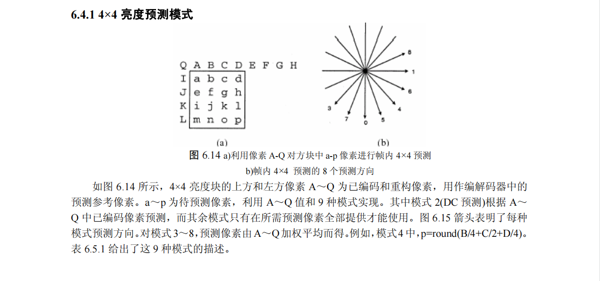
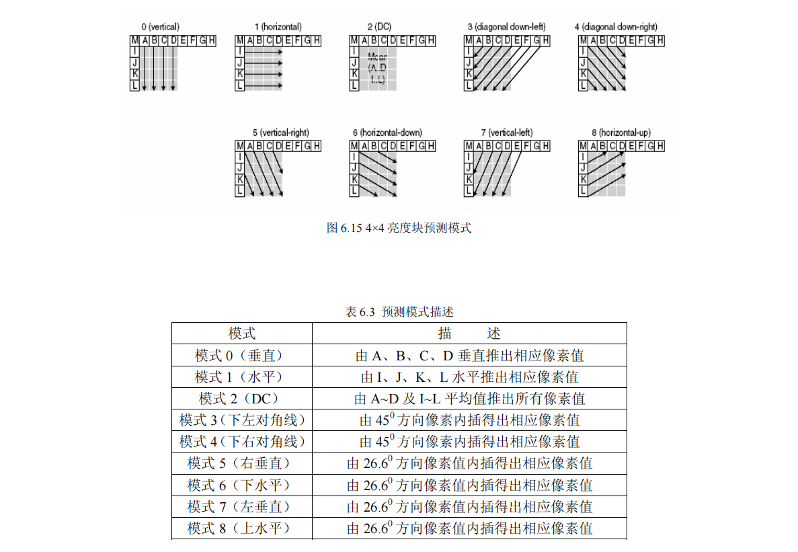
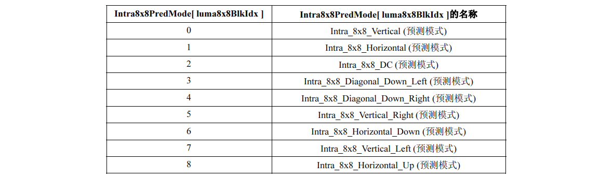
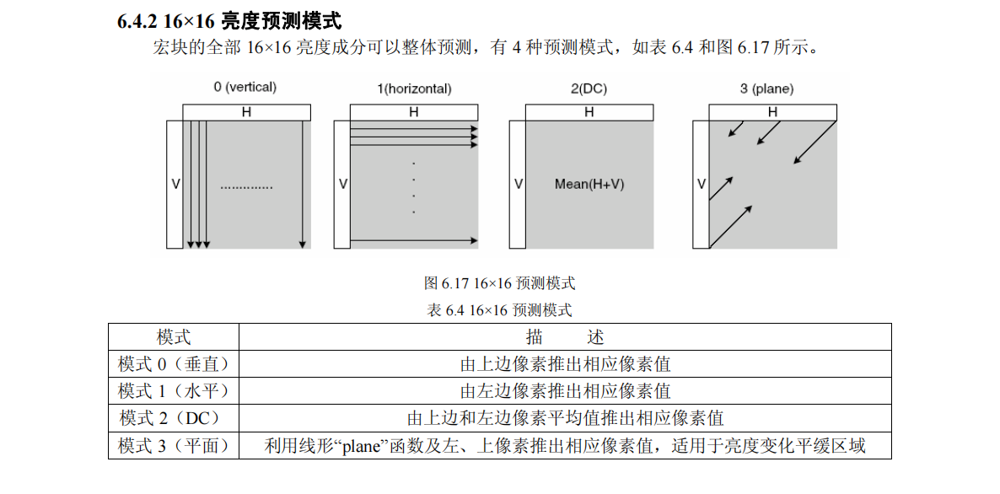
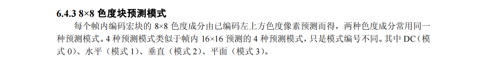
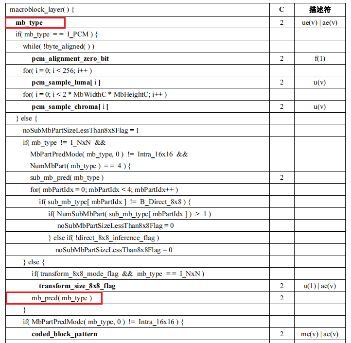
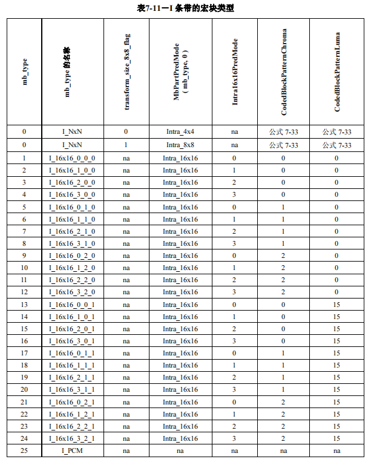
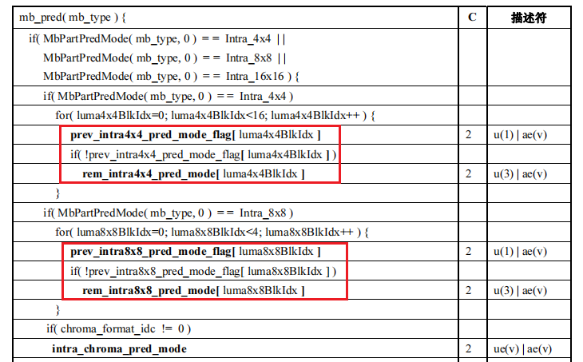
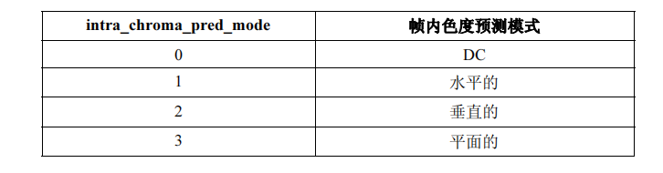

## 宏块分析函数

*这里引用雷神的“宏块分析（Analysis）部分的函数调用关系图”*


**由于作者使用的x264版本与雷神的不一致，所以函数名可能也有部分差异，例如部分函数在更新版本的x264中没有前面的“x264_”，但不影响上面那幅图的阅读**


## 宏块类型

我们知道，H.264是以16x16宏块为单位进行编码的，但16x16的宏块可以进行划分，形成多种尺寸，包括16x8、8x16、8x8、8x4、4x8、4x4等。

宏块包含多种类型，可以分为三大类型：

- **I宏块：I_16x16、I_8x8、I_4x4、I_PCM**
- P宏块：P_16x16、P_16x8、P_8x16、P_8x8、P_8x4、P_4x8、P_4x4、P_SKIP
- B宏块：B_16x16、B_16x8、B_8x16、B_8x8、B_8x4、B_4x8、B_4x4、B_SKIP、B_Direct

**其中IDR/I帧只允许包含I宏块、P帧允许包含P宏块也允许包含I宏块， B帧允许包含B宏块和I宏块**

一般而言，画面比较平坦的区域使用尺寸比较大的宏块进行编码，画面比较复杂的区域使用尺寸比较小的宏块进行编码


## 宏块类型分析

由于不同的宏块可以划分为多种不同的尺寸，宏块类型分析的目的就是**决定当前宏块以何种宏块类型进行编码**，是p16x16还是p8x8又或者其他......

宏块类型分析的大概流程遍历所有可能的宏块类型，选择最优的一个作为当前宏块的编码类型

**那么如何判断当前宏块是否是最优的呢？**

最优可以理解为编码损失“最小”，编码代价“最小”。 x264提供两种方式，**一种是SAD(Sum of Absolute Difference)即绝对误差和，另一种是SATD(Sum of Absolute Transformed Difference)即绝对误差经过hadamard变换后的和**，选择SAD/SATD最小的作为最优的宏块类型

> SAD就是将两个宏块按照位置进行像素相减，再将绝对值累加起来，这种方式仅反映残差时域差异，影响PSNR的值，不能有效反映码流的大小。
>
> SATD即将像素残差再经过hadamard变换后累加的绝对值，可以将其看作简单的时频变换，其值在一定程度上可以反映生成码流的大小。
>
> SATD对比SAD多了一步哈达玛变换，因此引入了额外的计算量，但由于能够反映频域的信息情况，因此能够决策出“更优”的方式
>
> 编码后的码流的大小是和图像块DCT变换后频域信息紧密相关的，而和变换前的时域信息关联性小一些；SAD只能反应时域信息，SATD却可以反映频域信息，而且Hadamard变换计算复杂度也低于DCT变换，因此是比较合适的模式选择的依据

具体使用SAD还是SATD，由编码参数i_subpel_refine决定，i_subpel_refine > 1使用SATD，否则使用SAD。


## 帧内编码基础知识介绍

帧内编码是利用图像空间上的高度相关性，编码当前宏块时可以通过周围已经编码重建后的像素推导出一个“虚假宏块”，然后只需传递给解码器当前宏块与“虚假宏块”的残差值即可。

对于16x16的亮度块有4种帧内预测模式，8x8和4x4的亮度块都有9种帧内预测模式；而色度块也拥有4种帧内预测模式，预测方向与16x16亮度的一样只是序号不太一样。








**毕老师那本H264书籍中是没有I_8x8的，I_8x8的帧内预测模式与I_4x4的一样**










### H264帧内预测模式解析

这里先抛出一个问题：**解码器如何知道当前Intra宏块的宏块类型以及帧内预测模式的？**

*(P帧的宏块类型的解析会在帧间编码章节介绍，这里就不重复介绍了)*

#### 宏块类型的解析

*我们先看一下h264宏块层的语法，主要关注红色框部分*




**每个宏块的都有一个mb_type用于标识当前宏块的类型**，下面是I Slice宏块对应Intra宏块的标号




上面已经介绍了，Intra宏块有I_16x16、I_8x8、I_4x4、I_PCM四种类型，但是这里竟然多达27种，中间多了很多I_16x16_x_x_x的类型，这是这么回事呢？

我个人认为是H264为了进一步压缩码率，单独将I_16x16分了多种类型。我们知道Intra_16x16的亮度帧内预测模式最高支持4种(DC、H、V、Plane四个方向的)，序号为0 ~ 3 ，一般而言我们是需要将当前宏块的帧内预测模式写进宏块层码流之中的（这需要占用到一定的比特数的)，但H264中为了节省这点比特将当前预测模式以及CBP统一放到mb_type当中了。

以上图的mb_type = 1,2,3,4的类型为例(暂时忽略CBP)，如果当前宏块是Intra_16x16的，且帧内预测模式的序号是1，则对应的mb_type就为2，这里不需要再将帧内预测模式写进码流中，解码器可以根据mb_type的值查表解析出当前宏块类型和帧内预测模式

> CBP，CodedBlockPattern的缩写。在h264中，将一个16x16块划分四个8x8的区域，如果某个8x8的区域变换量化后的值都为0的话，是可以不去传递全为“0”的残差值，但需要有一个标识，去表示某个8x8块的残差是否需要传递，解码端在解码时检测到此标识说明当前8x8块的残差为0，直接填充0即可。
>
> 这个标识就是CBP，CBP一共占6bits(YUV420的情况下)，分为两个部分，一个是亮度CBP占4bits(CBP的低4位)，一个是色度CBP占2bits(高2位)
>
> 如果某个16x16宏块的CBP是000100，解析得到cbp_chroma = 00，cbp_luma = 0100，说明码流中不存在当前色度块的残差，且不存在亮度块0，2，3的残差，但存在亮度块1的残差

 

#### 亮度帧内预测模式的解析

对于Intra16x16宏块预测模式的解析前面已经介绍了，直接根据mb_type查表即可，这里介绍Intra_8x8、Intra_4x4的

我们知道亮度Intra_8x8、Intra_4x4包含9种帧内预测模式，序号0~8，正常来说需要4bit才能表示9种模式2^4 = 16 > 9，如果当前是Intra_4x4的话，一个16x16宏块包含16个4x4宏块，每个4x4宏块都用4bit去存储当前预测模式的话，那将消耗16 * 4 = 64bit，这数据量无疑是比较大的，因此h264*另辟*蹊径。

*先看一张关乎预测模式的图片*




不管是Intra_4x4还是Intra_8x8，都会拥有**prev_intraXxX_pred_mode_flag**和**rem_intraXxX_pred_mode**， 4x4会有16个，8x8会有4个

对于Intra_4x4和Intra_8x8的宏块都有一个**预测帧内预测模式**，就是根据上方宏块的预测模式，和左方宏块的预测模式推导出一个值，此值就是预测帧内预测模式，下面是x264中获取预测帧内预测模式的代码

```c++
// x264源码 common/macroblock.h和common/predict.h
static const int8_t x264_mb_pred_mode4x4_fix[13] =
{
    -1,
    I_PRED_4x4_V,   I_PRED_4x4_H,   I_PRED_4x4_DC,
    I_PRED_4x4_DDL, I_PRED_4x4_DDR, I_PRED_4x4_VR,
    I_PRED_4x4_HD,  I_PRED_4x4_VL,  I_PRED_4x4_HU,
    I_PRED_4x4_DC,  I_PRED_4x4_DC,  I_PRED_4x4_DC
};
#define x264_mb_pred_mode4x4_fix(t) x264_mb_pred_mode4x4_fix[(t)+1]

// 获取Intra4x4块的预测帧内预测模式
static ALWAYS_INLINE int x264_mb_predict_intra4x4_mode( x264_t *h, int idx )
{
    // 左方宏块的帧内预测模式
    const int ma = h->mb.cache.intra4x4_pred_mode[x264_scan8[idx] - 1];
    // 上方宏块的帧内预测模式
    const int mb = h->mb.cache.intra4x4_pred_mode[x264_scan8[idx] - 8];
    // 根据左方、上方的预测模式获取预测帧内预测模式(两者取最小的一个)
    const int m  = X264_MIN( x264_mb_pred_mode4x4_fix(ma),
                             x264_mb_pred_mode4x4_fix(mb) );

    if( m < 0 ) // 如果左方宏块或者上方宏块是无效宏块，得到的m会小于0，此时直接将I_PRED_4x4_DC作为当前宏块的预测帧内预测模式
        return I_PRED_4x4_DC;
    
    return m;
}
```

prev_intraXxX_pred_mode_flag为true时，表示**不需要**额外传递当前宏块的帧内预测模式(即预测帧内预测模式等于实际的帧内预测模式)

prev_intraXxX_pred_mode_flag为false时，表示**需要**额外传递当前宏块的帧内预测模式，具体的值写在rem_intraXxX_pred_mode里面

**假设当前4x4宏块的实际帧内预测模式是x，预测帧内预测模式是y**

- 如果x == y时，即真正的帧内预测模式等于预测帧内预测模式，此时将prev_intra4x4_pred_mode_flag[i]设为1即可，不再需要传递rem_intra4x4_pred_mod的值； 解码端在解析时发现prev_intra4x4_pred_mode_flag[i]为1，可以直接根据上方、左方宏块的预测模式推导出当前宏块的帧内预测模式
- 如果x != y时，需要真正传递帧内预测模式，将prev_intra4x4_pred_mode_flag[i]置为0。如果x < y时，rem_intra4x4_pred_mode[i] = x，如果 x > y时rem_intra4x4_pred_mode[i] = x - 1

仔细看x != y 的情况，这种设计比较巧妙：

```c++
// 编码伪代码
if( x < y)
    rem_intraXxX_pred_mode[i] = x;
else
    rem_intraXxX_pred_mode[i] = x - 1;
```

我们知道Intra_4x4帧内预测模式的序号是0~8的，所以x，y的范围也是0~8。对于x < y的情况下，x的最大值是7，此时可以用3bit去表示当前的预测模式了；如果x > y的话，x的范围是[y+1，8]，那么rem_intra4x4_pred_mode的值可以设置为x-1，rem_intra4x4_pred_mode的范围就是[y， 7]， 此时也可以用3bit去表示了；

**在解码时**，我们需要获取当前4x4的真实帧内预测模式x(未知数)，首先根据上方、左方宏块的预测模式得到预测帧内预测模式y，然后获取prev_intra4x4_pred_mode_flag、rem_intra4x4_pred_mode的值。如果prev_intra4x4_pred_mode_flag为1，那么x = y(解析完成)； 如果prev_intra4x4_pred_mode_flag为0，如果rem_intra4x4_pred_mode < y，那么x = rem_intra4x4_pred_mode， 否则 x = rem_intra4x4_pred_mode + 1

```c++
// 解码伪代码
int x; // 待获取的当前4x4宏块的帧内预测模式(是个未知数)
int y = X264_MIN(ma,mb); // 获取预测帧内预测模式
int prev_intra4x4_pred_mode_flag = read(); // 从码流中获取prev_intra4x4_pred_mode_flag的值
if(prev_intra4x4_pred_mode_flag == 1) {
    x = y;
} else {
	int rem_intra4x4_pred_mode = read();  // 从码流中获取rem_intra4x4_pred_mode的值
    if(rem_intra4x4_pred_mode < y)
        x = rem_intra4x4_pred_mode;
    else
        x = rem_intra4x4_pred_mode + 1;
}
```


当实际预测模式等于预测帧内预测模式时，只需要1bit就能表示出来(prev_intra4x4_pred_mode_flag)，不相等时需要4bit来表示(prev_intra4x4_pred_mode_flag的1bit + rem_intra4x4_pred_mode的3bit)。 如果没有这种“方法”，不管实际预测模式是否等于预测帧内预测模式都需要4bit来表示 ，这样对比下来确实能省下不少比特占用


#### 色度帧内预测模式

由于色度帧内预测模式只有4种，序号0~3，直接写进码流种，见宏块预测语法中的*intra_chroma_pred_mode*, 下图是色度预测模式对应的序号




## 源码分析

在每编码一块宏块前都会调用x264_macroblock_analyse函数，对当前宏块进行分析，决定当前宏块以何种类型进行编码以及帧内预测模式等。

此函数在slice_write中被调用

```c++
/* 宏块分析，函数位置encoder/encoder.c*/
void x264_macroblock_analyse( x264_t *h )
{
    x264_mb_analysis_t analysis;
    int i_cost = COST_MAX;
	// 获取当前宏块的QP
    h->mb.i_qp = x264_ratecontrol_mb_qp( h );
    /* If the QP of this MB is within 1 of the previous MB, code the same QP as the previous MB,
     * to lower the bit cost of the qp_delta.  Don't do this if QPRD is enabled. */
    if( h->param.rc.i_aq_mode && h->param.analyse.i_subpel_refine < 10 )
        h->mb.i_qp = abs(h->mb.i_qp - h->mb.i_last_qp) == 1 ? h->mb.i_last_qp : h->mb.i_qp;

    if( h->param.analyse.b_mb_info )
        h->fdec->effective_qp[h->mb.i_mb_xy] = h->mb.i_qp; /* Store the real analysis QP. */
    /*
     	初始化相关的工作，如果开启“帧级多线程”的话，可能会在此函数阻塞(详细参考“x264多线程”章节)
    */
    mb_analyse_init( h, &analysis, h->mb.i_qp );

    /*--------------------------- Do the analysis ---------------------------*/
    if( h->sh.i_type == SLICE_TYPE_I )
    {
        // 如果当前帧的IDR/I帧，由于IDR/I帧只允许包含I宏块，因此只需分析I宏块的类型
intra_analysis:
        if( analysis.i_mbrd )
            mb_init_fenc_cache( h, analysis.i_mbrd >= 2 );
        // 计算不同I宏块类型的编码代价
        mb_analyse_intra( h, &analysis, COST_MAX );
        if( analysis.i_mbrd )
            intra_rd( h, &analysis, COST_MAX );
		// i_satd_i16x16是以I_16x16类型的编码代价，保存到i_cost
        i_cost = analysis.i_satd_i16x16;
        // 宏块类型设置为I_16X16
        h->mb.i_type = I_16x16;
        /*
        	COPY2_IF_LT是一个宏定义，展开:
        	#define COPY2_IF_LT(x,y,a,b)\
                if( (y) < (x) )\
                {\
                    (x) = (y);\
                    (a) = (b);\
                }
        */
        // 如果i_satd_i4x4 < i_cost，则i_cost设置为i_satd_i4x4，宏块类型设置为I_4x4
        COPY2_IF_LT( i_cost, analysis.i_satd_i4x4, h->mb.i_type, I_4x4 );
        // 如果i_satd_i8x8 < i_cost，则i_cost设置为i_satd_i8x8，宏块类型设置为I_8x8
        COPY2_IF_LT( i_cost, analysis.i_satd_i8x8, h->mb.i_type, I_8x8 );
        if( analysis.i_satd_pcm < i_cost )
            h->mb.i_type = I_PCM;

        else if( analysis.i_mbrd >= 2 )
            intra_rd_refine( h, &analysis );
    }
    else if( h->sh.i_type == SLICE_TYPE_P )
    {
        int b_skip = 0;

        h->mc.prefetch_ref( h->mb.pic.p_fref[0][0][h->mb.i_mb_x&3], h->mb.pic.i_stride[0], 0 );

        analysis.b_try_skip = 0;
        if( analysis.b_force_intra )
        {
            if( !h->param.analyse.b_psy )
            {
                mb_analyse_init_qp( h, &analysis, X264_MAX( h->mb.i_qp - h->mb.ip_offset, h->param.rc.i_qp_min ) );
                goto intra_analysis;
            }
        }
        else
        {
            /* Special fast-skip logic using information from mb_info. */
            // 如果存在mb_info，一定条件下可以确定当前宏块类型为P_SKIP，提前终止后续其他类型的分析，节省时间
            if( h->fdec->mb_info && (h->fdec->mb_info[h->mb.i_mb_xy]&X264_MBINFO_CONSTANT) )
            {
                if( !SLICE_MBAFF && (h->fdec->i_frame - h->fref[0][0]->i_frame) == 1 && !h->sh.b_weighted_pred &&
                    h->fref[0][0]->effective_qp[h->mb.i_mb_xy] <= h->mb.i_qp )
                {
                    h->mb.i_partition = D_16x16;
                    /* Use the P-SKIP MV if we can... */
                    if( !M32(h->mb.cache.pskip_mv) )
                    {
                        b_skip = 1;
                        h->mb.i_type = P_SKIP;
                    }
                    /* Otherwise, just force a 16x16 block. */
                    else
                    {
                        h->mb.i_type = P_L0;
                        analysis.l0.me16x16.i_ref = 0;
                        M32( analysis.l0.me16x16.mv ) = 0;
                    }
                    goto skip_analysis;
                }
                /* Reset the information accordingly */
                else if( h->param.analyse.b_mb_info_update )
                    h->fdec->mb_info[h->mb.i_mb_xy] &= ~X264_MBINFO_CONSTANT;
            }

            int skip_invalid = h->i_thread_frames > 1 && h->mb.cache.pskip_mv[1] > h->mb.mv_max_spel[1];
            /* If the current macroblock is off the frame, just skip it. */
            if( HAVE_INTERLACED && !MB_INTERLACED && h->mb.i_mb_y * 16 >= h->param.i_height && !skip_invalid )
                b_skip = 1;
            /* Fast P_SKIP detection */
            else if( h->param.analyse.b_fast_pskip )
            {
                if( skip_invalid )
                    // FIXME don't need to check this if the reference frame is done
                    {}
                else if( h->param.analyse.i_subpel_refine >= 3 )
                    analysis.b_try_skip = 1;
                else if( h->mb.i_mb_type_left[0] == P_SKIP ||
                         h->mb.i_mb_type_top == P_SKIP ||
                         h->mb.i_mb_type_topleft == P_SKIP ||
                         h->mb.i_mb_type_topright == P_SKIP )
                    b_skip = x264_macroblock_probe_pskip( h );  // 如果周围宏块存在P_SKIP宏块，可以提前当前宏块是否可以是SKIP类型
            }
        }

        h->mc.prefetch_ref( h->mb.pic.p_fref[0][0][h->mb.i_mb_x&3], h->mb.pic.i_stride[0], 1 );

        if( b_skip )
        {
            // 如果当前宏块是PSKIP类型，设置宏块类型，mv等信息，无需进行其他宏块类型的分析，提前终止宏块分析过程，节省时间
            h->mb.i_type = P_SKIP;
            h->mb.i_partition = D_16x16;
            assert( h->mb.cache.pskip_mv[1] <= h->mb.mv_max_spel[1] || h->i_thread_frames == 1 );
skip_analysis:
            /* Set up MVs for future predictors */
            for( int i = 0; i < h->mb.pic.i_fref[0]; i++ )
                M32( h->mb.mvr[0][i][h->mb.i_mb_xy] ) = 0;
        }
        else
        {
            /*
            	获取当前支持的inter partitions，h->param.analyse.inter
            	x264提供了不同编码速度的档次，一些速度较快的档次会限制inter的值，只分析部分宏块类型，从而节省时间
            	例如inter = X264_ANALYSE_I4x4 | X264_ANALYSE_I8x8 | X264_ANALYSE_PSUB16x16时，P/B帧的宏块只会分析I_16x16 、I_8x8、
            	I_4X4、P_16x8、P_8x16、P_8x8几种类型，不会分析p4x8、p8x4、p4x4等
            	
            	下面是相关的宏定义(I16X16、p16x16、b16x16一定是要有的，不需要额外通过宏指定)：
      			#define X264_ANALYSE_I4x4       0x0001  // Analyse i4x4
                #define X264_ANALYSE_I8x8       0x0002  // Analyse i8x8 (requires 8x8 transform)
            	#define X264_ANALYSE_PSUB16x16  0x0010  // Analyse p16x8, p8x16 and p8x8
            	#define X264_ANALYSE_PSUB8x8    0x0020  // Analyse p8x4, p4x8, p4x4
            	#define X264_ANALYSE_BSUB16x16  0x0100  // Analyse b16x8, b8x16 and b8x8
            */
            const unsigned int flags = h->param.analyse.inter;
            int i_type;
            int i_partition;
            int i_satd_inter, i_satd_intra;
			// 初始化
            mb_analyse_load_costs( h, &analysis );
            // P16x16 帧间预测宏块分析
            mb_analyse_inter_p16x16( h, &analysis );

            if( h->mb.i_type == P_SKIP )
            {
                // 如果mb_analyse_inter_p16x16分析出来当前类型是P_SKIP，可以直接return提前中止
                for( int i = 1; i < h->mb.pic.i_fref[0]; i++ )
                    M32( h->mb.mvr[0][i][h->mb.i_mb_xy] ) = 0;
                return;
            }
			
            // 判断inter是否支持X264_ANALYSE_PSUB16x16
            if( flags & X264_ANALYSE_PSUB16x16 )
            {
                // 如果支持先进行p8x8 帧间宏块分析
                if( h->param.analyse.b_mixed_references )
                    mb_analyse_inter_p8x8_mixed_ref( h, &analysis );
                else
                    mb_analyse_inter_p8x8( h, &analysis );
            }

            /* Select best inter mode */
            i_type = P_L0;
            i_partition = D_16x16;
            i_cost = analysis.l0.me16x16.cost; // p16x16的代价me16x16.cost

            if( ( flags & X264_ANALYSE_PSUB16x16 ) && (!analysis.b_early_terminate ||
                analysis.l0.i_cost8x8 < analysis.l0.me16x16.cost) )
            {
                // 如果p8x8的代价更低，更新i_type，i_partition，i_cost
                i_type = P_8x8;
                i_partition = D_8x8;
                i_cost = analysis.l0.i_cost8x8;

                /* Do sub 8x8 */
                // 判断inter是否支持X264_ANALYSE_PSUB8x8(p8x4, p4x8, p4x4)
                if( flags & X264_ANALYSE_PSUB8x8 )
                {
                    for( int i = 0; i < 4; i++ )
                    {
                        // p4x4 帧间宏块分析
                        mb_analyse_inter_p4x4( h, &analysis, i );
                        int i_thresh8x4 = analysis.l0.me4x4[i][1].cost_mv + analysis.l0.me4x4[i][2].cost_mv;
                        if( !analysis.b_early_terminate || analysis.l0.i_cost4x4[i] < analysis.l0.me8x8[i].cost + i_thresh8x4 )
                        {
                            int i_cost8x8 = analysis.l0.i_cost4x4[i];
                            h->mb.i_sub_partition[i] = D_L0_4x4;
							// p8x4间宏块分析
                            mb_analyse_inter_p8x4( h, &analysis, i );
                            // cost比较
                            COPY2_IF_LT( i_cost8x8, analysis.l0.i_cost8x4[i],
                                         h->mb.i_sub_partition[i], D_L0_8x4 );
                            // p4x8帧间宏块分析
                            mb_analyse_inter_p4x8( h, &analysis, i );
                            // cost比较
                            COPY2_IF_LT( i_cost8x8, analysis.l0.i_cost4x8[i],
                                         h->mb.i_sub_partition[i], D_L0_4x8 );

                            i_cost += i_cost8x8 - analysis.l0.me8x8[i].cost;
                        }
                        mb_cache_mv_p8x8( h, &analysis, i );
                    }
                    /* 
                    	icost为p8x8、p8x4、p4x8、p4x4中代价最小的值，这里不再区分出i_cost8x4/i_cost4x8/i_cost4x4
                    	因为p8x4/p4x8/p4x4都属于子宏块
                    */
                    analysis.l0.i_cost8x8 = i_cost;
                }
            }

            /* Now do 16x8/8x16 */
            int i_thresh16x8 = analysis.l0.me8x8[1].cost_mv + analysis.l0.me8x8[2].cost_mv;
            if( ( flags & X264_ANALYSE_PSUB16x16 ) && (!analysis.b_early_terminate ||
                analysis.l0.i_cost8x8 < analysis.l0.me16x16.cost + i_thresh16x8) )
            {
            	// 如果p8x8的cost小于p16x16，再进行p16x8、p8x16的宏块分析，筛选出cost最小的一个
                int i_avg_mv_ref_cost = (analysis.l0.me8x8[2].cost_mv + analysis.l0.me8x8[2].i_ref_cost
                                      + analysis.l0.me8x8[3].cost_mv + analysis.l0.me8x8[3].i_ref_cost + 1) >> 1;
                analysis.i_cost_est16x8[1] = analysis.i_satd8x8[0][2] + analysis.i_satd8x8[0][3] + i_avg_mv_ref_cost;
				// p16x8帧间宏块分析
                mb_analyse_inter_p16x8( h, &analysis, i_cost );
                // cost比较
                COPY3_IF_LT( i_cost, analysis.l0.i_cost16x8, i_type, P_L0, i_partition, D_16x8 );

                i_avg_mv_ref_cost = (analysis.l0.me8x8[1].cost_mv + analysis.l0.me8x8[1].i_ref_cost
                                  + analysis.l0.me8x8[3].cost_mv + analysis.l0.me8x8[3].i_ref_cost + 1) >> 1;
                analysis.i_cost_est8x16[1] = analysis.i_satd8x8[0][1] + analysis.i_satd8x8[0][3] + i_avg_mv_ref_cost;
				// p8x16帧间宏块分析
                mb_analyse_inter_p8x16( h, &analysis, i_cost );
                // cost比较
                COPY3_IF_LT( i_cost, analysis.l0.i_cost8x16, i_type, P_L0, i_partition, D_8x16 );
            }

            h->mb.i_partition = i_partition;

            /* refine qpel */
            //FIXME mb_type costs?
            // 确定宏块类型的基础上，进行x264_me_refine_qpel亚像素运动搜索
            if( analysis.i_mbrd || !h->mb.i_subpel_refine )
            {
                /* refine later */
            }
            else if( i_partition == D_16x16 )
            {
                x264_me_refine_qpel( h, &analysis.l0.me16x16 );
                i_cost = analysis.l0.me16x16.cost;
            }
            else if( i_partition == D_16x8 )
            {
                x264_me_refine_qpel( h, &analysis.l0.me16x8[0] );
                x264_me_refine_qpel( h, &analysis.l0.me16x8[1] );
                i_cost = analysis.l0.me16x8[0].cost + analysis.l0.me16x8[1].cost;
            }
            else if( i_partition == D_8x16 )
            {
                x264_me_refine_qpel( h, &analysis.l0.me8x16[0] );
                x264_me_refine_qpel( h, &analysis.l0.me8x16[1] );
                i_cost = analysis.l0.me8x16[0].cost + analysis.l0.me8x16[1].cost;
            }
            else if( i_partition == D_8x8 )
            {
                i_cost = 0;
                for( int i8x8 = 0; i8x8 < 4; i8x8++ )
                {
                    switch( h->mb.i_sub_partition[i8x8] )
                    {
                        case D_L0_8x8:
                            x264_me_refine_qpel( h, &analysis.l0.me8x8[i8x8] );
                            i_cost += analysis.l0.me8x8[i8x8].cost;
                            break;
                        case D_L0_8x4:
                            x264_me_refine_qpel( h, &analysis.l0.me8x4[i8x8][0] );
                            x264_me_refine_qpel( h, &analysis.l0.me8x4[i8x8][1] );
                            i_cost += analysis.l0.me8x4[i8x8][0].cost +
                                      analysis.l0.me8x4[i8x8][1].cost;
                            break;
                        case D_L0_4x8:
                            x264_me_refine_qpel( h, &analysis.l0.me4x8[i8x8][0] );
                            x264_me_refine_qpel( h, &analysis.l0.me4x8[i8x8][1] );
                            i_cost += analysis.l0.me4x8[i8x8][0].cost +
                                      analysis.l0.me4x8[i8x8][1].cost;
                            break;

                        case D_L0_4x4:
                            x264_me_refine_qpel( h, &analysis.l0.me4x4[i8x8][0] );
                            x264_me_refine_qpel( h, &analysis.l0.me4x4[i8x8][1] );
                            x264_me_refine_qpel( h, &analysis.l0.me4x4[i8x8][2] );
                            x264_me_refine_qpel( h, &analysis.l0.me4x4[i8x8][3] );
                            i_cost += analysis.l0.me4x4[i8x8][0].cost +
                                      analysis.l0.me4x4[i8x8][1].cost +
                                      analysis.l0.me4x4[i8x8][2].cost +
                                      analysis.l0.me4x4[i8x8][3].cost;
                            break;
                        default:
                            x264_log( h, X264_LOG_ERROR, "internal error (!8x8 && !4x4)\n" );
                            break;
                    }
                }
            }

            if( h->mb.b_chroma_me )
            {
                // 如果开启了色度块的帧内宏块分析则对亮度、色度块都进行分析
                if( CHROMA444 )
                {
                    mb_analyse_intra( h, &analysis, i_cost );
                    mb_analyse_intra_chroma( h, &analysis );
                }
                else
                {
                    mb_analyse_intra_chroma( h, &analysis );
                    mb_analyse_intra( h, &analysis, i_cost - analysis.i_satd_chroma );
                }
                analysis.i_satd_i16x16 += analysis.i_satd_chroma;
                analysis.i_satd_i8x8   += analysis.i_satd_chroma;
                analysis.i_satd_i4x4   += analysis.i_satd_chroma;
            }
            else
                mb_analyse_intra( h, &analysis, i_cost ); // 帧内宏块分析(包含i16x16、i8x8、i4x4)

            i_satd_inter = i_cost;
            i_satd_intra = X264_MIN3( analysis.i_satd_i16x16,
                                      analysis.i_satd_i8x8,
                                      analysis.i_satd_i4x4 ); // 选择代价最小的帧内编码代价

            if( analysis.i_mbrd )
            {
                mb_analyse_p_rd( h, &analysis, X264_MIN(i_satd_inter, i_satd_intra) );
                i_type = P_L0;
                i_partition = D_16x16;
                i_cost = analysis.l0.i_rd16x16;
                COPY2_IF_LT( i_cost, analysis.l0.i_cost16x8, i_partition, D_16x8 );
                COPY2_IF_LT( i_cost, analysis.l0.i_cost8x16, i_partition, D_8x16 );
                COPY3_IF_LT( i_cost, analysis.l0.i_cost8x8, i_partition, D_8x8, i_type, P_8x8 );
                h->mb.i_type = i_type;
                h->mb.i_partition = i_partition;
                if( i_cost < COST_MAX )
                    mb_analyse_transform_rd( h, &analysis, &i_satd_inter, &i_cost );
                intra_rd( h, &analysis, i_satd_inter * 5/4 + 1 );
            }
			/*
            	与上述p宏块的最小代价进行对比，决策出当前宏块最合适的宏块类型和i_cost
            	注意上文有说到P帧的宏块可以包含P宏块和I宏块，所以需要对帧内、帧间的宏块都进行分析
            	而I帧只允许包含I宏块，所以只需要进行帧间宏块分析
          	*/
            COPY2_IF_LT( i_cost, analysis.i_satd_i16x16, i_type, I_16x16 );
            COPY2_IF_LT( i_cost, analysis.i_satd_i8x8, i_type, I_8x8 );
            COPY2_IF_LT( i_cost, analysis.i_satd_i4x4, i_type, I_4x4 );
            COPY2_IF_LT( i_cost, analysis.i_satd_pcm, i_type, I_PCM );

            h->mb.i_type = i_type;
			
            // 一些收尾工作，包括保存宏块信息，RD优化等
            if( analysis.b_force_intra && !IS_INTRA(i_type) )
            {
                /* Intra masking: copy fdec to fenc and re-encode the block as intra in order to make it appear as if
                 * it was an inter block. */
                analyse_update_cache( h, &analysis );
                x264_macroblock_encode( h );
                for( int p = 0; p < (CHROMA444 ? 3 : 1); p++ )
                    h->mc.copy[PIXEL_16x16]( h->mb.pic.p_fenc[p], FENC_STRIDE, h->mb.pic.p_fdec[p], FDEC_STRIDE, 16 );
                if( !CHROMA444 )
                {
                    int height = 16 >> CHROMA_V_SHIFT;
                    h->mc.copy[PIXEL_8x8]  ( h->mb.pic.p_fenc[1], FENC_STRIDE, h->mb.pic.p_fdec[1], FDEC_STRIDE, height );
                    h->mc.copy[PIXEL_8x8]  ( h->mb.pic.p_fenc[2], FENC_STRIDE, h->mb.pic.p_fdec[2], FDEC_STRIDE, height );
                }
                mb_analyse_init_qp( h, &analysis, X264_MAX( h->mb.i_qp - h->mb.ip_offset, h->param.rc.i_qp_min ) );
                goto intra_analysis;
            }
	
            if( analysis.i_mbrd >= 2 && h->mb.i_type != I_PCM )
            {
                if( IS_INTRA( h->mb.i_type ) )
                {
                    intra_rd_refine( h, &analysis );
                }
                else if( i_partition == D_16x16 )
                {
                    x264_macroblock_cache_ref( h, 0, 0, 4, 4, 0, analysis.l0.me16x16.i_ref );
                    analysis.l0.me16x16.cost = i_cost;
                    x264_me_refine_qpel_rd( h, &analysis.l0.me16x16, analysis.i_lambda2, 0, 0 );
                }
                else if( i_partition == D_16x8 )
                {
                    M32( h->mb.i_sub_partition ) = D_L0_8x8 * 0x01010101;
                    x264_macroblock_cache_ref( h, 0, 0, 4, 2, 0, analysis.l0.me16x8[0].i_ref );
                    x264_macroblock_cache_ref( h, 0, 2, 4, 2, 0, analysis.l0.me16x8[1].i_ref );
                    x264_me_refine_qpel_rd( h, &analysis.l0.me16x8[0], analysis.i_lambda2, 0, 0 );
                    x264_me_refine_qpel_rd( h, &analysis.l0.me16x8[1], analysis.i_lambda2, 8, 0 );
                }
                else if( i_partition == D_8x16 )
                {
                    M32( h->mb.i_sub_partition ) = D_L0_8x8 * 0x01010101;
                    x264_macroblock_cache_ref( h, 0, 0, 2, 4, 0, analysis.l0.me8x16[0].i_ref );
                    x264_macroblock_cache_ref( h, 2, 0, 2, 4, 0, analysis.l0.me8x16[1].i_ref );
                    x264_me_refine_qpel_rd( h, &analysis.l0.me8x16[0], analysis.i_lambda2, 0, 0 );
                    x264_me_refine_qpel_rd( h, &analysis.l0.me8x16[1], analysis.i_lambda2, 4, 0 );
                }
                else if( i_partition == D_8x8 )
                {
                    analyse_update_cache( h, &analysis );
                    for( int i8x8 = 0; i8x8 < 4; i8x8++ )
                    {
                        if( h->mb.i_sub_partition[i8x8] == D_L0_8x8 )
                        {
                            x264_me_refine_qpel_rd( h, &analysis.l0.me8x8[i8x8], analysis.i_lambda2, i8x8*4, 0 );
                        }
                        else if( h->mb.i_sub_partition[i8x8] == D_L0_8x4 )
                        {
                            x264_me_refine_qpel_rd( h, &analysis.l0.me8x4[i8x8][0], analysis.i_lambda2, i8x8*4+0, 0 );
                            x264_me_refine_qpel_rd( h, &analysis.l0.me8x4[i8x8][1], analysis.i_lambda2, i8x8*4+2, 0 );
                        }
                        else if( h->mb.i_sub_partition[i8x8] == D_L0_4x8 )
                        {
                            x264_me_refine_qpel_rd( h, &analysis.l0.me4x8[i8x8][0], analysis.i_lambda2, i8x8*4+0, 0 );
                            x264_me_refine_qpel_rd( h, &analysis.l0.me4x8[i8x8][1], analysis.i_lambda2, i8x8*4+1, 0 );
                        }
                        else if( h->mb.i_sub_partition[i8x8] == D_L0_4x4 )
                        {
                            x264_me_refine_qpel_rd( h, &analysis.l0.me4x4[i8x8][0], analysis.i_lambda2, i8x8*4+0, 0 );
                            x264_me_refine_qpel_rd( h, &analysis.l0.me4x4[i8x8][1], analysis.i_lambda2, i8x8*4+1, 0 );
                            x264_me_refine_qpel_rd( h, &analysis.l0.me4x4[i8x8][2], analysis.i_lambda2, i8x8*4+2, 0 );
                            x264_me_refine_qpel_rd( h, &analysis.l0.me4x4[i8x8][3], analysis.i_lambda2, i8x8*4+3, 0 );
                        }
                    }
                }
            }
        }
    }
    else if( h->sh.i_type == SLICE_TYPE_B )
    {
        // B Slice的宏块分析，大致流程与P Slice的类似
        int i_bskip_cost = COST_MAX;
        int b_skip = 0;

        if( analysis.i_mbrd )
            mb_init_fenc_cache( h, analysis.i_mbrd >= 2 );

        h->mb.i_type = B_SKIP;
        if( h->mb.b_direct_auto_write )
        {
            /* direct=auto heuristic: prefer whichever mode allows more Skip macroblocks */
            for( int i = 0; i < 2; i++ )
            {
                int b_changed = 1;
                h->sh.b_direct_spatial_mv_pred ^= 1;
                analysis.b_direct_available = x264_mb_predict_mv_direct16x16( h, i && analysis.b_direct_available ? &b_changed : NULL );
                if( analysis.b_direct_available )
                {
                    if( b_changed )
                    {
                        x264_mb_mc( h );
                        b_skip = x264_macroblock_probe_bskip( h );
                    }
                    h->stat.frame.i_direct_score[ h->sh.b_direct_spatial_mv_pred ] += b_skip;
                }
                else
                    b_skip = 0;
            }
        }
        else
            analysis.b_direct_available = x264_mb_predict_mv_direct16x16( h, NULL );

        analysis.b_try_skip = 0;
        if( analysis.b_direct_available )
        {
            if( !h->mb.b_direct_auto_write )
                x264_mb_mc( h );
            /* If the current macroblock is off the frame, just skip it. */
            if( HAVE_INTERLACED && !MB_INTERLACED && h->mb.i_mb_y * 16 >= h->param.i_height )
                b_skip = 1;
            else if( analysis.i_mbrd )
            {
                i_bskip_cost = ssd_mb( h );
                /* 6 = minimum cavlc cost of a non-skipped MB */
                b_skip = h->mb.b_skip_mc = i_bskip_cost <= ((6 * analysis.i_lambda2 + 128) >> 8);
            }
            else if( !h->mb.b_direct_auto_write )
            {
                /* Conditioning the probe on neighboring block types
                 * doesn't seem to help speed or quality. */
                analysis.b_try_skip = x264_macroblock_probe_bskip( h );  // B_SKIP探测
                if( h->param.analyse.i_subpel_refine < 3 )
                    b_skip = analysis.b_try_skip;
            }
            /* Set up MVs for future predictors */
            if( b_skip )
            {
                for( int i = 0; i < h->mb.pic.i_fref[0]; i++ )
                    M32( h->mb.mvr[0][i][h->mb.i_mb_xy] ) = 0;
                for( int i = 0; i < h->mb.pic.i_fref[1]; i++ )
                    M32( h->mb.mvr[1][i][h->mb.i_mb_xy] ) = 0;
            }
        }

        if( !b_skip )
        {
            const unsigned int flags = h->param.analyse.inter;
            int i_type;
            int i_partition;
            int i_satd_inter;
            h->mb.b_skip_mc = 0;
            h->mb.i_type = B_DIRECT;
			// 初始化
            mb_analyse_load_costs( h, &analysis );

            /* select best inter mode */
            /* direct must be first */
            if( analysis.b_direct_available )
                mb_analyse_inter_direct( h, &analysis );
			
            // B16x16帧间宏块分析
            mb_analyse_inter_b16x16( h, &analysis );

            if( h->mb.i_type == B_SKIP )
            {
                for( int i = 1; i < h->mb.pic.i_fref[0]; i++ )
                    M32( h->mb.mvr[0][i][h->mb.i_mb_xy] ) = 0;
                for( int i = 1; i < h->mb.pic.i_fref[1]; i++ )
                    M32( h->mb.mvr[1][i][h->mb.i_mb_xy] ) = 0;
                return;
            }

            i_type = B_L0_L0;
            i_partition = D_16x16;
            i_cost = analysis.l0.me16x16.cost;
            COPY2_IF_LT( i_cost, analysis.l1.me16x16.cost, i_type, B_L1_L1 );
            COPY2_IF_LT( i_cost, analysis.i_cost16x16bi, i_type, B_BI_BI );
            COPY2_IF_LT( i_cost, analysis.i_cost16x16direct, i_type, B_DIRECT );

            if( analysis.i_mbrd && analysis.b_early_terminate && analysis.i_cost16x16direct <= i_cost * 33/32 )
            {
                mb_analyse_b_rd( h, &analysis, i_cost );
                if( i_bskip_cost < analysis.i_rd16x16direct &&
                    i_bskip_cost < analysis.i_rd16x16bi &&
                    i_bskip_cost < analysis.l0.i_rd16x16 &&
                    i_bskip_cost < analysis.l1.i_rd16x16 )
                {
                    h->mb.i_type = B_SKIP;
                    analyse_update_cache( h, &analysis );
                    return;
                }
            }

            if( flags & X264_ANALYSE_BSUB16x16 )
            {
                // B8x8帧间宏块分析
                if( h->param.analyse.b_mixed_references )
                    mb_analyse_inter_b8x8_mixed_ref( h, &analysis );
                else
                    mb_analyse_inter_b8x8( h, &analysis );

                COPY3_IF_LT( i_cost, analysis.i_cost8x8bi, i_type, B_8x8, i_partition, D_8x8 );

                /* Try to estimate the cost of b16x8/b8x16 based on the satd scores of the b8x8 modes */
                int i_cost_est16x8bi_total = 0, i_cost_est8x16bi_total = 0;
                int i_mb_type, i_partition16x8[2], i_partition8x16[2];
                for( int i = 0; i < 2; i++ )
                {
                    int avg_l0_mv_ref_cost, avg_l1_mv_ref_cost;
                    int i_l0_satd, i_l1_satd, i_bi_satd, i_best_cost;
                    // 16x8
                    i_best_cost = COST_MAX;
                    i_l0_satd = analysis.i_satd8x8[0][i*2] + analysis.i_satd8x8[0][i*2+1];
                    i_l1_satd = analysis.i_satd8x8[1][i*2] + analysis.i_satd8x8[1][i*2+1];
                    i_bi_satd = analysis.i_satd8x8[2][i*2] + analysis.i_satd8x8[2][i*2+1];
                    avg_l0_mv_ref_cost = ( analysis.l0.me8x8[i*2].cost_mv + analysis.l0.me8x8[i*2].i_ref_cost
                                         + analysis.l0.me8x8[i*2+1].cost_mv + analysis.l0.me8x8[i*2+1].i_ref_cost + 1 ) >> 1;
                    avg_l1_mv_ref_cost = ( analysis.l1.me8x8[i*2].cost_mv + analysis.l1.me8x8[i*2].i_ref_cost
                                         + analysis.l1.me8x8[i*2+1].cost_mv + analysis.l1.me8x8[i*2+1].i_ref_cost + 1 ) >> 1;
                    COPY2_IF_LT( i_best_cost, i_l0_satd + avg_l0_mv_ref_cost, i_partition16x8[i], D_L0_8x8 );
                    COPY2_IF_LT( i_best_cost, i_l1_satd + avg_l1_mv_ref_cost, i_partition16x8[i], D_L1_8x8 );
                    COPY2_IF_LT( i_best_cost, i_bi_satd + avg_l0_mv_ref_cost + avg_l1_mv_ref_cost, i_partition16x8[i], D_BI_8x8 );
                    analysis.i_cost_est16x8[i] = i_best_cost;

                    // 8x16
                    i_best_cost = COST_MAX;
                    i_l0_satd = analysis.i_satd8x8[0][i] + analysis.i_satd8x8[0][i+2];
                    i_l1_satd = analysis.i_satd8x8[1][i] + analysis.i_satd8x8[1][i+2];
                    i_bi_satd = analysis.i_satd8x8[2][i] + analysis.i_satd8x8[2][i+2];
                    avg_l0_mv_ref_cost = ( analysis.l0.me8x8[i].cost_mv + analysis.l0.me8x8[i].i_ref_cost
                                         + analysis.l0.me8x8[i+2].cost_mv + analysis.l0.me8x8[i+2].i_ref_cost + 1 ) >> 1;
                    avg_l1_mv_ref_cost = ( analysis.l1.me8x8[i].cost_mv + analysis.l1.me8x8[i].i_ref_cost
                                         + analysis.l1.me8x8[i+2].cost_mv + analysis.l1.me8x8[i+2].i_ref_cost + 1 ) >> 1;
                    COPY2_IF_LT( i_best_cost, i_l0_satd + avg_l0_mv_ref_cost, i_partition8x16[i], D_L0_8x8 );
                    COPY2_IF_LT( i_best_cost, i_l1_satd + avg_l1_mv_ref_cost, i_partition8x16[i], D_L1_8x8 );
                    COPY2_IF_LT( i_best_cost, i_bi_satd + avg_l0_mv_ref_cost + avg_l1_mv_ref_cost, i_partition8x16[i], D_BI_8x8 );
                    analysis.i_cost_est8x16[i] = i_best_cost;
                }
                i_mb_type = B_L0_L0 + (i_partition16x8[0]>>2) * 3 + (i_partition16x8[1]>>2);
                analysis.i_cost_est16x8[1] += analysis.i_lambda * i_mb_b16x8_cost_table[i_mb_type];
                i_cost_est16x8bi_total = analysis.i_cost_est16x8[0] + analysis.i_cost_est16x8[1];
                i_mb_type = B_L0_L0 + (i_partition8x16[0]>>2) * 3 + (i_partition8x16[1]>>2);
                analysis.i_cost_est8x16[1] += analysis.i_lambda * i_mb_b16x8_cost_table[i_mb_type];
                i_cost_est8x16bi_total = analysis.i_cost_est8x16[0] + analysis.i_cost_est8x16[1];

                /* We can gain a little speed by checking the mode with the lowest estimated cost first */
                int try_16x8_first = i_cost_est16x8bi_total < i_cost_est8x16bi_total;
                if( try_16x8_first && (!analysis.b_early_terminate || i_cost_est16x8bi_total < i_cost) )
                {
                    mb_analyse_inter_b16x8( h, &analysis, i_cost );
                    COPY3_IF_LT( i_cost, analysis.i_cost16x8bi, i_type, analysis.i_mb_type16x8, i_partition, D_16x8 );
                }
                if( !analysis.b_early_terminate || i_cost_est8x16bi_total < i_cost )
                {
                    mb_analyse_inter_b8x16( h, &analysis, i_cost );
                    COPY3_IF_LT( i_cost, analysis.i_cost8x16bi, i_type, analysis.i_mb_type8x16, i_partition, D_8x16 );
                }
                if( !try_16x8_first && (!analysis.b_early_terminate || i_cost_est16x8bi_total < i_cost) )
                {
                    mb_analyse_inter_b16x8( h, &analysis, i_cost );
                    COPY3_IF_LT( i_cost, analysis.i_cost16x8bi, i_type, analysis.i_mb_type16x8, i_partition, D_16x8 );
                }
            }

            if( analysis.i_mbrd || !h->mb.i_subpel_refine )
            {
                /* refine later */
            }
            /* refine qpel */
            else if( i_partition == D_16x16 )
            {
                analysis.l0.me16x16.cost -= analysis.i_lambda * i_mb_b_cost_table[B_L0_L0];
                analysis.l1.me16x16.cost -= analysis.i_lambda * i_mb_b_cost_table[B_L1_L1];
                if( i_type == B_L0_L0 )
                {
                    x264_me_refine_qpel( h, &analysis.l0.me16x16 );
                    i_cost = analysis.l0.me16x16.cost
                           + analysis.i_lambda * i_mb_b_cost_table[B_L0_L0];
                }
                else if( i_type == B_L1_L1 )
                {
                    x264_me_refine_qpel( h, &analysis.l1.me16x16 );
                    i_cost = analysis.l1.me16x16.cost
                           + analysis.i_lambda * i_mb_b_cost_table[B_L1_L1];
                }
                else if( i_type == B_BI_BI )
                {
                    x264_me_refine_qpel( h, &analysis.l0.bi16x16 );
                    x264_me_refine_qpel( h, &analysis.l1.bi16x16 );
                }
            }
            else if( i_partition == D_16x8 )
            {
                for( int i = 0; i < 2; i++ )
                {
                    if( analysis.i_mb_partition16x8[i] != D_L1_8x8 )
                        x264_me_refine_qpel( h, &analysis.l0.me16x8[i] );
                    if( analysis.i_mb_partition16x8[i] != D_L0_8x8 )
                        x264_me_refine_qpel( h, &analysis.l1.me16x8[i] );
                }
            }
            else if( i_partition == D_8x16 )
            {
                for( int i = 0; i < 2; i++ )
                {
                    if( analysis.i_mb_partition8x16[i] != D_L1_8x8 )
                        x264_me_refine_qpel( h, &analysis.l0.me8x16[i] );
                    if( analysis.i_mb_partition8x16[i] != D_L0_8x8 )
                        x264_me_refine_qpel( h, &analysis.l1.me8x16[i] );
                }
            }
            else if( i_partition == D_8x8 )
            {
                for( int i = 0; i < 4; i++ )
                {
                    x264_me_t *m;
                    int i_part_cost_old;
                    int i_type_cost;
                    int i_part_type = h->mb.i_sub_partition[i];
                    int b_bidir = (i_part_type == D_BI_8x8);

                    if( i_part_type == D_DIRECT_8x8 )
                        continue;
                    if( x264_mb_partition_listX_table[0][i_part_type] )
                    {
                        m = &analysis.l0.me8x8[i];
                        i_part_cost_old = m->cost;
                        i_type_cost = analysis.i_lambda * i_sub_mb_b_cost_table[D_L0_8x8];
                        m->cost -= i_type_cost;
                        x264_me_refine_qpel( h, m );
                        if( !b_bidir )
                            analysis.i_cost8x8bi += m->cost + i_type_cost - i_part_cost_old;
                    }
                    if( x264_mb_partition_listX_table[1][i_part_type] )
                    {
                        m = &analysis.l1.me8x8[i];
                        i_part_cost_old = m->cost;
                        i_type_cost = analysis.i_lambda * i_sub_mb_b_cost_table[D_L1_8x8];
                        m->cost -= i_type_cost;
                        x264_me_refine_qpel( h, m );
                        if( !b_bidir )
                            analysis.i_cost8x8bi += m->cost + i_type_cost - i_part_cost_old;
                    }
                    /* TODO: update mvp? */
                }
            }

            i_satd_inter = i_cost;

            if( analysis.i_mbrd )
            {
                mb_analyse_b_rd( h, &analysis, i_satd_inter );
                i_type = B_SKIP;
                i_cost = i_bskip_cost;
                i_partition = D_16x16;
                COPY2_IF_LT( i_cost, analysis.l0.i_rd16x16, i_type, B_L0_L0 );
                COPY2_IF_LT( i_cost, analysis.l1.i_rd16x16, i_type, B_L1_L1 );
                COPY2_IF_LT( i_cost, analysis.i_rd16x16bi, i_type, B_BI_BI );
                COPY2_IF_LT( i_cost, analysis.i_rd16x16direct, i_type, B_DIRECT );
                COPY3_IF_LT( i_cost, analysis.i_rd16x8bi, i_type, analysis.i_mb_type16x8, i_partition, D_16x8 );
                COPY3_IF_LT( i_cost, analysis.i_rd8x16bi, i_type, analysis.i_mb_type8x16, i_partition, D_8x16 );
                COPY3_IF_LT( i_cost, analysis.i_rd8x8bi, i_type, B_8x8, i_partition, D_8x8 );

                h->mb.i_type = i_type;
                h->mb.i_partition = i_partition;
            }

            if( h->mb.b_chroma_me )
            {
                if( CHROMA444 )
                {
                    mb_analyse_intra( h, &analysis, i_satd_inter );
                    mb_analyse_intra_chroma( h, &analysis );
                }
                else
                {
                    mb_analyse_intra_chroma( h, &analysis );
                    mb_analyse_intra( h, &analysis, i_satd_inter - analysis.i_satd_chroma );
                }
                analysis.i_satd_i16x16 += analysis.i_satd_chroma;
                analysis.i_satd_i8x8   += analysis.i_satd_chroma;
                analysis.i_satd_i4x4   += analysis.i_satd_chroma;
            }
            else
                mb_analyse_intra( h, &analysis, i_satd_inter );

            if( analysis.i_mbrd )
            {
                mb_analyse_transform_rd( h, &analysis, &i_satd_inter, &i_cost );
                intra_rd( h, &analysis, i_satd_inter * 17/16 + 1 );
            }

            COPY2_IF_LT( i_cost, analysis.i_satd_i16x16, i_type, I_16x16 );
            COPY2_IF_LT( i_cost, analysis.i_satd_i8x8, i_type, I_8x8 );
            COPY2_IF_LT( i_cost, analysis.i_satd_i4x4, i_type, I_4x4 );
            COPY2_IF_LT( i_cost, analysis.i_satd_pcm, i_type, I_PCM );

            h->mb.i_type = i_type;
            h->mb.i_partition = i_partition;

            if( analysis.i_mbrd >= 2 && IS_INTRA( i_type ) && i_type != I_PCM )
                intra_rd_refine( h, &analysis );
            if( h->mb.i_subpel_refine >= 5 )
                refine_bidir( h, &analysis );

            if( analysis.i_mbrd >= 2 && i_type > B_DIRECT && i_type < B_SKIP )
            {
                int i_biweight;
                analyse_update_cache( h, &analysis );

                if( i_partition == D_16x16 )
                {
                    if( i_type == B_L0_L0 )
                    {
                        analysis.l0.me16x16.cost = i_cost;
                        x264_me_refine_qpel_rd( h, &analysis.l0.me16x16, analysis.i_lambda2, 0, 0 );
                    }
                    else if( i_type == B_L1_L1 )
                    {
                        analysis.l1.me16x16.cost = i_cost;
                        x264_me_refine_qpel_rd( h, &analysis.l1.me16x16, analysis.i_lambda2, 0, 1 );
                    }
                    else if( i_type == B_BI_BI )
                    {
                        i_biweight = h->mb.bipred_weight[analysis.l0.bi16x16.i_ref][analysis.l1.bi16x16.i_ref];
                        x264_me_refine_bidir_rd( h, &analysis.l0.bi16x16, &analysis.l1.bi16x16, i_biweight, 0, analysis.i_lambda2 );
                    }
                }
                else if( i_partition == D_16x8 )
                {
                    for( int i = 0; i < 2; i++ )
                    {
                        h->mb.i_sub_partition[i*2] = h->mb.i_sub_partition[i*2+1] = analysis.i_mb_partition16x8[i];
                        if( analysis.i_mb_partition16x8[i] == D_L0_8x8 )
                            x264_me_refine_qpel_rd( h, &analysis.l0.me16x8[i], analysis.i_lambda2, i*8, 0 );
                        else if( analysis.i_mb_partition16x8[i] == D_L1_8x8 )
                            x264_me_refine_qpel_rd( h, &analysis.l1.me16x8[i], analysis.i_lambda2, i*8, 1 );
                        else if( analysis.i_mb_partition16x8[i] == D_BI_8x8 )
                        {
                            i_biweight = h->mb.bipred_weight[analysis.l0.me16x8[i].i_ref][analysis.l1.me16x8[i].i_ref];
                            x264_me_refine_bidir_rd( h, &analysis.l0.me16x8[i], &analysis.l1.me16x8[i], i_biweight, i*2, analysis.i_lambda2 );
                        }
                    }
                }
                else if( i_partition == D_8x16 )
                {
                    for( int i = 0; i < 2; i++ )
                    {
                        h->mb.i_sub_partition[i] = h->mb.i_sub_partition[i+2] = analysis.i_mb_partition8x16[i];
                        if( analysis.i_mb_partition8x16[i] == D_L0_8x8 )
                            x264_me_refine_qpel_rd( h, &analysis.l0.me8x16[i], analysis.i_lambda2, i*4, 0 );
                        else if( analysis.i_mb_partition8x16[i] == D_L1_8x8 )
                            x264_me_refine_qpel_rd( h, &analysis.l1.me8x16[i], analysis.i_lambda2, i*4, 1 );
                        else if( analysis.i_mb_partition8x16[i] == D_BI_8x8 )
                        {
                            i_biweight = h->mb.bipred_weight[analysis.l0.me8x16[i].i_ref][analysis.l1.me8x16[i].i_ref];
                            x264_me_refine_bidir_rd( h, &analysis.l0.me8x16[i], &analysis.l1.me8x16[i], i_biweight, i, analysis.i_lambda2 );
                        }
                    }
                }
                else if( i_partition == D_8x8 )
                {
                    for( int i = 0; i < 4; i++ )
                    {
                        if( h->mb.i_sub_partition[i] == D_L0_8x8 )
                            x264_me_refine_qpel_rd( h, &analysis.l0.me8x8[i], analysis.i_lambda2, i*4, 0 );
                        else if( h->mb.i_sub_partition[i] == D_L1_8x8 )
                            x264_me_refine_qpel_rd( h, &analysis.l1.me8x8[i], analysis.i_lambda2, i*4, 1 );
                        else if( h->mb.i_sub_partition[i] == D_BI_8x8 )
                        {
                            i_biweight = h->mb.bipred_weight[analysis.l0.me8x8[i].i_ref][analysis.l1.me8x8[i].i_ref];
                            x264_me_refine_bidir_rd( h, &analysis.l0.me8x8[i], &analysis.l1.me8x8[i], i_biweight, i, analysis.i_lambda2 );
                        }
                    }
                }
            }
        }
    }

    analyse_update_cache( h, &analysis );

    /* In rare cases we can end up qpel-RDing our way back to a larger partition size
     * without realizing it.  Check for this and account for it if necessary. */
    if( analysis.i_mbrd >= 2 )
    {
        /* Don't bother with bipred or 8x8-and-below, the odds are incredibly low. */
        static const uint8_t check_mv_lists[X264_MBTYPE_MAX] = {[P_L0]=1, [B_L0_L0]=1, [B_L1_L1]=2};
        int list = check_mv_lists[h->mb.i_type] - 1;
        if( list >= 0 && h->mb.i_partition != D_16x16 &&
            M32( &h->mb.cache.mv[list][x264_scan8[0]] ) == M32( &h->mb.cache.mv[list][x264_scan8[12]] ) &&
            h->mb.cache.ref[list][x264_scan8[0]] == h->mb.cache.ref[list][x264_scan8[12]] )
                h->mb.i_partition = D_16x16;
    }

    if( !analysis.i_mbrd )
        mb_analyse_transform( h );

    if( analysis.i_mbrd == 3 && !IS_SKIP(h->mb.i_type) )
        mb_analyse_qp_rd( h, &analysis );

    h->mb.b_trellis = h->param.analyse.i_trellis;
    h->mb.b_noise_reduction = h->mb.b_noise_reduction || (!!h->param.analyse.i_noise_reduction && !IS_INTRA( h->mb.i_type ));

    if( !IS_SKIP(h->mb.i_type) && h->mb.i_psy_trellis && h->param.analyse.i_trellis == 1 )
        psy_trellis_init( h, 0 );
    if( h->mb.b_trellis == 1 || h->mb.b_noise_reduction )
        h->mb.i_skip_intra = 0;
}
```


**帧内宏块分析**

```c++
static void mb_analyse_intra( x264_t *h, x264_mb_analysis_t *a, int i_satd_inter )
{
    /*
            	获取当前支持的intra partitions，h->param.analyse.intra
            	例如intra = X264_ANALYSE_I4x4，IDR/I帧的宏块只会分析I_16x16、I_4X4几种类型，不会分析I_8x8
            	
            	下面是相关的宏定义(I16X16、p16x16、b16x16一定是要有的，不需要额外通过宏指定)：
      			#define X264_ANALYSE_I4x4       0x0001  // Analyse i4x4
                #define X264_ANALYSE_I8x8       0x0002  // Analyse i8x8 (requires 8x8 transform)
            	#define X264_ANALYSE_PSUB16x16  0x0010  // Analyse p16x8, p8x16 and p8x8
            	#define X264_ANALYSE_PSUB8x8    0x0020  // Analyse p8x4, p4x8, p4x4
            	#define X264_ANALYSE_BSUB16x16  0x0100  // Analyse b16x8, b8x16 and b8x8
    */
    const unsigned int flags = h->sh.i_type == SLICE_TYPE_I ? h->param.analyse.intra : h->param.analyse.inter;
    pixel *p_src = h->mb.pic.p_fenc[0];
    pixel *p_dst = h->mb.pic.p_fdec[0];
    static const int8_t intra_analysis_shortcut[2][2][2][5] =
    {
        {{{I_PRED_4x4_HU, -1, -1, -1, -1},
          {I_PRED_4x4_DDL, I_PRED_4x4_VL, -1, -1, -1}},
         {{I_PRED_4x4_DDR, I_PRED_4x4_HD, I_PRED_4x4_HU, -1, -1},
          {I_PRED_4x4_DDL, I_PRED_4x4_DDR, I_PRED_4x4_VR, I_PRED_4x4_VL, -1}}},
        {{{I_PRED_4x4_HU, -1, -1, -1, -1},
          {-1, -1, -1, -1, -1}},
         {{I_PRED_4x4_DDR, I_PRED_4x4_HD, I_PRED_4x4_HU, -1, -1},
          {I_PRED_4x4_DDR, I_PRED_4x4_VR, -1, -1, -1}}},
    };

    int idx;
    int lambda = a->i_lambda;

    /*---------------- Try all mode and calculate their score ---------------*/
    /* Disabled i16x16 for AVC-Intra compat */
    if( !h->param.i_avcintra_class )
    {
        //  获取有效的16x16的帧内预测模式，对于I_16x16最多有4种帧内预测模式(分别是Vertical、Horizontal、DC、Plane)
        const int8_t *predict_mode = predict_16x16_mode_available( h->mb.i_neighbour_intra );

        /* Not heavily tuned */
        static const uint8_t i16x16_thresh_lut[11] = { 2, 2, 2, 3, 3, 4, 4, 4, 4, 4, 4 };
        int i16x16_thresh = a->b_fast_intra ? (i16x16_thresh_lut[h->mb.i_subpel_refine]*i_satd_inter)>>1 : COST_MAX;

        if( !h->mb.b_lossless && predict_mode[3] >= 0 )
        {
            // 如果4种预测模式都有效
            // 先分析计算Vertical、Horizontal、DC三种模式的代价cost保存到a->i_satd_i16x16_dir中
            h->pixf.intra_mbcmp_x3_16x16( p_src, p_dst, a->i_satd_i16x16_dir );
            /* 
            	对于I_16x16的宏块，实际使用的帧内预测模式信息是包含在mb_type中的，帧内预测模式不同对应的mb_type也不同
            	而mb_type是需要使用哥伦布编码写进码流中的，mb_type数值不同哥伦布编码后生成的二进制码流长度可能也不太一样
            	此处为了处理“实际mb_type也占用码流大小”的问题，因此编码cost会额外加上“mb_type的长度”，
            	"mb_type的长度"通过bs_size_ue(x)计算得到，lambda相当一个放大系数
            */
            a->i_satd_i16x16_dir[0] += lambda * bs_size_ue(0);
            a->i_satd_i16x16_dir[1] += lambda * bs_size_ue(1);
            a->i_satd_i16x16_dir[2] += lambda * bs_size_ue(2);
            // cost对比，选择最小的一个
            COPY2_IF_LT( a->i_satd_i16x16, a->i_satd_i16x16_dir[0], a->i_predict16x16, 0 );
            COPY2_IF_LT( a->i_satd_i16x16, a->i_satd_i16x16_dir[1], a->i_predict16x16, 1 );
            COPY2_IF_LT( a->i_satd_i16x16, a->i_satd_i16x16_dir[2], a->i_predict16x16, 2 );

            /* Plane is expensive, so don't check it unless one of the previous modes was useful. */
            // plane模式的分析比较复杂耗时，只有i_satd_i16x16<=i16x16_thresh才会分析此模式，从而节省时间
            if( a->i_satd_i16x16 <= i16x16_thresh )
            {
                h->predict_16x16[I_PRED_16x16_P]( p_dst );
                // 分析计算Plane模式的代价cost，并比较
                a->i_satd_i16x16_dir[I_PRED_16x16_P] = h->pixf.mbcmp[PIXEL_16x16]( p_src, FENC_STRIDE, p_dst, FDEC_STRIDE );
                a->i_satd_i16x16_dir[I_PRED_16x16_P] += lambda * bs_size_ue(3);
                COPY2_IF_LT( a->i_satd_i16x16, a->i_satd_i16x16_dir[I_PRED_16x16_P], a->i_predict16x16, 3 );
            }
        }
        else
        {
            // 如果只有部分帧内预测模式有效的话(即*predict_mode >= 0)，遍历分析这些模式
            for( ; *predict_mode >= 0; predict_mode++ )
            {
                int i_satd;
                int i_mode = *predict_mode;

                if( h->mb.b_lossless )
                    x264_predict_lossless_16x16( h, 0, i_mode );
                else
                    h->predict_16x16[i_mode]( p_dst );
				// 分析计算predict_mode模式的代价，并比较
                i_satd = h->pixf.mbcmp[PIXEL_16x16]( p_src, FENC_STRIDE, p_dst, FDEC_STRIDE ) +
                         lambda * bs_size_ue( x264_mb_pred_mode16x16_fix[i_mode] );
                COPY2_IF_LT( a->i_satd_i16x16, i_satd, a->i_predict16x16, i_mode );
                a->i_satd_i16x16_dir[i_mode] = i_satd;
            }
        }

        if( h->sh.i_type == SLICE_TYPE_B )
            /* cavlc mb type prefix */
            a->i_satd_i16x16 += lambda * i_mb_b_cost_table[I_16x16];

        if( a->i_satd_i16x16 > i16x16_thresh )
            return;
    }
	// 代码到这里I16x16宏块已经分析完了，接下来就是I8x8和I4x4的分析(如果有开启的话)
    
    uint16_t *cost_i4x4_mode = h->cost_table->i4x4_mode[a->i_qp] + 8;
    /* 8x8 prediction selection */
    // I_8x8只有在high profile或者更高的profile才被允许
    if( flags & X264_ANALYSE_I8x8 ) // 如果允许I_8x8宏块
    {
        ALIGNED_ARRAY_32( pixel, edge,[36] );
        x264_pixel_cmp_t sa8d = (h->pixf.mbcmp[0] == h->pixf.satd[0]) ? h->pixf.sa8d[PIXEL_8x8] : h->pixf.mbcmp[PIXEL_8x8];
        int i_satd_thresh = a->i_mbrd ? COST_MAX : X264_MIN( i_satd_inter, a->i_satd_i16x16 );

        // FIXME some bias like in i4x4?
        // 如果是8x8类型，一个宏块需要保存4个预测模式(4个8x8宏块的预测模式会写进码流中)，占用一定的比特数，所以这里给i_cost一个初始值
        int i_cost = lambda * 4; /* base predmode costs */
        h->mb.i_cbp_luma = 0;

        if( h->sh.i_type == SLICE_TYPE_B )
            i_cost += lambda * i_mb_b_cost_table[I_8x8];

        for( idx = 0;; idx++ ) // 循环4个8x8的宏块
        {
            int x = idx&1;
            int y = idx>>1;
            pixel *p_src_by = p_src + 8*x + 8*y*FENC_STRIDE;
            pixel *p_dst_by = p_dst + 8*x + 8*y*FDEC_STRIDE;
            int i_best = COST_MAX;
            // i_pred_mode是通过周围已编码宏块预测出来的模式(只有I_8x8、I_4x4才有此步骤)
            int i_pred_mode = x264_mb_predict_intra4x4_mode( h, 4*idx );
			// 获取8x8可用的预测模式(最多9种)
            const int8_t *predict_mode = predict_8x8_mode_available( a->b_avoid_topright, h->mb.i_neighbour8[idx], idx );
            // 对周围像素进行滤波(只有I_8x8才需要)
            h->predict_8x8_filter( p_dst_by, edge, h->mb.i_neighbour8[idx], ALL_NEIGHBORS );

            if( h->pixf.intra_mbcmp_x9_8x8 && predict_mode[8] >= 0 ) // 如果9种预测模式都有效
            {
                /* No shortcuts here. The SSSE3 implementation of intra_mbcmp_x9 is fast enough. */
                // 分析9种预测的代价，选择cost最小的一个
                i_best = h->pixf.intra_mbcmp_x9_8x8( p_src_by, p_dst_by, edge, cost_i4x4_mode-i_pred_mode, a->i_satd_i8x8_dir[idx] );
                i_cost += i_best & 0xffff; // i_best低16位保存着最小的cost
                i_best >>= 16; // 右移16位，为cost最小对应的预测模式
                a->i_predict8x8[idx] = i_best; // 保存预测模式
                if( idx == 3 || i_cost > i_satd_thresh )
                    break; // 如果idx = 3说明8x8宏块遍历结束了可以break; 或者8x8宏块还未遍历完，但cost已经超过了上述的i16x16，也没比较继续分析了
                x264_macroblock_cache_intra8x8_pred( h, 2*x, 2*y, i_best ); // 信息保存
            }
            else
            {
                // 如果9种预测模式种只有部分的有效
                if( !h->mb.b_lossless && predict_mode[5] >= 0 )
                {
                    // predict_mode[5] >= 0能够保证DC、H、V三个方向的预测模式一定是有效的
                    ALIGNED_ARRAY_16( int32_t, satd,[9] );
                    // 分析计算DC、H、V的代价，将cost保存在satd数组当中
                    h->pixf.intra_mbcmp_x3_8x8( p_src_by, edge, satd );
                    int favor_vertical = satd[I_PRED_4x4_H] > satd[I_PRED_4x4_V];
                    /* 
                    i_pred_mode是周围宏块推导出来的预测模式； 与上文的mb_type的类似，帧内宏块预测模式也需要写进码流当中，
                    由于i_8x8、i_4x4支持9种预测模式，需要2^4 >= 9 ，4bit才能表示，这样比较浪费空间，于是h264提出了一种方法，
                    详细的上面已经介绍了，这里主要就是为了减去那部分节省的比特
                    */
                    satd[i_pred_mode] -= 3 * lambda;
                    for( int i = 2; i >= 0; i-- )
                    {
                        // 比较DC、H、V三个方向的cost大小，筛选出最小的那个
                        int cost = satd[i];
                        a->i_satd_i8x8_dir[idx][i] = cost + 4 * lambda;
                        COPY2_IF_LT( i_best, cost, a->i_predict8x8[idx], i );
                    }

                    /* Take analysis shortcuts: don't analyse modes that are too
                     * far away direction-wise from the favored mode. */
                    // 由于i_8x8支持9种预测模式，如果全都对其进行分析会比较耗时，这里会跳过一些“不太可能”的预测模式不去分析，从而节省时间。
                    if( a->i_mbrd < 1 + a->b_fast_intra )
                        predict_mode = intra_analysis_shortcut[a->b_avoid_topright][predict_mode[8] >= 0][favor_vertical];
                    else
                        predict_mode += 3;
                }
				// 遍历分析剩余的预测模式
                for( ; *predict_mode >= 0 && (i_best >= 0 || a->i_mbrd >= 2); predict_mode++ )
                {
                    int i_satd;
                    int i_mode = *predict_mode;
					// 分析i_mode模式
                    if( h->mb.b_lossless )
                        x264_predict_lossless_8x8( h, p_dst_by, 0, idx, i_mode, edge );
                    else
                        h->predict_8x8[i_mode]( p_dst_by, edge );

                    i_satd = sa8d( p_dst_by, FDEC_STRIDE, p_src_by, FENC_STRIDE );
                    if( i_pred_mode == x264_mb_pred_mode4x4_fix(i_mode) )
                        i_satd -= 3 * lambda;  // 同上
					// cost比较
                    COPY2_IF_LT( i_best, i_satd, a->i_predict8x8[idx], i_mode );
                    a->i_satd_i8x8_dir[idx][i_mode] = i_satd + 4 * lambda;
                }
                i_cost += i_best + 3*lambda;

                if( idx == 3 || i_cost > i_satd_thresh )
                    break; // 同上
                if( h->mb.b_lossless )
                    x264_predict_lossless_8x8( h, p_dst_by, 0, idx, a->i_predict8x8[idx], edge );
                else
                    h->predict_8x8[a->i_predict8x8[idx]]( p_dst_by, edge );
                // 信息保存
                x264_macroblock_cache_intra8x8_pred( h, 2*x, 2*y, a->i_predict8x8[idx] );
            }
            /* we need to encode this block now (for next ones) */
            /*
                 * 16x16块 -> 8x8块
                 *
                 * +--------+--------+
                 * |        |        |
                 * |   0    |    1   |
                 * |        |        |
                 * +--------+--------+
                 * |        |        |
                 * |   2    |    3   |
                 * |        |        |
                 * +--------+--------+
            	这里需要先对当前分析完的8x8宏块进行编码（变换、量化、反量化、反变换等）
            	因为：例如宏块1进行预测时，需要依赖宏块0重建后的像素，所以必须先对宏块0进行编码操作
            	(i4x4也需要在分析完进行编码的操作，但16x16的不需要，因为16x16依赖的是其他宏块外的像素，所以不需要在宏块分析完就立即编码)
            */
            x264_mb_encode_i8x8( h, 0, idx, a->i_qp, a->i_predict8x8[idx], edge, 0 );
        }

        if( idx == 3 ) // 如果idx == 3的话说明4个8x8都遍历分析完了
        {
            a->i_satd_i8x8 = i_cost;
            if( h->mb.i_skip_intra )
            {
                h->mc.copy[PIXEL_16x16]( h->mb.pic.i8x8_fdec_buf, 16, p_dst, FDEC_STRIDE, 16 );
                h->mb.pic.i8x8_nnz_buf[0] = M32( &h->mb.cache.non_zero_count[x264_scan8[ 0]] );
                h->mb.pic.i8x8_nnz_buf[1] = M32( &h->mb.cache.non_zero_count[x264_scan8[ 2]] );
                h->mb.pic.i8x8_nnz_buf[2] = M32( &h->mb.cache.non_zero_count[x264_scan8[ 8]] );
                h->mb.pic.i8x8_nnz_buf[3] = M32( &h->mb.cache.non_zero_count[x264_scan8[10]] );
                h->mb.pic.i8x8_cbp = h->mb.i_cbp_luma;
                if( h->mb.i_skip_intra == 2 )
                    h->mc.memcpy_aligned( h->mb.pic.i8x8_dct_buf, h->dct.luma8x8, sizeof(h->mb.pic.i8x8_dct_buf) );
            }
        }
        else
        {
            /* 
            	如果 idx!=3的话，说明4个8x8宏块没有分析完，因为中间cost就已经超过了前面的16x16cost，
            	那么8x8宏块类型不可能作为当前宏块的类型了，因此i_satd_i8x8设置为COST_MAX 
            */
            static const uint16_t cost_div_fix8[3] = {1024,512,341};
            a->i_satd_i8x8 = COST_MAX;
            i_cost = (i_cost * cost_div_fix8[idx]) >> 8;
        }
        /* Not heavily tuned */
        static const uint8_t i8x8_thresh[11] = { 4, 4, 4, 5, 5, 5, 6, 6, 6, 6, 6 };
        if( a->b_early_terminate && X264_MIN(i_cost, a->i_satd_i16x16) > (i_satd_inter*i8x8_thresh[h->mb.i_subpel_refine])>>2 )
            return;
    }

    /* 4x4 prediction selection */
    // I4x4宏块分析
    if( flags & X264_ANALYSE_I4x4 )
    {
        // 如果是4x4类型，一个宏块需要保存16个预测模式(16个4x4宏块的预测模式会写进码流中)，占用一定的比特数(比8x8的更多)，这里也给i_cost一个初始值
        int i_cost = lambda * (24+16); /* 24from JVT (SATD0), 16 from base predmode costs */
        int i_satd_thresh = a->b_early_terminate ? X264_MIN3( i_satd_inter, a->i_satd_i16x16, a->i_satd_i8x8 ) : COST_MAX;
        h->mb.i_cbp_luma = 0;

        if( a->b_early_terminate && a->i_mbrd )
            i_satd_thresh = i_satd_thresh * (10-a->b_fast_intra)/8;

        if( h->sh.i_type == SLICE_TYPE_B )
            i_cost += lambda * i_mb_b_cost_table[I_4x4];
        
		// 下面就是I4x4的宏块分析，整体流程与I8x8的差不多
        for( idx = 0;; idx++ ) // 遍历16个4x4宏块
        {
            pixel *p_src_by = p_src + block_idx_xy_fenc[idx];
            pixel *p_dst_by = p_dst + block_idx_xy_fdec[idx];
            int i_best = COST_MAX;
            // 周围宏块推导出来的预测模式
            int i_pred_mode = x264_mb_predict_intra4x4_mode( h, idx );
			// 获取有效的预测模式
            const int8_t *predict_mode = predict_4x4_mode_available( a->b_avoid_topright, h->mb.i_neighbour4[idx], idx );

            if( (h->mb.i_neighbour4[idx] & (MB_TOPRIGHT|MB_TOP)) == MB_TOP )
                /* emulate missing topright samples */
                MPIXEL_X4( &p_dst_by[4 - FDEC_STRIDE] ) = PIXEL_SPLAT_X4( p_dst_by[3 - FDEC_STRIDE] );

            if( h->pixf.intra_mbcmp_x9_4x4 && predict_mode[8] >= 0 )
            {
                /* No shortcuts here. The SSSE3 implementation of intra_mbcmp_x9 is fast enough. */
                // 分析9种预测模式，选择出cost最小的一个
                i_best = h->pixf.intra_mbcmp_x9_4x4( p_src_by, p_dst_by, cost_i4x4_mode-i_pred_mode );
                i_cost += i_best & 0xffff; // 取cost
                i_best >>= 16; // 取cost最小对应的预测农事
                a->i_predict4x4[idx] = i_best;
                if( i_cost > i_satd_thresh || idx == 15 ) // 如果宏块遍历结束break，或者i_cost > i_satd_thresh提前中止
                    break;
                h->mb.cache.intra4x4_pred_mode[x264_scan8[idx]] = i_best;
            }
            else
            {
                // 如果9种预测模式种只有部分的有效
                if( !h->mb.b_lossless && predict_mode[5] >= 0 )
                {
                    // predict_mode[5] >= 0能够保证DC、H、V三个方向的预测模式一定是有效的
                    ALIGNED_ARRAY_16( int32_t, satd,[9] );
                    // 分析计算DC、H、V的代价，将cost保存在satd数组当中
                    h->pixf.intra_mbcmp_x3_4x4( p_src_by, p_dst_by, satd );
                    int favor_vertical = satd[I_PRED_4x4_H] > satd[I_PRED_4x4_V];
                    satd[i_pred_mode] -= 3 * lambda;
                    i_best = satd[I_PRED_4x4_DC]; a->i_predict4x4[idx] = I_PRED_4x4_DC;
                    COPY2_IF_LT( i_best, satd[I_PRED_4x4_H], a->i_predict4x4[idx], I_PRED_4x4_H );
                    COPY2_IF_LT( i_best, satd[I_PRED_4x4_V], a->i_predict4x4[idx], I_PRED_4x4_V );

                    /* Take analysis shortcuts: don't analyse modes that are too
                     * far away direction-wise from the favored mode. */
                    // 由于i_4x4支持9种预测模式，如果全都对其进行分析会比较耗时，这里会跳过一些“不太可能”的预测模式不去分析，从而节省时间。
                    if( a->i_mbrd < 1 + a->b_fast_intra )
                        predict_mode = intra_analysis_shortcut[a->b_avoid_topright][predict_mode[8] >= 0][favor_vertical];
                    else
                        predict_mode += 3;
                }

                if( i_best > 0 )
                {
                    // 遍历分析剩余的预测模式
                    for( ; *predict_mode >= 0; predict_mode++ )
                    {
                        int i_satd;
                        int i_mode = *predict_mode;

                        if( h->mb.b_lossless )
                            x264_predict_lossless_4x4( h, p_dst_by, 0, idx, i_mode );
                        else
                            h->predict_4x4[i_mode]( p_dst_by );

                        i_satd = h->pixf.mbcmp[PIXEL_4x4]( p_src_by, FENC_STRIDE, p_dst_by, FDEC_STRIDE );
                        if( i_pred_mode == x264_mb_pred_mode4x4_fix(i_mode) )
                        {
                            i_satd -= lambda * 3;
                            if( i_satd <= 0 )
                            {
                                i_best = i_satd;
                                a->i_predict4x4[idx] = i_mode;
                                break;
                            }
                        }

                        COPY2_IF_LT( i_best, i_satd, a->i_predict4x4[idx], i_mode );
                    }
                }

                i_cost += i_best + 3 * lambda;
                if( i_cost > i_satd_thresh || idx == 15 )
                    break; // 如果宏块遍历结束break，或者i_cost > i_satd_thresh提前中止
                if( h->mb.b_lossless )
                    x264_predict_lossless_4x4( h, p_dst_by, 0, idx, a->i_predict4x4[idx] );
                else
                    h->predict_4x4[a->i_predict4x4[idx]]( p_dst_by );
                h->mb.cache.intra4x4_pred_mode[x264_scan8[idx]] = a->i_predict4x4[idx];
            }
            /* we need to encode this block now (for next ones) */
            // 此处需要对当前4x4宏块进行编码，原理同上(I_8x8)
            x264_mb_encode_i4x4( h, 0, idx, a->i_qp, a->i_predict4x4[idx], 0 );
        }
        if( idx == 15 )
        {
            // 保存i4x4的cost
            a->i_satd_i4x4 = i_cost;
            if( h->mb.i_skip_intra )
            {
                h->mc.copy[PIXEL_16x16]( h->mb.pic.i4x4_fdec_buf, 16, p_dst, FDEC_STRIDE, 16 );
                h->mb.pic.i4x4_nnz_buf[0] = M32( &h->mb.cache.non_zero_count[x264_scan8[ 0]] );
                h->mb.pic.i4x4_nnz_buf[1] = M32( &h->mb.cache.non_zero_count[x264_scan8[ 2]] );
                h->mb.pic.i4x4_nnz_buf[2] = M32( &h->mb.cache.non_zero_count[x264_scan8[ 8]] );
                h->mb.pic.i4x4_nnz_buf[3] = M32( &h->mb.cache.non_zero_count[x264_scan8[10]] );
                h->mb.pic.i4x4_cbp = h->mb.i_cbp_luma;
                if( h->mb.i_skip_intra == 2 )
                    h->mc.memcpy_aligned( h->mb.pic.i4x4_dct_buf, h->dct.luma4x4, sizeof(h->mb.pic.i4x4_dct_buf) );
            }
        }
        else
            a->i_satd_i4x4 = COST_MAX; // i4x4宏块分析提前中止了，直接将i_satd_i4x4设为COST_MAX
    }
}
```


#### 帧内宏块分析流程总结

通过阅读**mb_analyse_intra**已经能够直观看出Intra宏块分析的大致情况了，这里简单总结一下：

**1、I_16x16宏块分析**

(a) 调用predict_16x16_mode_available()根据周围宏块的情况获取可用的帧内预测模式（主要检查左边、上边和左上方的块是否可用），最多4种预测模式

(b) 遍历计算有效的帧内预测模式：

​	i.调用predict_16x16[]()汇编函数进行Intra16x16帧内预测

​	ii.调用x264_pixel_function_t中的mbcmp[]()计算编码代价（mbcmp[]()指向SAD或者SATD汇编函数）

(c) 获取最小代价的Intra16x16模式

**2、I_8x8宏块分析**

(a) 循环处理4个8x8宏块

​	i. 调用predict_8x8_mode_available根据周围宏块的情况获取可用的帧内预测模式（主要检查左边、上边和左上方的块是否可用）,最多支持9种预测模式

​	ii. 调用predict_8x8_filter对相邻像素进行滤波(I_8x8特有)

​	iii. 如果DC、H、V三个方向的预测模式有效，先进行这三个方向的帧内宏块分析，计算编码代价,并会跳过一些“不太可能”的预测模式；接着遍历分析余下的帧内预测模式并计算相应的编码代价；

​    iiii.  获取编码代价cost最小的intra8x8预测模式，并将当前8x8宏块进行变换+量化+反量化+反变换的操作

(b) 将4个8x8块的最小代价相加，得到总代价

**3、I_4x4宏块分析**

(a) 循环处理16个4x4宏块

​	i. 调用predict_4x4_mode_available根据周围宏块的情况获取可用的帧内预测模式（主要检查左边、上边和左上方的块是否可用）,最多支持9种预测模式

​	ii. 如果DC、H、V三个方向的预测模式有效，先进行这三个方向的帧内宏块分析，计算编码代价,并会跳过一些“不太可能”的预测模式；接着遍历分析余下的帧内预测模式并计算相应的编码代价；

​    iii.  获取编码代价cost最小的intra4x4预测模式，并将当前4x4 宏块进行变换+量化+反量化+反变换的操作

(b) 将16个4x4块的最小代价相加，得到总代价

**4、对比i_16x16、i_8x8、i_4x4三者的代价cost，选择cost最小的作为当前的宏块类型，以及cost最小对应的预测模式作为当前宏块的预测模式**


## 参考引用

🐱‍🏍x264 github仓库：https://github.com/mirror/x264

🐱‍🏍雷神博客：https://blog.csdn.net/leixiaohua1020/article/details/45917757

🐱‍🏍《新一代视频压缩编码标准--H.264/AVC 》 ---- 毕厚杰
