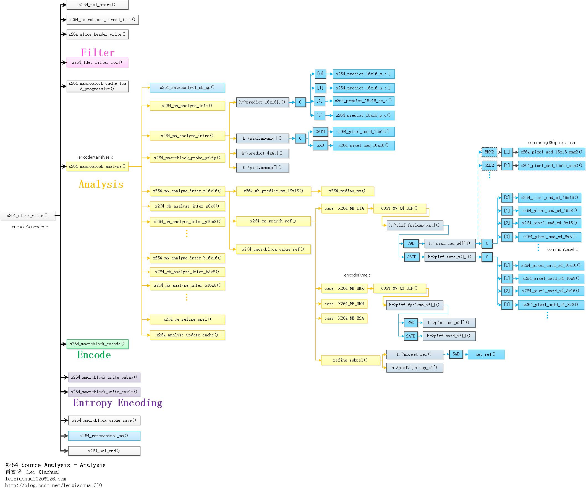
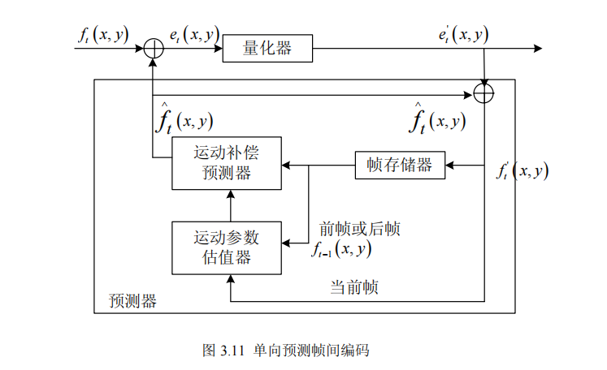
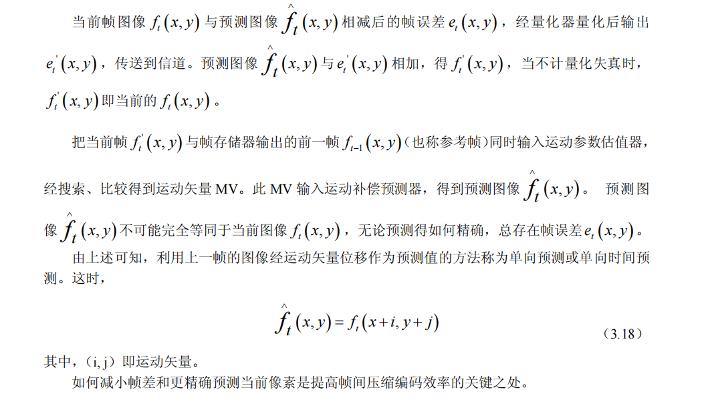
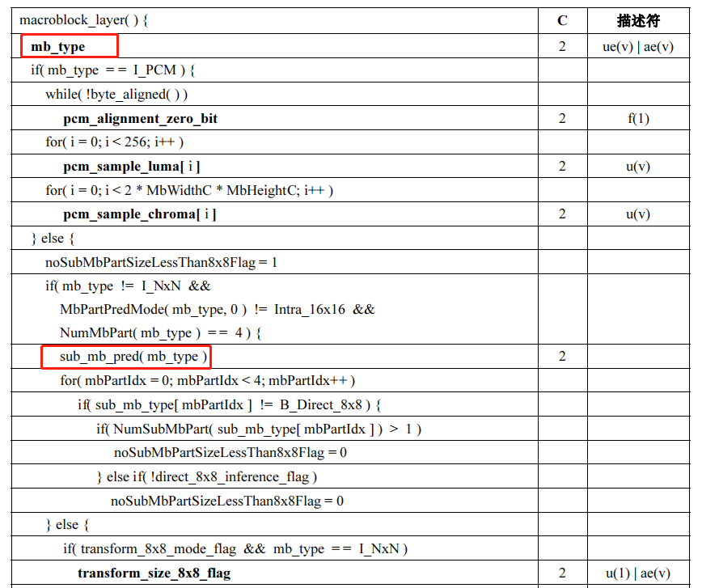
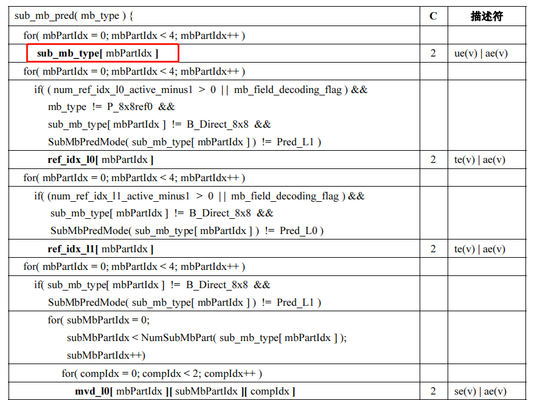
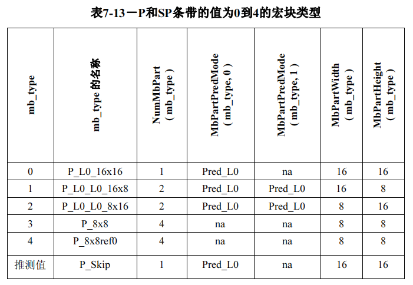
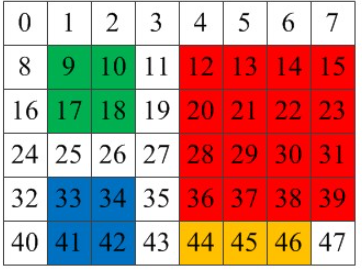
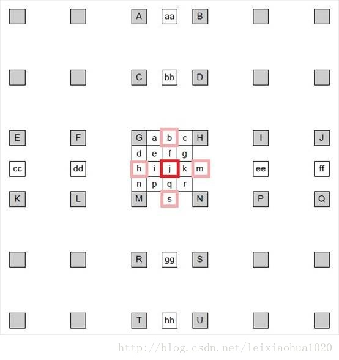
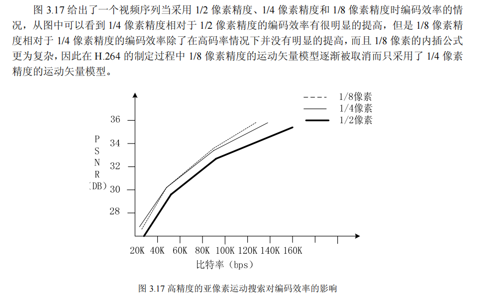

## 宏块分析函数

*这里引用雷神的“宏块分析（Analysis）部分的函数调用关系图”*



**由于作者使用的x264版本与雷神的不一致，所以函数名可能也有部分差异，例如部分函数在更新版本的x264中没有前面的“x264_”，但不影响上面那幅图的阅读**


## 宏块类型

我们知道，H.264是以16x16宏块为单位进行编码的，但16x16的宏块可以进行划分，形成多种尺寸，包括16x8、8x16、8x8、8x4、4x8、4x4等。

宏块包含多种类型，可以分为三大类型：

- I宏块：I_16x16、I_8x8、I_4x4、I_PCM
- **P宏块：P_16x16、P_16x8、P_8x16、P_8x8、P_8x4、P_4x8、P_4x4、P_SKIP**
- B宏块：B_16x16、B_16x8、B_8x16、B_8x8、B_8x4、B_4x8、B_4x4、B_SKIP、B_Direct

**其中IDR/I帧只允许包含I宏块、P帧允许包含P宏块也允许包含I宏块， B帧允许包含B宏块和I宏块**

一般而言，画面比较平坦的区域使用尺寸比较大的宏块进行编码，画面比较复杂的区域使用尺寸比较小的宏块进行编码


## 宏块类型分析

由于不同的宏块可以划分为多种不同的尺寸，宏块类型分析的目的就是**决定当前宏块以何种宏块类型进行编码**，是p16x16还是p8x8又或者其他......

宏块类型分析的大概流程遍历所有可能的宏块类型，选择最优的一个作为当前宏块的编码类型

**那么如何判断当前宏块是否是最优的呢？**(关于率失真详细可参考[10.率失真优化RDO.md](./10.率失真优化RDO.md])章节)

最优可以理解为编码代价“最小”。**x264的编码代价依据率失真理论计算得到**，即**Cost = D + lambda*R**，**其中D表示失真度，R表示码流大小**。 x264提供三种方式用于计算Cost值：

-  前两种类型lambda和R是一样的，其中**D分别通过SAD和SATD表示**，**R用于表示一些macroblock_layer的一些字段的bits开销**(不会包含residual的bits，因为sad、satd的计算不会真正对当前宏块进行encode，所以是得不到residual编码后的bits的)；对于Intra宏块而言R用于表示”帧内预测模式的比特开销“，对于Inter宏块R用于表示”运动矢量残差，参考帧索引的比特开销“
- 第三种就是RDO(率失真优化)，也是通过**Cost = D + lambda*R**的公式计算得到编码代价，不过与前两种不同的是，此方式的D是通过解码后宏块与原始宏块的SSD值表示，R表示当前宏块编码后的bits开销，lambda使用的值也与sad/satd的不一样。 由于此方式在宏块分析阶段(x264_macroblock_analyse)就涉及到真正的”x264_macroblock_encode“操作，因此计算复杂度也是最高的

> SAD就是将两个宏块按照位置进行像素相减，再将绝对值累加起来，这种方式仅反映残差时域差异，影响PSNR的值，不能有效反映码流的大小。
>
> SATD即将像素残差再经过**hadamard变换**后累加的绝对值，可以将其看作简单的时频变换，其值在一定程度上可以反映生成码流的大小。
>
> SATD对比SAD多了一步哈达玛变换，因此引入了额外的计算量，但由于能够反映频域的信息情况，因此能够决策出“更优”的方式
>
> 编码后的码流的大小是和图像块DCT变换后频域信息紧密相关的，而和变换前的时域信息关联性小一些；SAD只能反应时域信息，SATD却可以反映频域信息，而且Hadamard变换计算复杂度也低于DCT变换，因此是比较合适的模式选择的依据

具体使用SAD还是SATD，由编码参数i_subpel_refine决定，i_subpel_refine > 1使用SATD，否则使用SAD。


## 帧间编码基础知识介绍

一般而言，帧间预测编码编码效率比帧内更高。有人测得，对缓慢变化 256 级灰度的黑白图像序列，帧间差超过阈值 3 的像素不到一帧像素的 4％；对剧烈变化 256 亮度值的彩色电视序列，帧间差超过阈值 6 的像素平均只占一帧的 7.5％。

#### **帧间编码的原理**






大白话讲，就是可以直接存储当前图像与参考图像(上一帧图像)的像素残差，一般来说前后两帧像素相差不大，所以像素残差的值通常都很小，再经过变换量化熵编码生成的码流会很小，从而达到视频压缩的作用。

当然，H264标准并不是我们大白话讲的那么简单，H264中像素残差不是按照一个个像素点与参考图像相同位置的像素点做差值计算的。H264将一张图像划分为N个16x16的大宏块，循环对这N个16x16进行帧间编码处理；

帧间编码的大致流程如下：首先编码当前宏块时会根据周围已编码宏块的运动矢量确定一个预测运动矢量(MVP)，然后根据MVP以及当前宏块的位置信息找到在参考图像中对应的位置，然后以此位置作为起始点进行运动搜索，找到与当前宏块“最匹配的块”，当前宏块与匹配的宏块做差值计算，然后对差值进行变换量化熵编码写进码流，同时记录当前宏块与匹配块位置的偏移(MV，运动矢量)也写进码流当中

P宏块帧间编码也是能够支持多种尺寸的划分，p16x16、p16x8、p8x16、(p8x8、p8x4、p4x8、p4x4，这四种属于子宏块类型)，一般而言画面比较平坦的区域使用大尺寸的划分，画面比较复杂的区域使用小尺寸的划分。*与帧内编码类似，P宏块的划分方式也是写进mb_type当中的*


#### **如何解析帧间宏块的划分方式？**

*先看下宏块层和子宏块层的语法*







**每个P宏块都有都有一个mb_type，同时如果NumMbPart( mb_type ) = = 4 (即当前16x16宏块划分为8x8)，则会包含sub_mb_pred()，里面会有四个子宏块类型sub_mb_type**

下面是mb_type对应的宏块划分方式：



可以看出mb_type = 1时，划分方式16x8，如果mb_type = 3 or 4时划分方式是8x8，此时会额外存在4个子宏块，下图是sub_mb_type对应的子宏块划分方式


### 运动搜索

在参考图像上找到与当前编码块“最匹配的块”的整个过程就是**运动搜索**

在x264中运动搜索方法有四种：**菱形搜索(钻石搜索)**、**六边形搜索**、**非对称十字搜索**、*全搜索*。 其中全搜素的性价比很低除了实验性研究一般使用得不多

平均时间复杂度：菱形搜索 < 六边形搜索 < 非对称十字搜索 < 全搜索

平均搜索范围：菱形搜索 < 六边形搜索< 非对称十字搜多 < 全搜索


在介绍运动搜索具体方法之前，先介绍**预测运动矢量（MVP）**

### 预测运动矢量

由帧间编码的原理可知运动搜索是基于“块匹配”进行的，找到在参考帧中与当前编码块“最匹配的块”，从开始搜索到搜索到“最匹配块”的整个过程就是**运动搜索**。但是开始搜索的起点位置并不一定是参考帧中的相同位置，例如当前编码的16x16宏块的位置是(100，100)，那么运动搜索开始的位置并不一定是在参考帧的(100，100)的位置，也有可能是（150,100）。当然这个开始位置肯定不是随机值，它取决于周围已编码宏块()的运动矢量，通过周围已编码宏块的MV推导一个值出来，这个值就是**预测运动矢量**，当前宏块的位置信息 + 预测运动矢量就是起始运动搜索的位置。

而且编码每个分块的运动矢量需要较大的比特位，由于相邻块的运动矢量通常是高度相关的，实际的运动矢量MV与预测运动矢量MVP相差不大，所以**只需在码流中存储运动矢量与预测运动矢量的差值MVD即可**；解码器从从码流中拿到运动矢量残差MVD，再根据周围宏块推导出MVP，两者相加即能得到当前宏块原始的运动矢量

**MV （运动矢量）= MVP（预测运动矢量） + MVD（运动矢量残差）**




*上图引用了雷神的图，在x264中是一个比较重要结构。 里面每个小格子用于表示一个4x4的子宏块(<u>x264内部会根据小格子的序号找到相应的4x4宏块</u>)**，**红色部分代表当前编码的16x16宏块的亮度部分，绿色、蓝色则代表两个色度8x8宏块*


```c++
// x264获取16x16预测运动矢量代码
#define X264_SCAN8_0 (4+1*8)  // 13
void x264_mb_predict_mv_16x16( x264_t *h, int i_list, int i_ref, int16_t mvp[2] )
{
    /*
    	结合上面的图片分析，X264_SCAN8_0表示当前16x16宏块位置
    	X264_SCAN8_0-1为左边宏块位置
    	X264_SCAN8_0-8为上边宏块位置
    	X264_SCAN8_0-8+4为右上方宏块位置
    	X264_SCAN8_0-8-1为左上方宏块位置
    	
    */
    int     i_refa = h->mb.cache.ref[i_list][X264_SCAN8_0 - 1]; // 左方宏块的参考帧数量，-2为不可用
    int16_t *mv_a  = h->mb.cache.mv[i_list][X264_SCAN8_0 - 1]; // 左方宏块的mv
    int     i_refb = h->mb.cache.ref[i_list][X264_SCAN8_0 - 8]; // 上方宏块的参考帧数量
    int16_t *mv_b  = h->mb.cache.mv[i_list][X264_SCAN8_0 - 8]; // 上方宏块的mv
    int     i_refc = h->mb.cache.ref[i_list][X264_SCAN8_0 - 8 + 4]; // 右上方宏块的参考帧数量
    int16_t *mv_c  = h->mb.cache.mv[i_list][X264_SCAN8_0 - 8 + 4]; // 右上方宏块的mv
    if( i_refc == -2 )
    {
        // 如果右上方宏块不可用，那么取左上方宏块作为mv_c
        i_refc = h->mb.cache.ref[i_list][X264_SCAN8_0 - 8 - 1];
        mv_c   = h->mb.cache.mv[i_list][X264_SCAN8_0 - 8 - 1];
    }
	
    // 检查a、b、c的参考帧数量是否与当前帧相等
    int i_count = (i_refa == i_ref) + (i_refb == i_ref) + (i_refc == i_ref);

    if( i_count > 1 )
    {
        // count大于1取三者的中值
median:
        x264_median_mv( mvp, mv_a, mv_b, mv_c );
    }
    else if( i_count == 1 )
    {
        // 如果count==1，取i_refa相等的那个
        if( i_refa == i_ref )
            CP32( mvp, mv_a );
        else if( i_refb == i_ref )
            CP32( mvp, mv_b );
        else
            CP32( mvp, mv_c );
    }
    else if( i_refb == -2 && i_refc == -2 && i_refa != -2 ) // 如果a有效取a
        CP32( mvp, mv_a );
    else
        goto median;
}

```


### 运动搜索方法

**一、菱形搜索(钻石搜索)**

**二、六边形搜索**


### 亚像素插值/搜索

**H264为什么会有亚像素搜索?**

因为整像素运动搜索匹配出来的“最匹配的块”的残差值可能仍然比较大，为了进一步降低编码码率，提出对整像素进行内插生成亚像素，运动搜索匹配的块可能落在”亚像素“上面，此时两者的残差可能会更小；**其实目的就是用时间换空间(压缩率)**


*这部分内容就直接copy雷神的博客了 https://blog.csdn.net/leixiaohua1020/article/details/45936267*

《H.264标准》中规定，运动估计为1/4像素精度。因此在H.264编码和解码的过程中，需要将画面中的像素进行插值——简单地说就是把原先的1个像素点拓展成4x4一共16个点。下图显示了H.264编码和解码过程中像素插值情况。可以看出原先的G点的右下方通过插值的方式产生了a、b、c、d等一共16个点。


> 如图所示，1/4像素内插一般分成两步：
>
> ​	(1) 半像素内插。通过6抽头滤波器计算得到半像素
>
> ​	(2) 线性内插。1/4像素点的计算算法
>
> 图中半像素内插点为b、m、h、s、j五个点。半像素内插方法是对整像素点进行6 抽头滤波得出，滤波器的权重为(1/32, -5/32, 5/8, 5/8, -5/32, 1/32)。
>
> 例如b的计算公式为：**b=round( (E - 5F + 20G + 20H - 5I + J ) / 32)**
>
> 
>
> 剩下几个半像素点的计算关系如下：
>
> ​	m：由B、D、H、N、S、U计算
>
> ​	h：由A、C、G、M、R、T计算
>
> ​	s：由K、L、M、N、P、Q计算
>
> ​	j：由cc、dd、h、m、ee、ff计算。需要注意j点的运算量比较大，因为cc、dd、ee、ff都需要通过半像素内插方法进行计算
>
> 
>
> 在获得半像素点之后，就可以通过简单的线性内插获得1/4像素内插点了。1/4像素内插的方式如下图所示。例如图中a点的计算公式如下：
>
> **a=round( (G+b)/2 )**
>
> 
>
> 在这里有一点需要注意：位于4个角的e、g、p、r四个点并不是通过j点计算计算的，而是通过b、h、s、m四个半像素点计算的
>
> e = round((b + h) / 2)
>
> g = round((b + m) / 2)
>
> p = round((h + S) / 2)
>
> r = round((m + s) / 2)

**H264为什么最多支持到1/4精度的运动搜索呢？而不是精度更深的1/8或者1/12呢？**




亚像素运动搜索与整像素运动搜索流程一样，都是基于块匹配，只是亚像素运动搜索的参考图像中的像素是通过内插来的(即亚像素)。

x264中亚像素运动搜索的方式只使用**钻石搜索**

并且x264出于对编码时间的考虑，首先会先进行整像素的运动搜索，找到一个比较匹配位置，然后在以此位置为原点做亚像素的运动搜索


## 源码解析

在每编码一块宏块前都会调用x264_macroblock_analyse函数，对当前宏块进行分析，决定当前宏块以何种类型进行编码，以及确定运动矢量等信息

```c++
/* 宏块分析，函数位置encoder/encoder.c*/
void x264_macroblock_analyse( x264_t *h )
{
    x264_mb_analysis_t analysis;
    int i_cost = COST_MAX;
	// 获取当前宏块的QP
    h->mb.i_qp = x264_ratecontrol_mb_qp( h );
    /* If the QP of this MB is within 1 of the previous MB, code the same QP as the previous MB,
     * to lower the bit cost of the qp_delta.  Don't do this if QPRD is enabled. */
    if( h->param.rc.i_aq_mode && h->param.analyse.i_subpel_refine < 10 )
        h->mb.i_qp = abs(h->mb.i_qp - h->mb.i_last_qp) == 1 ? h->mb.i_last_qp : h->mb.i_qp;

    if( h->param.analyse.b_mb_info )
        h->fdec->effective_qp[h->mb.i_mb_xy] = h->mb.i_qp; /* Store the real analysis QP. */
    /*
     	初始化相关的工作，如果开启“帧级多线程”的话，可能会在此函数阻塞(详细参考“x264多线程”章节)
    */
    mb_analyse_init( h, &analysis, h->mb.i_qp );

    /*--------------------------- Do the analysis ---------------------------*/
    if( h->sh.i_type == SLICE_TYPE_I )
    {
        // I Slice分析, 详细见“5.宏块分析之帧内编码.md”章节
    }
    else if( h->sh.i_type == SLICE_TYPE_P )
    {
        int b_skip = 0;

        h->mc.prefetch_ref( h->mb.pic.p_fref[0][0][h->mb.i_mb_x&3], h->mb.pic.i_stride[0], 0 );

        analysis.b_try_skip = 0;
        if( analysis.b_force_intra )
        {
            if( !h->param.analyse.b_psy )
            {
                mb_analyse_init_qp( h, &analysis, X264_MAX( h->mb.i_qp - h->mb.ip_offset, h->param.rc.i_qp_min ) );
                goto intra_analysis;
            }
        }
        else
        {
            /* Special fast-skip logic using information from mb_info. */
            // 如果存在mb_info，一定条件下可以确定当前宏块类型为P_SKIP，提前终止后续其他类型的分析，节省时间
            if( h->fdec->mb_info && (h->fdec->mb_info[h->mb.i_mb_xy]&X264_MBINFO_CONSTANT) )
            {
                if( !SLICE_MBAFF && (h->fdec->i_frame - h->fref[0][0]->i_frame) == 1 && !h->sh.b_weighted_pred &&
                    h->fref[0][0]->effective_qp[h->mb.i_mb_xy] <= h->mb.i_qp )
                {
                    h->mb.i_partition = D_16x16;
                    /* Use the P-SKIP MV if we can... */
                    if( !M32(h->mb.cache.pskip_mv) )
                    {
                        b_skip = 1;
                        h->mb.i_type = P_SKIP;
                    }
                    /* Otherwise, just force a 16x16 block. */
                    else
                    {
                        h->mb.i_type = P_L0;
                        analysis.l0.me16x16.i_ref = 0;
                        M32( analysis.l0.me16x16.mv ) = 0;
                    }
                    goto skip_analysis;
                }
                /* Reset the information accordingly */
                else if( h->param.analyse.b_mb_info_update )
                    h->fdec->mb_info[h->mb.i_mb_xy] &= ~X264_MBINFO_CONSTANT;
            }

            int skip_invalid = h->i_thread_frames > 1 && h->mb.cache.pskip_mv[1] > h->mb.mv_max_spel[1];
            /* If the current macroblock is off the frame, just skip it. */
            if( HAVE_INTERLACED && !MB_INTERLACED && h->mb.i_mb_y * 16 >= h->param.i_height && !skip_invalid )
                b_skip = 1;
            /* Fast P_SKIP detection */
            // fast skip detection是x264中一项比较重要的速度优化功能
            else if( h->param.analyse.b_fast_pskip )
            {
                if( skip_invalid )
                    // FIXME don't need to check this if the reference frame is done
                    {}
                else if( h->param.analyse.i_subpel_refine >= 3 ) // 如果i_subpel_refine比较大就不进行“fast skip detection”了
                    analysis.b_try_skip = 1;
                else if( h->mb.i_mb_type_left[0] == P_SKIP || // 坐标宏块类型
                         h->mb.i_mb_type_top == P_SKIP ||     // 上边宏块类型
                         h->mb.i_mb_type_topleft == P_SKIP || // 左上角宏块类型
                         h->mb.i_mb_type_topright == P_SKIP ) // 右上角宏块类型
                    b_skip = x264_macroblock_probe_pskip( h );  // 如果周围宏块存在P_SKIP宏块，可以提前当前宏块是否可以是SKIP类型
            }
        }

        h->mc.prefetch_ref( h->mb.pic.p_fref[0][0][h->mb.i_mb_x&3], h->mb.pic.i_stride[0], 1 );

        if( b_skip )
        {
            // 如果当前宏块是PSKIP类型，设置宏块类型，mv等信息，无需进行其他宏块类型的分析，提前终止宏块分析过程，节省时间
            h->mb.i_type = P_SKIP;
            h->mb.i_partition = D_16x16;
            assert( h->mb.cache.pskip_mv[1] <= h->mb.mv_max_spel[1] || h->i_thread_frames == 1 );
skip_analysis:
            /* Set up MVs for future predictors */
            for( int i = 0; i < h->mb.pic.i_fref[0]; i++ )
                M32( h->mb.mvr[0][i][h->mb.i_mb_xy] ) = 0;
        }
        else
        {
            /*
            	获取当前支持的inter partitions，h->param.analyse.inter
            	x264提供了不同编码速度的档次，一些速度较快的档次会限制inter的值，只分析部分宏块类型，从而节省时间
            	例如inter = X264_ANALYSE_I4x4 | X264_ANALYSE_I8x8 | X264_ANALYSE_PSUB16x16时，P帧的宏块只会分析I_16x16 、I_8x8、
            	I_4X4、P_16x8、P_8x16、P_8x8几种类型，不会分析p4x8、p8x4、p4x4等
            	
            	下面是相关的宏定义(I16X16、p16x16、b16x16一定是要有的，不需要额外通过宏指定)：
      			#define X264_ANALYSE_I4x4       0x0001  // Analyse i4x4
                #define X264_ANALYSE_I8x8       0x0002  // Analyse i8x8 (requires 8x8 transform)
            	#define X264_ANALYSE_PSUB16x16  0x0010  // Analyse p16x8, p8x16 and p8x8
            	#define X264_ANALYSE_PSUB8x8    0x0020  // Analyse p8x4, p4x8, p4x4
            	#define X264_ANALYSE_BSUB16x16  0x0100  // Analyse b16x8, b8x16 and b8x8
            */
            const unsigned int flags = h->param.analyse.inter;
            int i_type;
            int i_partition;
            int i_satd_inter, i_satd_intra;
			// 初始化
            mb_analyse_load_costs( h, &analysis );
            // P16x16 帧间预测宏块分析
            mb_analyse_inter_p16x16( h, &analysis );

            if( h->mb.i_type == P_SKIP )
            {
                // 如果mb_analyse_inter_p16x16分析出来当前类型是P_SKIP，可以直接return提前中止
                for( int i = 1; i < h->mb.pic.i_fref[0]; i++ )
                    M32( h->mb.mvr[0][i][h->mb.i_mb_xy] ) = 0;
                return;
            }
			
            // 判断inter是否支持X264_ANALYSE_PSUB16x16
            /*
            	如果开启X264_ANALYSE_PSUB16x16， 会先进行8x8的分析，然后再进16x8和8x16的分析
            	这样做的目的是为了提前跳出16x8、8x16的检测，节省编码计算开销，下面会提到
            */
            if( flags & X264_ANALYSE_PSUB16x16 )
            {
                // 如果支持先进行p8x8 帧间宏块分析
                if( h->param.analyse.b_mixed_references )
                    mb_analyse_inter_p8x8_mixed_ref( h, &analysis );
                else
                    mb_analyse_inter_p8x8( h, &analysis );
            }

            /* Select best inter mode */
            i_type = P_L0;
            i_partition = D_16x16;
            // p16x16的代价me16x16.cost，这里cost也是率失真(RD)值，后面x264_me_search_ref会提到
            i_cost = analysis.l0.me16x16.cost;

            if( ( flags & X264_ANALYSE_PSUB16x16 ) && (!analysis.b_early_terminate ||
                analysis.l0.i_cost8x8 < analysis.l0.me16x16.cost) )
            {
                // 如果p8x8的代价更低，更新i_type，i_partition，i_cost
                i_type = P_8x8;
                i_partition = D_8x8;
                i_cost = analysis.l0.i_cost8x8;

                /* Do sub 8x8 */
                // 判断inter是否支持X264_ANALYSE_PSUB8x8(p8x4, p4x8, p4x4)
                if( flags & X264_ANALYSE_PSUB8x8 )
                {
                    for( int i = 0; i < 4; i++ )
                    {
                        // p4x4 帧间宏块分析
                        mb_analyse_inter_p4x4( h, &analysis, i );
                        int i_thresh8x4 = analysis.l0.me4x4[i][1].cost_mv + analysis.l0.me4x4[i][2].cost_mv;
                        if( !analysis.b_early_terminate || analysis.l0.i_cost4x4[i] < analysis.l0.me8x8[i].cost + i_thresh8x4 )
                        {
                            int i_cost8x8 = analysis.l0.i_cost4x4[i];
                            h->mb.i_sub_partition[i] = D_L0_4x4;
							// p8x4间宏块分析
                            mb_analyse_inter_p8x4( h, &analysis, i );
                            // cost比较
                            COPY2_IF_LT( i_cost8x8, analysis.l0.i_cost8x4[i],
                                         h->mb.i_sub_partition[i], D_L0_8x4 );
                            // p4x8帧间宏块分析
                            mb_analyse_inter_p4x8( h, &analysis, i );
                            // cost比较
                            COPY2_IF_LT( i_cost8x8, analysis.l0.i_cost4x8[i],
                                         h->mb.i_sub_partition[i], D_L0_4x8 );

                            i_cost += i_cost8x8 - analysis.l0.me8x8[i].cost;
                        }
                        mb_cache_mv_p8x8( h, &analysis, i );
                    }
                    /* 
                    	icost为p8x8、p8x4、p4x8、p4x4中代价最小的值，这里不再区分出i_cost8x4/i_cost4x8/i_cost4x4
                    	因为p8x4/p4x8/p4x4都属于子宏块
                    */
                    analysis.l0.i_cost8x8 = i_cost;
                }
            }

            /* Now do 16x8/8x16 */
            int i_thresh16x8 = analysis.l0.me8x8[1].cost_mv + analysis.l0.me8x8[2].cost_mv; // 1、2块运动矢量的比特开销
            if( ( flags & X264_ANALYSE_PSUB16x16 ) && (!analysis.b_early_terminate ||
                analysis.l0.i_cost8x8 < analysis.l0.me16x16.cost + i_thresh16x8) )
            {
            	/* 如果p8x8的cost小于p16x16 + i_thresh16x8，再进行p16x8、p8x16的宏块分析，筛选出cost最小的一个 */
                // i_avg_mv_ref_cost为预估出来的第二个16x8块运动矢量的比特开销
                int i_avg_mv_ref_cost = (analysis.l0.me8x8[2].cost_mv + analysis.l0.me8x8[2].i_ref_cost
                                      + analysis.l0.me8x8[3].cost_mv + analysis.l0.me8x8[3].i_ref_cost + 1) >> 1;
                /* 
                	预估第二个16x8块的比特开销，mb_analyse_inter_p16x8先编码第一个16x8得到编码代码cost1
                	此时如果cost1 + i_cost_est16x8[1]已经大于i_cost的话就不需要进行第二个16x8块的分析了，节省编码时间
                 */
                analysis.i_cost_est16x8[1] = analysis.i_satd8x8[0][2] + analysis.i_satd8x8[0][3] + i_avg_mv_ref_cost;
				// p16x8帧间宏块分析
                mb_analyse_inter_p16x8( h, &analysis, i_cost );
                // cost比较
                COPY3_IF_LT( i_cost, analysis.l0.i_cost16x8, i_type, P_L0, i_partition, D_16x8 );
				
                // 同理，预估第二个8x16块的运动矢量比特开销
                i_avg_mv_ref_cost = (analysis.l0.me8x8[1].cost_mv + analysis.l0.me8x8[1].i_ref_cost
                                  + analysis.l0.me8x8[3].cost_mv + analysis.l0.me8x8[3].i_ref_cost + 1) >> 1;
                // 同理，用于提前终止
                analysis.i_cost_est8x16[1] = analysis.i_satd8x8[0][1] + analysis.i_satd8x8[0][3] + i_avg_mv_ref_cost;
				// p8x16帧间宏块分析
                mb_analyse_inter_p8x16( h, &analysis, i_cost );
                // cost比较
                COPY3_IF_LT( i_cost, analysis.l0.i_cost8x16, i_type, P_L0, i_partition, D_8x16 );
            }

            h->mb.i_partition = i_partition;

            /* refine qpel */
            //FIXME mb_type costs?
            // 确定宏块类型的基础上，（再一次）进行x264_me_refine_qpel亚像素运动搜索
            if( analysis.i_mbrd || !h->mb.i_subpel_refine )
            {
                /* refine later */
            }
            else if( i_partition == D_16x16 )
            {
                x264_me_refine_qpel( h, &analysis.l0.me16x16 );
                i_cost = analysis.l0.me16x16.cost;
            }
            else if( i_partition == D_16x8 )
            {
                x264_me_refine_qpel( h, &analysis.l0.me16x8[0] );
                x264_me_refine_qpel( h, &analysis.l0.me16x8[1] );
                i_cost = analysis.l0.me16x8[0].cost + analysis.l0.me16x8[1].cost;
            }
            else if( i_partition == D_8x16 )
            {
                x264_me_refine_qpel( h, &analysis.l0.me8x16[0] );
                x264_me_refine_qpel( h, &analysis.l0.me8x16[1] );
                i_cost = analysis.l0.me8x16[0].cost + analysis.l0.me8x16[1].cost;
            }
            else if( i_partition == D_8x8 )
            {
                i_cost = 0;
                for( int i8x8 = 0; i8x8 < 4; i8x8++ )
                {
                    switch( h->mb.i_sub_partition[i8x8] )
                    {
                        case D_L0_8x8:
                            x264_me_refine_qpel( h, &analysis.l0.me8x8[i8x8] );
                            i_cost += analysis.l0.me8x8[i8x8].cost;
                            break;
                        case D_L0_8x4:
                            x264_me_refine_qpel( h, &analysis.l0.me8x4[i8x8][0] );
                            x264_me_refine_qpel( h, &analysis.l0.me8x4[i8x8][1] );
                            i_cost += analysis.l0.me8x4[i8x8][0].cost +
                                      analysis.l0.me8x4[i8x8][1].cost;
                            break;
                        case D_L0_4x8:
                            x264_me_refine_qpel( h, &analysis.l0.me4x8[i8x8][0] );
                            x264_me_refine_qpel( h, &analysis.l0.me4x8[i8x8][1] );
                            i_cost += analysis.l0.me4x8[i8x8][0].cost +
                                      analysis.l0.me4x8[i8x8][1].cost;
                            break;

                        case D_L0_4x4:
                            x264_me_refine_qpel( h, &analysis.l0.me4x4[i8x8][0] );
                            x264_me_refine_qpel( h, &analysis.l0.me4x4[i8x8][1] );
                            x264_me_refine_qpel( h, &analysis.l0.me4x4[i8x8][2] );
                            x264_me_refine_qpel( h, &analysis.l0.me4x4[i8x8][3] );
                            i_cost += analysis.l0.me4x4[i8x8][0].cost +
                                      analysis.l0.me4x4[i8x8][1].cost +
                                      analysis.l0.me4x4[i8x8][2].cost +
                                      analysis.l0.me4x4[i8x8][3].cost;
                            break;
                        default:
                            x264_log( h, X264_LOG_ERROR, "internal error (!8x8 && !4x4)\n" );
                            break;
                    }
                }
            }

            if( h->mb.b_chroma_me )
            {
                // 如果开启了色度块的帧内宏块分析则对亮度、色度块都进行分析
                if( CHROMA444 )
                {
                    mb_analyse_intra( h, &analysis, i_cost );
                    mb_analyse_intra_chroma( h, &analysis );
                }
                else
                {
                    mb_analyse_intra_chroma( h, &analysis );
                    mb_analyse_intra( h, &analysis, i_cost - analysis.i_satd_chroma );
                }
                analysis.i_satd_i16x16 += analysis.i_satd_chroma;
                analysis.i_satd_i8x8   += analysis.i_satd_chroma;
                analysis.i_satd_i4x4   += analysis.i_satd_chroma;
            }
            else
                mb_analyse_intra( h, &analysis, i_cost ); // 帧内宏块分析(包含i16x16、i8x8、i4x4)

            i_satd_inter = i_cost;
            i_satd_intra = X264_MIN3( analysis.i_satd_i16x16,
                                      analysis.i_satd_i8x8,
                                      analysis.i_satd_i4x4 ); // 选择代价最小的帧内编码代价

            if( analysis.i_mbrd ) // 如果开启率失真优化
            {
                // P宏块的RDO
                mb_analyse_p_rd( h, &analysis, X264_MIN(i_satd_inter, i_satd_intra) );
                i_type = P_L0;
                i_partition = D_16x16;
                i_cost = analysis.l0.i_rd16x16;
                COPY2_IF_LT( i_cost, analysis.l0.i_cost16x8, i_partition, D_16x8 );
                COPY2_IF_LT( i_cost, analysis.l0.i_cost8x16, i_partition, D_8x16 );
                COPY3_IF_LT( i_cost, analysis.l0.i_cost8x8, i_partition, D_8x8, i_type, P_8x8 );
                h->mb.i_type = i_type;
                h->mb.i_partition = i_partition;
                if( i_cost < COST_MAX )
                    mb_analyse_transform_rd( h, &analysis, &i_satd_inter, &i_cost ); // 是否进行8x8变换量化还是4x4变换量化，RD检测
                intra_rd( h, &analysis, i_satd_inter * 5/4 + 1 ); // I宏块RDO
            }
			/*
            	与上述p宏块的最小代价进行对比，决策出当前宏块最合适的宏块类型和i_cost
            	注意上文有说到P帧的宏块可以包含P宏块和I宏块，所以需要对帧内、帧间的宏块都进行分析
            	而I帧只允许包含I宏块，所以只需要进行帧间宏块分析
          	*/
            COPY2_IF_LT( i_cost, analysis.i_satd_i16x16, i_type, I_16x16 );
            COPY2_IF_LT( i_cost, analysis.i_satd_i8x8, i_type, I_8x8 );
            COPY2_IF_LT( i_cost, analysis.i_satd_i4x4, i_type, I_4x4 );
            COPY2_IF_LT( i_cost, analysis.i_satd_pcm, i_type, I_PCM );

            h->mb.i_type = i_type;
			
            // 一些收尾工作，包括保存宏块信息，RD优化等
            if( analysis.b_force_intra && !IS_INTRA(i_type) )
            {
                /* Intra masking: copy fdec to fenc and re-encode the block as intra in order to make it appear as if
                 * it was an inter block. */
                analyse_update_cache( h, &analysis );
                x264_macroblock_encode( h );
                for( int p = 0; p < (CHROMA444 ? 3 : 1); p++ )
                    h->mc.copy[PIXEL_16x16]( h->mb.pic.p_fenc[p], FENC_STRIDE, h->mb.pic.p_fdec[p], FDEC_STRIDE, 16 );
                if( !CHROMA444 )
                {
                    int height = 16 >> CHROMA_V_SHIFT;
                    h->mc.copy[PIXEL_8x8]  ( h->mb.pic.p_fenc[1], FENC_STRIDE, h->mb.pic.p_fdec[1], FDEC_STRIDE, height );
                    h->mc.copy[PIXEL_8x8]  ( h->mb.pic.p_fenc[2], FENC_STRIDE, h->mb.pic.p_fdec[2], FDEC_STRIDE, height );
                }
                mb_analyse_init_qp( h, &analysis, X264_MAX( h->mb.i_qp - h->mb.ip_offset, h->param.rc.i_qp_min ) );
                goto intra_analysis;
            }
	
            if( analysis.i_mbrd >= 2 && h->mb.i_type != I_PCM ) // RDO
            {
                if( IS_INTRA( h->mb.i_type ) )
                {
                    intra_rd_refine( h, &analysis );
                }
                else if( i_partition == D_16x16 )
                {
                    x264_macroblock_cache_ref( h, 0, 0, 4, 4, 0, analysis.l0.me16x16.i_ref );
                    analysis.l0.me16x16.cost = i_cost;
                    x264_me_refine_qpel_rd( h, &analysis.l0.me16x16, analysis.i_lambda2, 0, 0 );
                }
                else if( i_partition == D_16x8 )
                {
                    M32( h->mb.i_sub_partition ) = D_L0_8x8 * 0x01010101;
                    x264_macroblock_cache_ref( h, 0, 0, 4, 2, 0, analysis.l0.me16x8[0].i_ref );
                    x264_macroblock_cache_ref( h, 0, 2, 4, 2, 0, analysis.l0.me16x8[1].i_ref );
                    x264_me_refine_qpel_rd( h, &analysis.l0.me16x8[0], analysis.i_lambda2, 0, 0 );
                    x264_me_refine_qpel_rd( h, &analysis.l0.me16x8[1], analysis.i_lambda2, 8, 0 );
                }
                else if( i_partition == D_8x16 )
                {
                    M32( h->mb.i_sub_partition ) = D_L0_8x8 * 0x01010101;
                    x264_macroblock_cache_ref( h, 0, 0, 2, 4, 0, analysis.l0.me8x16[0].i_ref );
                    x264_macroblock_cache_ref( h, 2, 0, 2, 4, 0, analysis.l0.me8x16[1].i_ref );
                    x264_me_refine_qpel_rd( h, &analysis.l0.me8x16[0], analysis.i_lambda2, 0, 0 );
                    x264_me_refine_qpel_rd( h, &analysis.l0.me8x16[1], analysis.i_lambda2, 4, 0 );
                }
                else if( i_partition == D_8x8 )
                {
                    analyse_update_cache( h, &analysis );
                    for( int i8x8 = 0; i8x8 < 4; i8x8++ )
                    {
                        if( h->mb.i_sub_partition[i8x8] == D_L0_8x8 )
                        {
                            x264_me_refine_qpel_rd( h, &analysis.l0.me8x8[i8x8], analysis.i_lambda2, i8x8*4, 0 );
                        }
                        else if( h->mb.i_sub_partition[i8x8] == D_L0_8x4 )
                        {
                            x264_me_refine_qpel_rd( h, &analysis.l0.me8x4[i8x8][0], analysis.i_lambda2, i8x8*4+0, 0 );
                            x264_me_refine_qpel_rd( h, &analysis.l0.me8x4[i8x8][1], analysis.i_lambda2, i8x8*4+2, 0 );
                        }
                        else if( h->mb.i_sub_partition[i8x8] == D_L0_4x8 )
                        {
                            x264_me_refine_qpel_rd( h, &analysis.l0.me4x8[i8x8][0], analysis.i_lambda2, i8x8*4+0, 0 );
                            x264_me_refine_qpel_rd( h, &analysis.l0.me4x8[i8x8][1], analysis.i_lambda2, i8x8*4+1, 0 );
                        }
                        else if( h->mb.i_sub_partition[i8x8] == D_L0_4x4 )
                        {
                            x264_me_refine_qpel_rd( h, &analysis.l0.me4x4[i8x8][0], analysis.i_lambda2, i8x8*4+0, 0 );
                            x264_me_refine_qpel_rd( h, &analysis.l0.me4x4[i8x8][1], analysis.i_lambda2, i8x8*4+1, 0 );
                            x264_me_refine_qpel_rd( h, &analysis.l0.me4x4[i8x8][2], analysis.i_lambda2, i8x8*4+2, 0 );
                            x264_me_refine_qpel_rd( h, &analysis.l0.me4x4[i8x8][3], analysis.i_lambda2, i8x8*4+3, 0 );
                        }
                    }
                }
            }
        }
    }
    else if( h->sh.i_type == SLICE_TYPE_B )
    {
        // B Slice的宏块分析，大致流程与P Slice的类似,代码就不贴了
    }

    analyse_update_cache( h, &analysis );

    /* In rare cases we can end up qpel-RDing our way back to a larger partition size
     * without realizing it.  Check for this and account for it if necessary. */
    if( analysis.i_mbrd >= 2 )
    {
        /* Don't bother with bipred or 8x8-and-below, the odds are incredibly low. */
        static const uint8_t check_mv_lists[X264_MBTYPE_MAX] = {[P_L0]=1, [B_L0_L0]=1, [B_L1_L1]=2};
        int list = check_mv_lists[h->mb.i_type] - 1;
        if( list >= 0 && h->mb.i_partition != D_16x16 &&
            M32( &h->mb.cache.mv[list][x264_scan8[0]] ) == M32( &h->mb.cache.mv[list][x264_scan8[12]] ) &&
            h->mb.cache.ref[list][x264_scan8[0]] == h->mb.cache.ref[list][x264_scan8[12]] )
                h->mb.i_partition = D_16x16;
    }

    if( !analysis.i_mbrd )
        mb_analyse_transform( h );

    if( analysis.i_mbrd == 3 && !IS_SKIP(h->mb.i_type) )
        mb_analyse_qp_rd( h, &analysis );

    h->mb.b_trellis = h->param.analyse.i_trellis;
    h->mb.b_noise_reduction = h->mb.b_noise_reduction || (!!h->param.analyse.i_noise_reduction && !IS_INTRA( h->mb.i_type ));

    if( !IS_SKIP(h->mb.i_type) && h->mb.i_psy_trellis && h->param.analyse.i_trellis == 1 )
        psy_trellis_init( h, 0 );
    if( h->mb.b_trellis == 1 || h->mb.b_noise_reduction )
        h->mb.i_skip_intra = 0;
}
```


帧间编码的划分方式比较多，流程基本是一致的，所以这里挑inter16x16的来分析

```c++
static void mb_analyse_inter_p16x16( x264_t *h, x264_mb_analysis_t *a )
{
    x264_me_t m;
    int i_mvc;
    ALIGNED_4( int16_t mvc[8][2] );
    int i_halfpel_thresh = INT_MAX;
    int *p_halfpel_thresh = (a->b_early_terminate && h->mb.pic.i_fref[0]>1) ? &i_halfpel_thresh : NULL;

    /* 16x16 Search on all ref frame */
    m.i_pixel = PIXEL_16x16;
    LOAD_FENC( &m, h->mb.pic.p_fenc, 0, 0 );

    a->l0.me16x16.cost = INT_MAX;
    for( int i_ref = 0; i_ref < h->mb.pic.i_fref[0]; i_ref++ ) // for循环遍历所有参考帧
    {
        m.i_ref_cost = REF_COST( 0, i_ref );
        i_halfpel_thresh -= m.i_ref_cost;

        /* search with ref */
        // 加载参考帧的像素
        LOAD_HPELS( &m, h->mb.pic.p_fref[0][i_ref], 0, i_ref, 0, 0 );
        LOAD_WPELS( &m, h->mb.pic.p_fref_w[i_ref], 0, i_ref, 0, 0 );
		
        // 获取预测运动矢量
        x264_mb_predict_mv_16x16( h, 0, i_ref, m.mvp );

        if( h->mb.ref_blind_dupe == i_ref )
        {
            CP32( m.mv, a->l0.mvc[0][0] );
            x264_me_refine_qpel_refdupe( h, &m, p_halfpel_thresh );
        }
        else
        {
            /* This just improves encoder performance, it's not part of the spec */
            x264_mb_predict_mv_ref16x16( h, 0, i_ref, mvc, &i_mvc );
            // 运动搜索，注意此时这里是进行整像素点的运动搜索
            x264_me_search_ref( h, &m, mvc, i_mvc, p_halfpel_thresh );
        }

        /* save mv for predicting neighbors */
        CP32( h->mb.mvr[0][i_ref][h->mb.i_mb_xy], m.mv );
        CP32( a->l0.mvc[i_ref][0], m.mv );

        /* early termination
         * SSD threshold would probably be better than SATD */
        /* 提前中止，如果当前宏块mv小于一定阈值，会尝试编码成pskip宏块 */
        if( i_ref == 0
            && a->b_try_skip
            && m.cost-m.cost_mv < 300*a->i_lambda
            &&  abs(m.mv[0]-h->mb.cache.pskip_mv[0])
              + abs(m.mv[1]-h->mb.cache.pskip_mv[1]) <= 1
            && x264_macroblock_probe_pskip( h ) )
        {
            h->mb.i_type = P_SKIP;
            analyse_update_cache( h, a );
            assert( h->mb.cache.pskip_mv[1] <= h->mb.mv_max_spel[1] || h->i_thread_frames == 1 );
            return;
        }

        m.cost += m.i_ref_cost;
        i_halfpel_thresh += m.i_ref_cost;

        if( m.cost < a->l0.me16x16.cost )
            h->mc.memcpy_aligned( &a->l0.me16x16, &m, sizeof(x264_me_t) );
    }
	// 保存宏块信息
    x264_macroblock_cache_ref( h, 0, 0, 4, 4, 0, a->l0.me16x16.i_ref );
    assert( a->l0.me16x16.mv[1] <= h->mb.mv_max_spel[1] || h->i_thread_frames == 1 );

    h->mb.i_type = P_L0;
    if( a->i_mbrd )
    {
        mb_init_fenc_cache( h, a->i_mbrd >= 2 || h->param.analyse.inter & X264_ANALYSE_PSUB8x8 );
        if( a->l0.me16x16.i_ref == 0 && M32( a->l0.me16x16.mv ) == M32( h->mb.cache.pskip_mv ) && !a->b_force_intra )
        {
            h->mb.i_partition = D_16x16;
            x264_macroblock_cache_mv_ptr( h, 0, 0, 4, 4, 0, a->l0.me16x16.mv );
            a->l0.i_rd16x16 = rd_cost_mb( h, a->i_lambda2 );
            if( !(h->mb.i_cbp_luma|h->mb.i_cbp_chroma) )
                h->mb.i_type = P_SKIP;
        }
    }
}

```


**运动搜索**

```c++
void x264_me_search_ref( x264_t *h, x264_me_t *m, int16_t (*mvc)[2], int i_mvc, int *p_halfpel_thresh )
{
    const int bw = x264_pixel_size[m->i_pixel].w;
    const int bh = x264_pixel_size[m->i_pixel].h;
    const int i_pixel = m->i_pixel;
    const int stride = m->i_stride[0];
    int i_me_range = h->param.analyse.i_me_range;
    int bmx, bmy, bcost = COST_MAX;
    int bpred_cost = COST_MAX;
    int omx, omy, pmx, pmy;
    pixel *p_fenc = m->p_fenc[0];
    pixel *p_fref_w = m->p_fref_w;
    ALIGNED_ARRAY_32( pixel, pix,[16*16] );
    ALIGNED_ARRAY_8( int16_t, mvc_temp,[16],[2] );

    ALIGNED_ARRAY_16( int, costs,[16] );
	
    // 获取运动搜索的范围 x∈[mv_x_min, mv_x_max] y∈[mv_y_min, mv_y_max]
    int mv_x_min = h->mb.mv_limit_fpel[0][0];
    int mv_y_min = h->mb.mv_limit_fpel[0][1];
    int mv_x_max = h->mb.mv_limit_fpel[1][0];
    int mv_y_max = h->mb.mv_limit_fpel[1][1];
/* Special version of pack to allow shortcuts in CHECK_MVRANGE */
#define pack16to32_mask2(mx,my) ((mx<<16)|(my&0x7FFF))
    uint32_t mv_min = pack16to32_mask2( -mv_x_min, -mv_y_min );
    uint32_t mv_max = pack16to32_mask2( mv_x_max, mv_y_max )|0x8000;
    uint32_t pmv, bpred_mv = 0;

#define CHECK_MVRANGE(mx,my) (!(((pack16to32_mask2(mx,my) + mv_min) | (mv_max - pack16to32_mask2(mx,my))) & 0x80004000))

    const uint16_t *p_cost_mvx = m->p_cost_mv - m->mvp[0];
    const uint16_t *p_cost_mvy = m->p_cost_mv - m->mvp[1];

    /* Try extra predictors if provided.  If subme >= 3, check subpel predictors,
     * otherwise round them to fullpel. */
    /*
    	i_subpel_refine是个可配置参数，x264_param_t的analyse.i_subpel_refine
    	i_subpel_refine越大时间复杂度越高，ultrafast等级i_subpel_refine = 0
    */
    if( h->mb.i_subpel_refine >= 3 )
    {
        /* Calculate and check the MVP first */
        int bpred_mx = x264_clip3( m->mvp[0], SPEL(mv_x_min), SPEL(mv_x_max) );
        int bpred_my = x264_clip3( m->mvp[1], SPEL(mv_y_min), SPEL(mv_y_max) );
        pmv = pack16to32_mask( bpred_mx, bpred_my );
        pmx = FPEL( bpred_mx );
        pmy = FPEL( bpred_my );

        COST_MV_HPEL( bpred_mx, bpred_my, bpred_cost );
        int pmv_cost = bpred_cost;

        if( i_mvc > 0 )
        {
            /* Clip MV candidates and eliminate those equal to zero and pmv. */
            int valid_mvcs = x264_predictor_clip( mvc_temp+2, mvc, i_mvc, h->mb.mv_limit_fpel, pmv );
            if( valid_mvcs > 0 )
            {
                int i = 1, cost;
                /* We stuff pmv here to branchlessly pick between pmv and the various
                 * MV candidates. [0] gets skipped in order to maintain alignment for
                 * x264_predictor_clip. */
                M32( mvc_temp[1] ) = pmv;
                bpred_cost <<= 4;
                do
                {
                    int mx = mvc_temp[i+1][0];
                    int my = mvc_temp[i+1][1];
                    COST_MV_HPEL( mx, my, cost );
                    COPY1_IF_LT( bpred_cost, (cost << 4) + i );
                } while( ++i <= valid_mvcs );
                bpred_mx = mvc_temp[(bpred_cost&15)+1][0];
                bpred_my = mvc_temp[(bpred_cost&15)+1][1];
                bpred_cost >>= 4;
            }
        }

        /* Round the best predictor back to fullpel and get the cost, since this is where
         * we'll be starting the fullpel motion search. */
        bmx = FPEL( bpred_mx );
        bmy = FPEL( bpred_my );
        bpred_mv = pack16to32_mask(bpred_mx, bpred_my);
        if( bpred_mv&0x00030003 ) /* Only test if the tested predictor is actually subpel... */
            COST_MV( bmx, bmy );
        else                          /* Otherwise just copy the cost (we already know it) */
            bcost = bpred_cost;

        /* Test the zero vector if it hasn't been tested yet. */
        if( pmv )
        {
            if( bmx|bmy ) COST_MV( 0, 0 );
        }
        /* If a subpel mv candidate was better than the zero vector, the previous
         * fullpel check won't have gotten it even if the pmv was zero. So handle
         * that possibility here. */
        else
        {
            COPY3_IF_LT( bcost, pmv_cost, bmx, 0, bmy, 0 );
        }
    }
    else
    {
        /* Calculate and check the fullpel MVP first */
        bmx = pmx = x264_clip3( FPEL(m->mvp[0]), mv_x_min, mv_x_max );
        bmy = pmy = x264_clip3( FPEL(m->mvp[1]), mv_y_min, mv_y_max );
        pmv = pack16to32_mask( bmx, bmy );

        /* Because we are rounding the predicted motion vector to fullpel, there will be
         * an extra MV cost in 15 out of 16 cases.  However, when the predicted MV is
         * chosen as the best predictor, it is often the case that the subpel search will
         * result in a vector at or next to the predicted motion vector.  Therefore, we omit
         * the cost of the MV from the rounded MVP to avoid unfairly biasing against use of
         * the predicted motion vector.
         *
         * Disclaimer: this is a post-hoc rationalization for why this hack works. */
        bcost = h->pixf.fpelcmp[i_pixel]( p_fenc, FENC_STRIDE, &p_fref_w[bmy*stride+bmx], stride );

        if( i_mvc > 0 )
        {
            /* Like in subme>=3, except we also round the candidates to fullpel. */
            int valid_mvcs = x264_predictor_roundclip( mvc_temp+2, mvc, i_mvc, h->mb.mv_limit_fpel, pmv );
            if( valid_mvcs > 0 )
            {
                int i = 1, cost;
                M32( mvc_temp[1] ) = pmv;
                bcost <<= 4;
                do
                {
                    int mx = mvc_temp[i+1][0];
                    int my = mvc_temp[i+1][1];
                    cost = h->pixf.fpelcmp[i_pixel]( p_fenc, FENC_STRIDE, &p_fref_w[my*stride+mx], stride ) + BITS_MVD( mx, my );
                    COPY1_IF_LT( bcost, (cost << 4) + i );
                } while( ++i <= valid_mvcs );
                bmx = mvc_temp[(bcost&15)+1][0];
                bmy = mvc_temp[(bcost&15)+1][1];
                bcost >>= 4;
            }
        }

        /* Same as above, except the condition is simpler. */
        if( pmv )
            COST_MV( 0, 0 );
    }

    /*
    	运动搜索
    	注意这个switch里面进行的是整像素的运动搜索，即比较的像素在参考图像中是真实存在的，而不是通过差值而来的
    */
    switch( h->mb.i_me_method )
    {
        case X264_ME_DIA:  // 钻石搜索，搜索跨度1
        { 
            /* diamond search, radius 1 */
            bcost <<= 4; // 左移四位，空出低四位，为了下面好判断方向
            int i = i_me_range; // i_me_range为最大搜索次数，见x264_param的analyse.i_me_range
            do
            {
                /*
                	 x * x
                	 * o *
                	 x * x
                	
                	比较计算o和四个*位置的代价
                */
                // 计算四个方向(上(0,-1)，下(0，1)，左(-1，0)，右(0,1))四个点的代价，保存到costs数组中
                COST_MV_X4_DIR( 0,-1, 0,1, -1,0, 1,0, costs );
                /* 
                	COPY1_IF_LT是个宏定义，展开后如下:
                		#define COPY1_IF_LT(x,y) if( (y) < (x) )(x) = (y);
            		此处是比较四个方向的cost值，筛选出最小的那个保存到bcost中
            		如果最小值是中间点那么bcost的低四位一定是0,否则低四位不为0(具体值见下面)
                */
                COPY1_IF_LT( bcost, (costs[0]<<4)+1 ); // 低四位 0x0001(上)
                COPY1_IF_LT( bcost, (costs[1]<<4)+3 ); // 低四位 0x0011(下)
                COPY1_IF_LT( bcost, (costs[2]<<4)+4 ); // 低四位 0x0100(左)
                COPY1_IF_LT( bcost, (costs[3]<<4)+12 );// 低四位 0x1100(右)
                if( !(bcost&15) ) // 如果低4位为0的话说明中间点的cost最小，运动搜索结束跳出
                    break;
                // bmx,bmy根据bcost的低4位的值做加减操作，即最小cost那个方向移动一个距离
                bmx -= (bcost<<28)>>30;
                bmy -= (bcost<<30)>>30; 
                bcost &= ~15; // 重置低4位
            } while( --i && CHECK_MVRANGE(bmx, bmy) ); // 检查是否达到最大搜索次数或者达到运动搜索的最大边界了
            bcost >>= 4; // 右移4位，恢复真正的编码cost
            break;
        }

        case X264_ME_HEX:
        {
    me_hex2:
            /* hexagon search, radius 2 */
    #if 0
    #else
            /* equivalent to the above, but eliminates duplicate candidates */

            /* hexagon */
            /*
                	  *   * 
                	  x x x 
                	* x o x *
                	  x x x 
                	  *   *  
                	
                	比较计算o和6个*的代价
            */
            // Step1: 六边形运动搜索，比较6个方向上的cost
            COST_MV_X3_DIR( -2,0, -1, 2,  1, 2, costs   );
            COST_MV_X3_DIR(  2,0,  1,-2, -1,-2, costs+4 ); /* +4 for 16-byte alignment */
            bcost <<= 3; // 空出低三位
            // 选择cost最小的一个方向，并根据方向设置bcost低三位的值
            COPY1_IF_LT( bcost, (costs[0]<<3)+2 );
            COPY1_IF_LT( bcost, (costs[1]<<3)+3 );
            COPY1_IF_LT( bcost, (costs[2]<<3)+4 );
            COPY1_IF_LT( bcost, (costs[4]<<3)+5 );
            COPY1_IF_LT( bcost, (costs[5]<<3)+6 );
            COPY1_IF_LT( bcost, (costs[6]<<3)+7 );

            if( bcost&7 )
            {
                /*
                	如果bcost最小的点不是“原点”，以此点为新的原点进行半六边形的搜索(只比较三个点)
                */
                // Step2: 半六边形运动搜索，比较3个方向上的cost
                int dir = (bcost&7)-2;
                bmx += hex2[dir+1][0];
                bmy += hex2[dir+1][1];

                /* half hexagon, not overlapping the previous iteration */
                for( int i = (i_me_range>>1) - 1; i > 0 && CHECK_MVRANGE(bmx, bmy); i-- )
                {
                    // 三个点的cost的计算
                    COST_MV_X3_DIR( hex2[dir+0][0], hex2[dir+0][1],
                                    hex2[dir+1][0], hex2[dir+1][1],
                                    hex2[dir+2][0], hex2[dir+2][1],
                                    costs );
                    bcost &= ~7;
                    COPY1_IF_LT( bcost, (costs[0]<<3)+1 );
                    COPY1_IF_LT( bcost, (costs[1]<<3)+2 );
                    COPY1_IF_LT( bcost, (costs[2]<<3)+3 );
                    if( !(bcost&7) ) // 如果cost最小是“原点”，搜索结束break
                        break;
                    dir += (bcost&7)-2;
                    dir = mod6m1[dir+1];
                    // 更新bmx、bmy更新为cost最小的点的位置，继续搜索
                    bmx += hex2[dir+1][0];
                    bmy += hex2[dir+1][1];
                }
            }
            bcost >>= 3; // 恢复bcost
    #endif
            /* square refine */
            // Step3: 小菱形搜索，先进行+方向的，在进行x方向的
            bcost <<= 4;
            COST_MV_X4_DIR(  0,-1,  0,1, -1,0, 1,0, costs );
            COPY1_IF_LT( bcost, (costs[0]<<4)+1 );
            COPY1_IF_LT( bcost, (costs[1]<<4)+2 );
            COPY1_IF_LT( bcost, (costs[2]<<4)+3 );
            COPY1_IF_LT( bcost, (costs[3]<<4)+4 );
            COST_MV_X4_DIR( -1,-1, -1,1, 1,-1, 1,1, costs );
            COPY1_IF_LT( bcost, (costs[0]<<4)+5 );
            COPY1_IF_LT( bcost, (costs[1]<<4)+6 );
            COPY1_IF_LT( bcost, (costs[2]<<4)+7 );
            COPY1_IF_LT( bcost, (costs[3]<<4)+8 );
            bmx += square1[bcost&15][0];
            bmy += square1[bcost&15][1];
            bcost >>= 4;
            break;
        }

        case X264_ME_UMH:
        {
            // 非对称十字搜索...
        }

        case X264_ME_ESA:
        case X264_ME_TESA:
        {
            // 全搜索...
#endif
        }
        break;
    }
    
    // 到这里，整像素的运动搜索已经结束了，接下来就是亚像素的运动搜索

    /* -> qpel mv */
    uint32_t bmv = pack16to32_mask(bmx,bmy);
    uint32_t bmv_spel = SPELx2(bmv);
    if( h->mb.i_subpel_refine < 3 )
    {
        m->cost_mv = p_cost_mvx[bmx<<2] + p_cost_mvy[bmy<<2];
        m->cost = bcost;
        /* compute the real cost */
        if( bmv == pmv ) m->cost += m->cost_mv;
        M32( m->mv ) = bmv_spel;
    }
    else
    {
        M32(m->mv) = bpred_cost < bcost ? bpred_mv : bmv_spel;
        m->cost = X264_MIN( bpred_cost, bcost );
    }

    /* subpel refine */
    if( h->mb.i_subpel_refine >= 2 )
    {
        // 根据i_subpel_refine的值获取半像素和1/4像素的搜索次数
        int hpel = subpel_iterations[h->mb.i_subpel_refine][2]; // 半像素
        int qpel = subpel_iterations[h->mb.i_subpel_refine][3]; // 1/4像素
        // 亚像素搜索
        refine_subpel( h, m, hpel, qpel, p_halfpel_thresh, 0 );
    }
}
#undef COST_MV


/* presets selected from good points on the speed-vs-quality curve of several test videos
 * subpel_iters[i_subpel_refine] = { refine_hpel, refine_qpel, me_hpel, me_qpel }
 * where me_* are the number of EPZS iterations run on all candidate block types,
 * and refine_* are run only on the winner.
 * the subme=8,9 values are much higher because any amount of satd search makes
 * up its time by reducing the number of qpel-rd iterations. */
static const uint8_t subpel_iterations[][4] =
   {{0,0,0,0},
    {1,1,0,0},
    {0,1,1,0},
    {0,2,1,0},
    {0,2,1,1},
    {0,2,1,2},
    {0,0,2,2},
    {0,0,2,2},
    {0,0,4,10},
    {0,0,4,10},
    {0,0,4,10},
    {0,0,4,10}};
```


**亚像素搜索**

```c++
static void refine_subpel( x264_t *h, x264_me_t *m, int hpel_iters, int qpel_iters, int *p_halfpel_thresh, int b_refine_qpel )
{
    const int bw = x264_pixel_size[m->i_pixel].w;
    const int bh = x264_pixel_size[m->i_pixel].h;
    const uint16_t *p_cost_mvx = m->p_cost_mv - m->mvp[0];
    const uint16_t *p_cost_mvy = m->p_cost_mv - m->mvp[1];
    const int i_pixel = m->i_pixel;
    const int b_chroma_me = h->mb.b_chroma_me && (i_pixel <= PIXEL_8x8 || CHROMA444);
    int chromapix = h->luma2chroma_pixel[i_pixel];
    int chroma_v_shift = CHROMA_V_SHIFT;
    int mvy_offset = chroma_v_shift & MB_INTERLACED & m->i_ref ? (h->mb.i_mb_y & 1)*4 - 2 : 0;

    ALIGNED_ARRAY_32( pixel, pix,[64*18] ); // really 17x17x2, but round up for alignment
    ALIGNED_ARRAY_16( int, costs,[4] );

    int bmx = m->mv[0];  // 整像素搜索后的mv
    int bmy = m->mv[1];
    int bcost = m->cost;
    int odir = -1, bdir;

    /* halfpel diamond search */
    /*
    	半像素钻石搜索
    	如果hpel_iters大于0，进行半像素的运动搜索，固定采用钻石搜索的方式
    	hpel_iters越大可搜索的次数就越多，时间消耗也越大
    */
    if( hpel_iters )
    {
        /* try the subpel component of the predicted mv */
        if( h->mb.i_subpel_refine < 3 )
        {
            int mx = x264_clip3( m->mvp[0], h->mb.mv_min_spel[0]+2, h->mb.mv_max_spel[0]-2 );
            int my = x264_clip3( m->mvp[1], h->mb.mv_min_spel[1]+2, h->mb.mv_max_spel[1]-2 );
            if( (mx-bmx)|(my-bmy) )
                COST_MV_SAD( mx, my );
        }

        bcost <<= 6;
        for( int i = hpel_iters; i > 0; i-- )
        {
            // 这里的omx，omy已经是1/4像素位置了
            int omx = bmx, omy = bmy;
            intptr_t stride = 64; // candidates are either all hpel or all qpel, so one stride is enough
            // 获取上下左右四个点的半像素位置
            pixel *src0, *src1, *src2, *src3;
            // src0为上方的像素点
            src0 = h->mc.get_ref( pix,    &stride, m->p_fref, m->i_stride[0], omx, omy-2, bw, bh+1, &m->weight[0] );
            // src2左方的像素点
            src2 = h->mc.get_ref( pix+32, &stride, m->p_fref, m->i_stride[0], omx-2, omy, bw+4, bh, &m->weight[0] );
            src1 = src0 + stride; // src1下方的像素点
            src3 = src2 + 1; // src3右方的像素点
            // 代价计算
            h->pixf.fpelcmp_x4[i_pixel]( m->p_fenc[0], src0, src1, src2, src3, stride, costs );
            costs[0] += p_cost_mvx[omx  ] + p_cost_mvy[omy-2];
            costs[1] += p_cost_mvx[omx  ] + p_cost_mvy[omy+2];
            costs[2] += p_cost_mvx[omx-2] + p_cost_mvy[omy  ];
            costs[3] += p_cost_mvx[omx+2] + p_cost_mvy[omy  ];
            // 选出代价最小的
            COPY1_IF_LT( bcost, (costs[0]<<6)+2 );
            COPY1_IF_LT( bcost, (costs[1]<<6)+6 );
            COPY1_IF_LT( bcost, (costs[2]<<6)+16 );
            COPY1_IF_LT( bcost, (costs[3]<<6)+48 );
            if( !(bcost&63) )
                break;
            bmx -= (bcost<<26)>>29;
            bmy -= (bcost<<29)>>29;
            bcost &= ~63;
        }
        bcost >>= 6;
    }

    if( !b_refine_qpel && (h->pixf.mbcmp_unaligned[0] != h->pixf.fpelcmp[0] || b_chroma_me) )
    {
        bcost = COST_MAX;
        COST_MV_SATD( bmx, bmy, -1 );
    }

    /* early termination when examining multiple reference frames */
    // 如果是多参考帧的话bcost大于一定阈值的话可以不进行1/4像素的运动搜索，提前中止
    if( p_halfpel_thresh )
    {
        if( (bcost*7)>>3 > *p_halfpel_thresh )
        {
            m->cost = bcost;
            m->mv[0] = bmx;
            m->mv[1] = bmy;
            // don't need cost_mv
            return;
        }
        else if( bcost < *p_halfpel_thresh )
            *p_halfpel_thresh = bcost;
    }

    /* quarterpel diamond search */
    // 1/4像素的运动搜索，过程类似
    if( h->mb.i_subpel_refine != 1 )
    {
        bdir = -1;
        for( int i = qpel_iters; i > 0; i-- )
        {
            if( bmy <= h->mb.mv_min_spel[1] || bmy >= h->mb.mv_max_spel[1] || bmx <= h->mb.mv_min_spel[0] || bmx >= h->mb.mv_max_spel[0] )
                break;
            odir = bdir;
            int omx = bmx, omy = bmy;
            COST_MV_SATD( omx, omy - 1, 0 );
            COST_MV_SATD( omx, omy + 1, 1 );
            COST_MV_SATD( omx - 1, omy, 2 );
            COST_MV_SATD( omx + 1, omy, 3 );
            if( (bmx == omx) & (bmy == omy) )
                break;
        }
    }
    /* Special simplified case for subme=1 */
    else if( bmy > h->mb.mv_min_spel[1] && bmy < h->mb.mv_max_spel[1] && bmx > h->mb.mv_min_spel[0] && bmx < h->mb.mv_max_spel[0] )
    {
        int omx = bmx, omy = bmy;
        /* We have to use mc_luma because all strides must be the same to use fpelcmp_x4 */
        h->mc.mc_luma( pix   , 64, m->p_fref, m->i_stride[0], omx, omy-1, bw, bh, &m->weight[0] );
        h->mc.mc_luma( pix+16, 64, m->p_fref, m->i_stride[0], omx, omy+1, bw, bh, &m->weight[0] );
        h->mc.mc_luma( pix+32, 64, m->p_fref, m->i_stride[0], omx-1, omy, bw, bh, &m->weight[0] );
        h->mc.mc_luma( pix+48, 64, m->p_fref, m->i_stride[0], omx+1, omy, bw, bh, &m->weight[0] );
        h->pixf.fpelcmp_x4[i_pixel]( m->p_fenc[0], pix, pix+16, pix+32, pix+48, 64, costs );
        costs[0] += p_cost_mvx[omx  ] + p_cost_mvy[omy-1];
        costs[1] += p_cost_mvx[omx  ] + p_cost_mvy[omy+1];
        costs[2] += p_cost_mvx[omx-1] + p_cost_mvy[omy  ];
        costs[3] += p_cost_mvx[omx+1] + p_cost_mvy[omy  ];
        bcost <<= 4;
        COPY1_IF_LT( bcost, (costs[0]<<4)+1 );
        COPY1_IF_LT( bcost, (costs[1]<<4)+3 );
        COPY1_IF_LT( bcost, (costs[2]<<4)+4 );
        COPY1_IF_LT( bcost, (costs[3]<<4)+12 );
        bmx -= (bcost<<28)>>30;
        bmy -= (bcost<<30)>>30;
        bcost >>= 4;
    }

    m->cost = bcost;
    m->mv[0] = bmx;
    m->mv[1] = bmy;
    m->cost_mv = p_cost_mvx[bmx] + p_cost_mvy[bmy];
}
```

