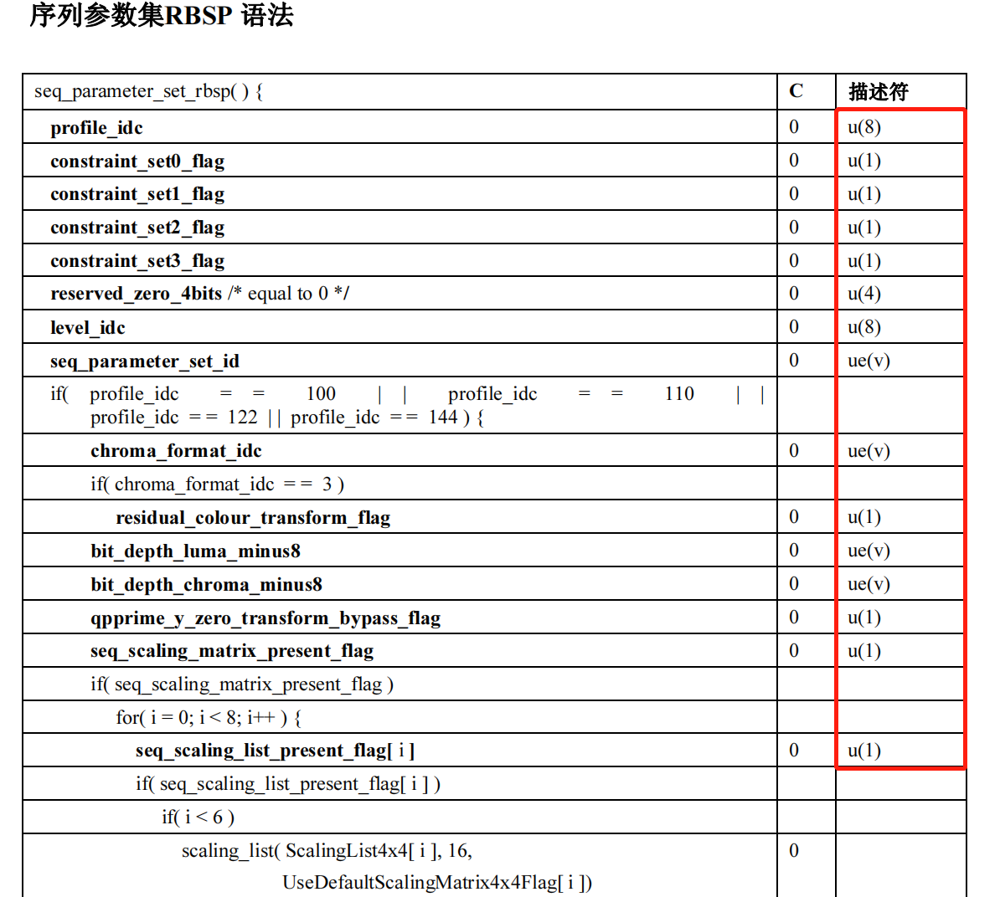
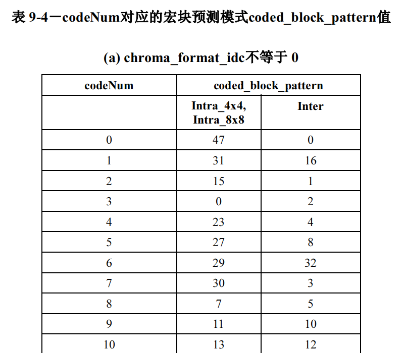
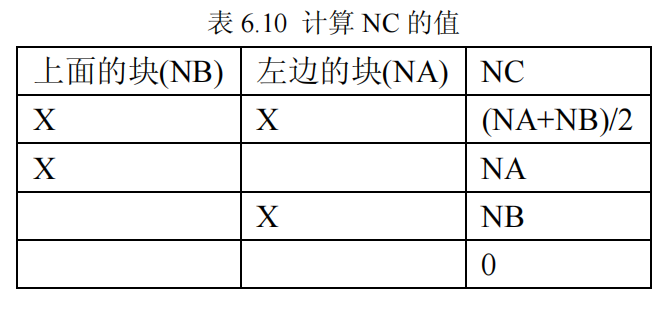
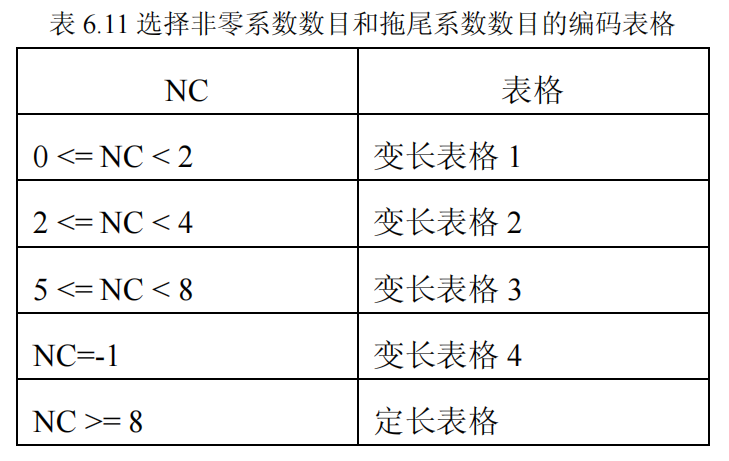
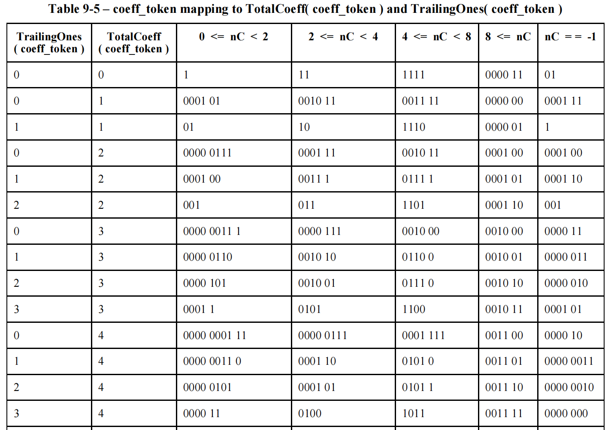
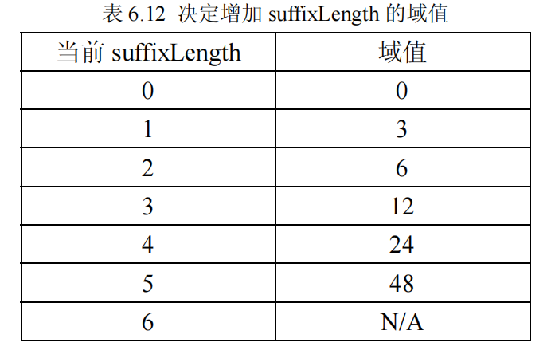
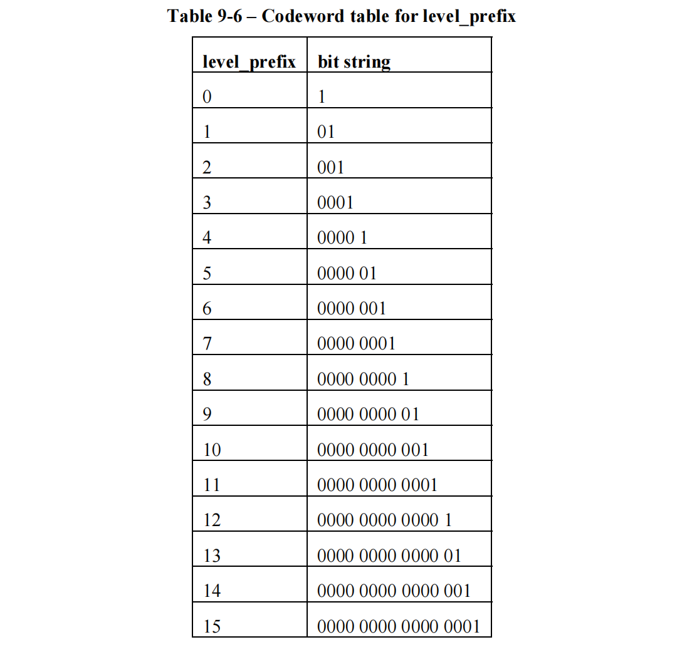
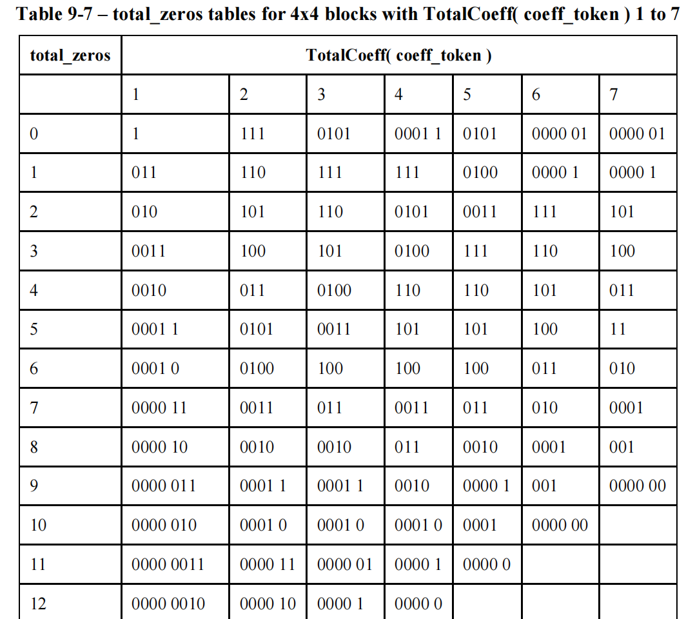
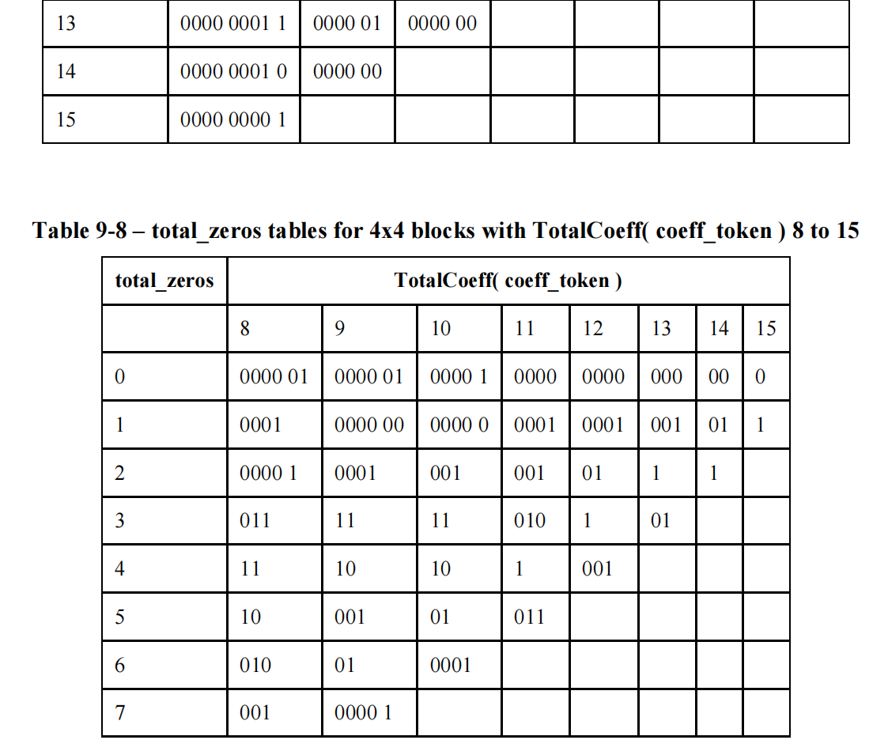
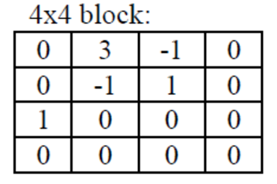

## 熵编码

**何为熵？：** (引用百度百科的解释)

[信息](https://baike.baidu.com/item/信息/111163)是个很抽象的概念。人们常常说信息很多，或者信息较少，但却很难说清楚信息到底有多少。比如一本五十万字的中文书到底有多少[信息量](https://baike.baidu.com/item/信息量/420401)。直到1948年，香农提出了“信息熵”的概念，才解决了对信息的量化度量问题。信息熵这个词是C.E.Shannon（香农）从热力学中借用过来的。热力学中的热熵是表示分子状态混乱程度的物理量。**香农用信息熵的概念来描述信源的不确定度**。

**即用熵来表示一个信息的多少**。一段文字、或者一串二进制码流能够完整表示(*可以理解为无损*)其意义所需要的最低信息量称之为熵极限(熵)。


**熵编码概述：**

熵编码是一种无损编码，例如常见哈夫曼编码、算数编码、游程编码等。熵编码的宗旨是使得码字的平均码长尽量能达到熵极限，即可以认为**熵编码的最大压缩量就是达到熵极限，最低平均码长就是熵的值**，**低于熵极限的一定是有损的，**因此看一个压缩算法的无损压缩效率就是看编码后的平均码长与熵极限的差值大小，差值越小说明压缩效率越高，反之则越低。

**熵编码的具体实施就是：对出现概率较大的符号取较短的码字，概率小的符号取较长的码字**


**H264中使用的熵编码有三种：**

- 0阶哥伦布编码
- 上下文自适应变长编码CAVLC
- CABAC


## 0阶哥伦布编码Golomb

**下图是部分图像序列集(SPS)的语法解析表**



看看红色框框中的ue(v)是无符号指数哥伦布编码

**Golomb分为四种：**

1. 无符号指数哥伦布编码 ue(v)
2. 有符号指数哥伦布编码 se(v)
3. 映射指数哥伦布编码 me(v)
4. 截断指数哥伦布编码 te(v)

**其中2，3，4都依赖与ue(v)**


> **无符号指数哥伦布编码 ue(v)**

**编码过程：**

- 将待编码数x + 1
- 将x+1转为二进制数(位数为M位)，再在转换的二进制数前加M-1个0，得到的数就是x的编码结果

**解码过程：**

- 从头开始读连续N个0停止，读入接下来的1，然后是后面N个bit的数字y
- 解码结果X = 2^N - 1 + y


**<u>举例</u>：**

```c++
//x ⇒ x+1 ⇒ 编码结果
 0 ⇒ 1 ⇒ 1            //解码: 2^0 - 1 + 0 = 0
 1 ⇒ 10 ⇒ 010         // 2^1 - 1 + 0 = 1
 2 ⇒ 11 ⇒ 011         // 2^1 - 1 + 1 = 2
 3 ⇒ 100 ⇒ 00100      // 2^2 - 1 + 0 = 3
 4 ⇒ 101 ⇒ 00101      // 2^2 - 1 + 1 = 4
 5 ⇒ 110 ⇒ 00110      // 2^2 - 1 + 2 = 5
 6 ⇒ 111 ⇒ 00111      // 2^2 - 1 + 3 = 6
 7 ⇒ 1000 ⇒ 0001000   // (2 ^ (M - 1) ) - 1 + (0b000) = 8 - 1 + 0 = 7
 8 ⇒ 1001 ⇒ 0001001   // (2 ^ (M - 1) ) - 1 + (0b001) = 8 - 1 + 1 = 8
```


> **有符号指数哥伦布编码 se(v)**

使用se(v)即待编码值可能是正数也可能是负数。由于ue(v)的编码已经拥有的唯一性，所以se(v)可以引用ue(v)的功能。

假设当前se(v)的待编码值的x，我们想个办法将x映射成b，再对b进行ue(v)编码成c。**x < = > b < = > c**， 此时b <=> c已经能确保唯一性了，即每个b都对应一个c，每个c对应一个b。因此我们也需要确保x <=> b也具有唯一性(**且b必须都是正数**)

方法：如果x小于等于0，则b = -2 * x， 否则x > 0则 b = 2*x - 1

| x                      | b    |
| :--------------------- | :--- |
| 0                      | 0    |
| 1                      | 1    |
| -1                     | 2    |
| 2                      | 3    |
| -2                     | 4    |
| 3                      | 5    |
| -3                     | 6    |
| (-1)^(k+1) + ceil(k/2) | k    |

**编码过程：**

- 如果x <= 0，则把他映射为-2 *x, 如果x > 0则映射为2x-1
- 将映射结果按照**无符号指数哥伦布编码**计算

**解码过程：**

- 进行ue(v)解码得到k
- x = (-1)^(k+1) + ceil(k/2)


> **映射指数哥伦布编码 me(v)**

**宏块层的coded_block_pattern使用me进行解析**

**解码过程(查表法)：**

- 进行ue(v)解码得到codeNum
- 在根据codeNum以及宏块类型进行查表

<u>部分表格：</u>




> **截断指数哥伦布编码 te(v)**

**编码过程：**

- 如果语法元素的值为0，则编码为1，如果语法元素值为1，则编码为0，此时占用1个比特位
- 如果语法元素的值大于1，则使用ue(v)进行编码

**解码过程：**

- 如果上限值x大于1，那么te(v)的输出，也即语法元素的值，和ue(v)的输出相同
- 否则上限值x等于1，那么te(v)的输出，也即语法元素的值，等于读入下一位比特值的取反


## CAVLC（基于上下文自适应的可变长编码）

### CAVLC基本原理

Context Adaptive Variable Length Coding (CAVLC) ，CAVLC的本质是变长编码，它的特性主要体现在自适应能力上，CAVLC可以根据已编码句法元素的情况动态的选择编码中使用的码表，并且随时更新拖尾系数后缀的长度，从而获得极高的压缩比。

CAVLC 用于亮度和色度残差数据的编码。残差经过变换量化后的数据表现出如下特性：4x4块数据经过预测、变换、量化后，非零系数主要集中在低频部分，而高频系数大部分是零；量化后的数据经过 zig-zag 扫描，DC 系数附近的非零系数值较大，而高频位置上的非零系数值大部分是+1 和-1；相邻的 4*4 块的非零系数的数目是相关的。CAVLC 充分利用残差经过整数变换、量化后数据的特性进行压缩，进一步减少数据中的冗余信息，为 H.264 卓越的编码效率奠定了基础。


### CAVLC的上下文模型

利用相邻已编码符号所提供的相关性，为所要编码的符号选择合适的上下文模型。利用合适的上下文模型，就可以大大降低符号间的冗余度。**在 CAVLC 中上下文模型的选择主要体现在两个方面, 非零系数编码所需表格的选择以及拖尾系数后缀长度的更新。**


### CAVLC的编码过程

#### Step1：编码非零系数的数目（TotalCoeffs）以及拖尾系数的数目(TrailingOnes) 

非零系数数目的范围是从 0 到 16，拖尾系数数目的范围是从 0 到 3。如果±1 的个数大于 3 个，只有最后 3 个被视为拖尾系数，其余的被视为普通的非零系数。**对非零系数数目和拖尾系数数目的编码是通过查表的方式，共有 4 个变长表格和 1 个定长表格可供选择**。

其中的定长表格的码字是 6个比特长，高 4 位表示非零系数的个数（TotalCoeffs），最低两位表示拖尾系数的个数(TrailingOnes)。

表格的选择是根据变量 NC（Number Current，当前块值）的值来选择的，在求变量 NC 值的过程中，体现了基于上下文的思想。除了色度的直流系数外，其它系数类型的 NC 值是根据当前块左边 4x4 块的非零系数数目（NA）和当前块上面 4*4 块的非零系数数目（NB）求得的。当输入的系数是色度的直流系数时，NC= -1。求 NC 的过程见表 6.10，X 表示与当前块同属于一个片并可用



**NC对应的表格**



下图是根据TotalCoeffs、TrailingOnes、NC的值生成的码流(由于表格比较长这里只截取一部分，详细的可以直接看H264文档)



例如，如果当前TotalCoeffs = 4， TrailingOnes = 3， NC = 2，生成的编码码流就是0100


#### Step2：编码每个拖尾系数的符号，ZigZag逆序

由Step1可知，拖尾系数就是值为±1的系数。对于每个拖尾系数（±1）只需要指明其符号，其符号用一个比特表示（

0 表示+，1 表示-）。编码的顺序是按照反向扫描的顺序，从高频数据开始；


#### Step3：编码除了拖尾系数之外的非零系数的幅值（Levels），ZigZag逆序

**非零系数的幅值（Levels）的组成分为两个部分，前缀（level_prefix）和后缀（level_suffix）。**

levelSuffixsSize 和 suffixLength 是编码过程中需要使用的两个变量(**suffixLength用于前缀，levelSuffixSize用于后缀**)。后缀是长度为 levelSuffixsSize 位的无符号整数。通常情况下变量 levelSuffixsSize 的值等于变量 suffixLength 的值，有两种情况例外：

-  当前缀等于 14 时，suffixLength 等于 0，levelSuffixsSize 等于 4。 
-  当前缀等于 15 时，levelSuffixsSize 等于 12。

变量 suffixLength 是基于上下文模式自适应更新的，suffixLength 的更新与当前的 suffixLength的值以及已经解码好的非零系数的值（Level）有关。suffixLength 数值的初始化以及更新过程如下所示：

- 1．普通情况下 suffixLength 初始化为 0，但是当块中有多于 10 个非零系数并且其中拖尾系数的数目少于 3 个，suffixLength 初始化为 1。 
- 2．编码在最高频率位置上的非零系数。
- 3．如果当前已经解码好的非零系数值大于预先定义好的阈值，变量 suffixLength 加 1。



**非零系数赋值的编码过程：**

假设当前待编码的非零系数为level

1、将level从有符号整数映射成无符号整数(映射过程具有唯一性)

```c++
if（level > 0）
	levelCode = level << 1 - 2

else
	levelCode = -(level << 1)  -  1
```

2、编码前缀

```c++
level_prefix = levelCode / (1 << suffixLength)
```

根据level_prefix查表得到对应的比特串(初始情况下suffixLength为0，除了特殊情况(见上))



3、编码后缀

先获取levelSuffixSize的值，levelSuffixSize通常会被赋值为suffixLength，除了两种情况(见上)

levelSuffixSize 表示的是level编码后缀的长度，后缀用0填充，长度为多少就填充多少个0，如levelSuffixSize = 3那么当前幅值编码的后缀就为000

4、更新suffixLength

根据levelCode的值以及suffixLength对应的阈值的情况更新suffixLength

```c++
if(suffixLength == 0)
    suffixLength++;
else if(levelCode > suffix_length_tab[suffixLength])
    suffixLength++;
```

suffixLength对应的阈值表格如下：


#### Step4：编码最后一个非零系数前零的数目(TotalZeros) 

TotalZeros 指的是在最后一个非零系数前零的数目，此非零系数指的是按照正向扫描的最后一个非零系数。例如：已知一串系数 0 0 5 0 3 0 0 0 1 0 0 -1 0 0 0 0，最后一个非零系数是-1，TotalZeros的值等于 2+3+1+2=8。因为非零系数数目（TotalCoeffs）是已知，这就决定了 TotalZeros 可能的最大值。**根据TotalZeros以及TotalCoeffs查表得到对应的码流**





#### Step5：编码每个非零系数前零的个数（RunBefore）

每个非零系数前零的个数（RunBefore）是按照反序来进行编码的，从最高频的非零系数开始。

例如：已知一串系数 0 0 5 0 3 0 0 0 1 0 0 -1 0 0 0 0，-1前面的相邻零个数为2，1前面的相邻零个数为3......

RunBefore 在以下两种情况下是不需要编码的：

1． 最后一个非零系数（在低频位置上）前零的个数。

2． 如果没有剩余的零需要编码（Σ[RunBefore]=TotalZeros）时，没有必要再进行 RunBefore 的编码

在 CAVLC 中，对每个非零系数前零的个数的编码是依赖于 ZerosLeft 的值，ZerosLeft 表示当前非零系数左边的所有零的个数，ZerosLeft 的初始值等于 TotalZeros，在每个非零系数的 RunBefore值编码后进行更新。用这种编码方法，有助于进一步压缩编码的比特数目。例如：如果当前 ZerosLeft等于 1，就是只剩下一个零没有编码，下一个非零系数前零的数目只可能是 0 或 1， 编码只需要一个比特。

#### **CAVLC编码举例：**

假设一个4x4宏块量化后的数值如下，CAVLC编码后的码流是S：



对上述4x4块进行zig-zag扫描，得到的序列 0， 3，0，1，-1，-1，0，1，0，0，0，0，0，0，0，0

**1、**

得到**非零系数TotalCoffes  = 5**(分别是3,1,-1,-1,1)，**拖尾系数TotalZeros  = 3**

由于NC值是根据左边、上边宏块推导出来了，这里假设是第一个4x4宏块，左边、上边宏块都不可用，所以当前NC = 0；

根据TotalCoffes、TotalZeros、NC查表得到比特流为**S = 0000100**

**2、**

逆序的拖尾系数的值为1,-1,-1，编码后的值分别为**011**，所以**S = 0000100011**

**3、**

逆序的除拖尾系数后的非零系数幅值分别为1，3；分别对其编码

**编码1：**

初始的levelSuffixsSize  = suffixLength = 0； 

levelCode = level << 1 - 2 ;  levelCode = 0;

level_prefix = levelCode / (1 << suffixLength);  level_prefix = 0;

**level_prefix查表得到的码流是1**

由于levelSuffixSize 等于0，所以后缀的长度也为0(即没有后缀)，所以**S = 00001000111**

更新suffxLength = 1；

**编码3：**

levelCode  = 3 << 1 - 2;  levelCode = 4;

level_prefix  = levelCode / (1 << suffixLength);  level_prefix = 2;

**level_prefix查表得到的码流是001**

levelSuffixSize = suffixLength = 1，所以后缀是**0**，生成的**S = 000010001110010**

**4、**

编码最后一个非零系数前的零个数，根据TotalZeros  = 3，TotalCoeffs = 5查表可知得到码流为111，所以**S = 000010001110010111**

**5、**

逆序编码每个非零系数前的零个数，每个非零系数的RunBefore和ZerosLeft为(1，3)、(2，0)、（2，0）、（2，1）、（1，1）

> 对1编码：  zerosLeft = 3, run_before = 1, 编码为“10”；             
>
> 对-1编码： zerosLeft = 2, run_before = 0, 编码为“1”；             
>
> 对-1编码： zerosLeft = 2, run_before = 0, 编码为“1”             
>
> 对1编码：  zerosLeft = 2, rub_before = 1, 编码为“01”             
>
> 对3编码：  zerosLeft = 1, run_before = 1, 最后一个元素不需要编码。

所以最终的 **S = 000010001110010111101101**


## CABAC(基于上下文的自适应二进制熵编码)


## 参考引用

🐱‍🏍《新一代视频压缩编码标准--H.264/AVC 》 ---- 毕厚杰
