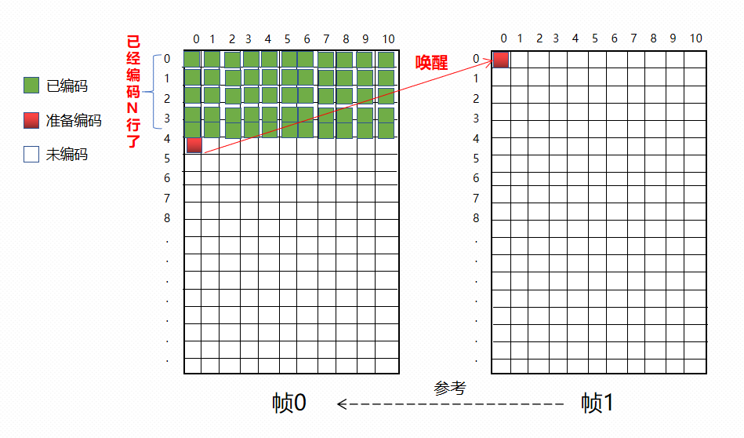

# 前言

**所谓并行编码就是多个线程同时编码，目的是为了降低单帧平均的编码时间**。

随着时代的进步，视频编码标准也一直不断的创新，用以满足当前以及未来一段时间的需求。从H261，H262，H263，H263+，H264再到后来的H265，H266。从H264到H266，每一个新标准都能在上一标准的基础上再提升30~50%的压缩率，然而压缩率的提升是建立在加大计算量的基础之上的。这就是我们常说的“**以时间换空间**”

为了能够降低单帧的平均编码时间，x264是能够支持多线程并行编码的；可以分为**帧级并行**和**片级并行**两种方式


下面是x264提供的文档，此处贴出其中一部分内容  https://github.com/mirror/x264/blob/master/doc/threads.txt

```tex
Historical notes:
Slice-based threads was the original threading model of x264.  It was replaced with frame-based threads in r607.  This document was originally written at that time.  Slice-based threading was brought back (as an optional mode) in r1364 for low-latency encoding.  Furthermore, frame-based threading was modified significantly in r1246, with the addition of threaded lookahead.

Old threading method: slice-based
application calls x264
x264 runs B-adapt and ratecontrol (serial)
split frame into several slices, and spawn a thread for each slice
wait until all threads are done
deblock and hpel filter (serial)
return to application
In x264cli, there is one additional thread to decode the input.

New threading method: frame-based
application calls x264
x264 requests a frame from lookahead, which runs B-adapt and ratecontrol parallel to the current thread, separated by a buffer of size sync-lookahead
spawn a thread for this frame
thread runs encode, deblock, hpel filter
meanwhile x264 waits for the oldest thread to finish
return to application, but the rest of the threads continue running in the background
No additional threads are needed to decode the input, unless decoding is slower than slice+deblock+hpel, in which case an additional input thread would allow decoding in parallel.

Penalties for slice-based threading:
Each slice adds some bitrate (or equivalently reduces quality), for a variety of reasons: the slice header costs some bits, cabac contexts are reset, mvs and intra samples can't be predicted across the slice boundary.
In CBR mode, multiple slices encode simultaneously, thus increasing the maximum misprediction possible with VBV.
Some parts of the encoder are serial, so it doesn't scale well with lots of cpus.
```

大概意思就是x264支持基于帧的多线程和基于Slice的多线程(也就是上面说的帧级并行和片级并行)，且帧级并行目前作为x264最新的并行编码方式，同时依旧保留片级并行的功能(用以实现低延迟编码)

- **多个Slice可以认为就是将一帧完整的图像分为互不重叠的几张小图，每个小图就是一个Slice，所谓片级并行，即对多个Slice同时编码**
- **所谓帧级并行就是同时对多个完整的图像进行编码**

*遗憾的是x264不支持同时开启帧级并行和Slice级并行，当然这从技术上是可以实现的*


#### 如何开启并行编码？

结合[x264的使用](1.x264的使用.md) 章节，在创建编码器的使用会配置编码参数x264_param_t

```c++
x264_param_t param;
param.i_threads = 4;  // 开启4个线程
param.b_sliced_threads = 0;  // 如果b_sliced_threads等于0表示使用帧级并行， 否则使用Slice并行
```


## 片级并行(Slice)

对于帧内宏块在进行编码时是需要依赖周围宏块重建后的像素点，而对于帧间宏块在进行运动搜索时也需要通过周围宏块的运动矢量得到预测运动矢量；因此可以看出来，不管是帧内宏块还是帧间宏块都要在周围(上方宏块和左方宏块)已经编码完才能进行编码，这样一帧图像好像只能“**从左往右，从上往下**”的方式逐步进行编码，**似乎无法做到并行编码！**

> 这里简单介绍下Slice
>
> 当时H264标准设计Slice的主要目的是为了防止误码扩散，一张图像可以分为1~N个Slice，Slice可以理解为“小图”；
>
> 将一张图像在空间上划分为1~N张小图，各个Slice不依赖其他Slice，能够单独编码单独解码；
>
> 假如一张图片分为4个Slice进行编码，在传输时由于网络丢包，接收端只收到其中两个Slice，这样这两个Slice也是能够正常解码。


**正是由于Slice之间的独立性，也为并行处理提供了思路。**例如将一帧图像分为4个Slice，由于各个Slice之间不互相依赖，所以可以开启四个线程对这4个Slice同时编码，从而降低单帧的编码时间


分多Slice编码有优点也有缺点，这里做个分析

**优点：**

- 能够并行处理，**降低单帧的编码时间**
- 更强的网络适应性(丢弃某个Slice不影响其他Slice的解码)

**缺点：**

- 编码质量会更差一点(因为多Slice会牺牲一定空间上的相关性，且不同Slice之前的边界无法进行滤波)

<u>还有一点不知道算不算优点</u>：一些旧设备上只支持SingleNalu的RTP传输，即一个RTP包含一个完整的Nalu(Slice)，由于受到MTU的限制一般RTP包的大小都会小于1500字节，正常情况下如果编码器使用单Slice编码，编码后的码流大小一般都会大于这个数，所以这种情况下编码器只能使用多Slice编码 (*具体的RTP payload H264的细节可以自行百度*)


## 帧级并行

由于Slice并行会牺牲不同Slice之间的空间上的相关性，导致编码质量会更低一下。可能正是出于这个考虑x264才引入了帧级并行，帧级并行还是针对一帧完整的帧进行编码，不会划分为多个Slice，所以不存在上述导致编码质量更低下的弊端。


我们知道H264的帧间编码，当前待编码帧是需要依赖之前已经编码完成的帧，所以似乎也**无法做到多个帧同时进行编码？**

其实不然，仔细想想可以发现，编码当前帧的某一行宏块时，在进行运动搜索是否需要搜索参考帧的整张图像呢？答案肯定是不需要的。例如Pic_0已经编码完前20行的宏块时，Pic_1的第一行宏块就可以开始编码了(*因为Pic_0第一行宏块在进行帧间运动搜索时是不需要搜索到Pic_0中第20行之后的宏块*)， 当Pic_1编码到第10行时，Pic_0只编码到第29行，此时Pic_1进行阻塞等待，待Pic_0编码完第30行时再通知Pic_1，两帧再同时进行编码， 虽然是同时编码但由于依赖性Pic_1一定会慢于Pic_0完成编码。  同理Pic_2也可以在Pic_1编码完一定行数之后也开启编码......

**这个“20行”的间隔只是个假设值，理论上这个值越小并行程度越高，但运动搜索的范围也会越小，理论上质量会更低一点**(*但如果这个行数间隔设置合理的话基本是不会影响编码质量的*)


**图示：**





帧级并行编码有优点也有缺点，这里做个分析

**优点：**

- 并行编码，**降低总的编码时间**(这个与Slice不同，Slice并行是降低单帧的编码时间(*当然这也是降低总编码时间*)，而帧级并行是降低总的编码时间， 理论上是不会降低单帧的编码时间的)
- 不会截断图像空间上的相关性，理论上对比单线程不会有质量下降的问题

**缺点：**

- **延迟输出，开启N个线程会延迟N-1帧输出**(当前技术上是可以实现不延迟输出的，但x264中没这么做)
- 更高的内存占用


## 源码分析


### 多线程初始化源码分析

开启多线程时，在创建编码器x264_encoder_open会进行一些线程相关资源的初始化

```c++
// 这里截取部分代码

#if HAVE_THREAD
static void encoder_thread_init( x264_t *h )
{
    // 设置线程优先级
    if( h->param.i_sync_lookahead )
        x264_lower_thread_priority( 10 );
}
#endif

x264_t *x264_encoder_open( x264_param_t *param )
{
    // ......
    
    // 线程初始化，这是个重点函数!!!
    if( h->param.i_threads > 1 &&
        x264_threadpool_init( &h->threadpool, h->param.i_threads, (void*)encoder_thread_init, h ) )
        goto fail;
    
    // h->param.i_threads为当前的线程数
    for( int i = 0; i < h->param.i_threads; i++ )
    {
        int init_nal_count = h->param.i_slice_count + 3;
        /*
        	allocate_threadlocal_data表示是否需要alloc
        	对于Slice并行(b_sliced_threads为1)是不需要额外在分配的，而帧级并行就需要多分配内存
        	所以开启帧级并行会比Slice并行会有更高的内存占用
         */
        int allocate_threadlocal_data = !h->param.b_sliced_threads || !i;
        if( i > 0 )
            *h->thread[i] = *h;
		// 初始化mutex、cond等资源
        if( x264_pthread_mutex_init( &h->thread[i]->mutex, NULL ) )
            goto fail;
        if( x264_pthread_cond_init( &h->thread[i]->cv, NULL ) )
            goto fail;
		
        if( allocate_threadlocal_data )
        {
            // 创建x264_frame_t
            h->thread[i]->fdec = x264_frame_pop_unused( h, 1 );
            if( !h->thread[i]->fdec )
                goto fail;
        }
        else
            h->thread[i]->fdec = h->thread[0]->fdec;
		// 申请用来存储编码后码流的内存空间
        CHECKED_MALLOC( h->thread[i]->out.p_bitstream, h->out.i_bitstream );
        /* Start each thread with room for init_nal_count NAL units; it'll realloc later if needed. */
        CHECKED_MALLOC( h->thread[i]->out.nal, init_nal_count*sizeof(x264_nal_t) );
        h->thread[i]->out.i_nals_allocated = init_nal_count;

        if( allocate_threadlocal_data && x264_macroblock_cache_allocate( h->thread[i] ) < 0 )
            goto fail;
    }
}
```


**x264_threadpool_init**

```c++
int x264_threadpool_init( x264_threadpool_t **p_pool, int threads,
                          void (*init_func)(void *), void *init_arg )
{
    if( threads <= 0 )
        return -1;

    if( x264_threading_init() < 0 )
        return -1;
	// 创建线程池
    x264_threadpool_t *pool;
    CHECKED_MALLOCZERO( pool, sizeof(x264_threadpool_t) );
    *p_pool = pool;

    pool->init_func = init_func;
    pool->init_arg  = init_arg;
    pool->threads   = threads;

    CHECKED_MALLOC( pool->thread_handle, pool->threads * sizeof(x264_pthread_t) );
	
    /*
    	初始化线程相关任务队列
    	uninit: list of jobs that are awaiting use
    	run: list of jobs that are queued for processing by the pool
    	done: list of jobs that have finished processing
     */
    if( x264_sync_frame_list_init( &pool->uninit, pool->threads ) ||
        x264_sync_frame_list_init( &pool->run, pool->threads ) ||
        x264_sync_frame_list_init( &pool->done, pool->threads ) )
        goto fail;

    for( int i = 0; i < pool->threads; i++ )
    {
       x264_threadpool_job_t *job;
       CHECKED_MALLOC( job, sizeof(x264_threadpool_job_t) );
       x264_sync_frame_list_push( &pool->uninit, (void*)job );
    }
    // 创建pool->threads个线程，每个线程都执行函数threadpool_thread
    for( int i = 0; i < pool->threads; i++ )
        if( x264_pthread_create( pool->thread_handle+i, NULL, (void*)threadpool_thread, pool ) )
            goto fail;

    return 0;
fail:
    return -1;
}
```


**threadpool_thread**

```c++
static void *threadpool_thread( x264_threadpool_t *pool )
{
    return (void*)x264_stack_align( threadpool_thread_internal, pool );
}

static void *threadpool_thread_internal( x264_threadpool_t *pool )
{
    if( pool->init_func )
        pool->init_func( pool->init_arg );  // 执行上面传下来的函数指针，即设置线程优先级

    /* 循环从run队列中获取job执行，执行完成之后放到done队列中去 */
    while( !pool->exit )
    {
        x264_threadpool_job_t *job = NULL;
        x264_pthread_mutex_lock( &pool->run.mutex );
        while( !pool->exit && !pool->run.i_size )
            x264_pthread_cond_wait( &pool->run.cv_fill, &pool->run.mutex );
        if( pool->run.i_size )
        {
            job = (void*)x264_frame_shift( pool->run.list );
            pool->run.i_size--;
        }
        x264_pthread_mutex_unlock( &pool->run.mutex );
        if( !job )
            continue;
        // 执行func函数，此函数为为编码函数
        job->ret = job->func( job->arg );
        // 编码完成之后放到done队列中去，等待输出
        x264_sync_frame_list_push( &pool->done, (void*)job );
    }
    return NULL;
}

```


#### 小结

开启多线程时，会创建多个线程，每个线程都会从任务队列run中取job，然后进行编码，编码完成之后Push到done队列中等待输出。 所以不管是Slice并行还是帧级并行，都是将当前的Slice/Frame编码任务放到run队列中即可


------


### 编码过程源码分析

```c++
// 截取部分代码
int  x264_encoder_encode( x264_t *h,
                             x264_nal_t **pp_nal, int *pi_nal,
                             x264_picture_t *pic_in,
                             x264_picture_t *pic_out )
{
    /*
    	thread_current为当前帧的上下文x264_t
    	thread_prev为上一帧的上下文
    	thread_oldest为最早的帧的上下文
    	如果非帧级并行这三个变量是指向同一个上下文的
    */
    x264_t *thread_current, *thread_prev, *thread_oldest;
    if( h->i_thread_frames > 1 )  // 帧级并行的时候h->i_thread_frames才会大于1
    {
        /*
        	多不同上下文之间的状态、码控同步
        	h->thread保存着多个线程的上下文，例如开启四个线程，则四个x264_t分别保存在h->thread[0]、h->thread[1]、h->thread[2]、h->thread[3]中
        	其中h->thread[0]与这里的h是一样的
        	上层每次调用x264_encoder_encode进行编码都会循环切x264_t，例如编码第一帧的时候用thread[1]去执行slice_write(x264第一帧是从thread[1]开始的)，编码第二帧的时候用thread[2]，第三帧用thread[3]，第四帧用thread[0]......
        */
        
        thread_prev    = h->thread[ h->i_thread_phase ];  // 上面上一帧所在的上下文
        h->i_thread_phase = (h->i_thread_phase + 1) % h->i_thread_frames;
        thread_current = h->thread[ h->i_thread_phase ];  // 编码当前帧的上下文
        /*
        	最“旧”帧的上下文
        	如果当前帧用的thread[0]则thread_oldest为thread[1]，
        	如果当前帧用的thread[1]则thread_oldest为thread[2]，
        	如果当前帧用的thread[3]则thread_oldest为thread[0]......
        	因为线程数是固定的，如果开启4个线程最多只能有4个线程在执行编码，所以将当前帧抛给对应线程执行编码时也会等待“最旧”的那个线程执行完，否则下一帧进来编码时是找不到空闲的thread[x]给它用的(等待操作会在encoder_frame_end中进行)
        */
        thread_oldest  = h->thread[ (h->i_thread_phase + 1) % h->i_thread_frames ];
        /*
        	不同的线程之间需要做好信息的同步，有些信息只和自己有关，例如h->fdec，h->fenc,当前帧的宏块信息等
        	但有些信息需要在多个线程之间同步，例如参考帧，frame_num，码率情况等等
        */
        // 信息同步
        thread_sync_context( thread_current, thread_prev );
        // 码控同步
        x264_thread_sync_ratecontrol( thread_current, thread_prev, thread_oldest );
        h = thread_current;
    }
    else
    {
        thread_current =
        thread_oldest  = h;
    }
    
    // ......
    
    /* Write frame */
    h->i_threadslice_start = 0;
    h->i_threadslice_end = h->mb.i_mb_height;
    if( h->i_thread_frames > 1 )
    {
        // 帧级并行
        x264_threadpool_run( h->threadpool, (void*)slices_write, h );
        h->b_thread_active = 1;
    }
    else if( h->param.b_sliced_threads )
    {
        // Slice级并行
        if( threaded_slices_write( h ) )
            return -1;
    }
    else
        if( (intptr_t)slices_write( h ) ) // 单线程
            return -1;
	// 编码收尾工作， thread_oldest为最早的上下文
    return encoder_frame_end( thread_oldest, thread_current, pp_nal, pi_nal, pic_out );
}

```


**这里先看下Slice并行的处理**

```c++
void x264_threadpool_run( x264_threadpool_t *pool, void *(*func)(void *), void *arg )
{
    // 从uninit队列中拿到一个空闲job，将当前编码函数slice_writes放进去，然后push进run队列中
    x264_threadpool_job_t *job = (void*)x264_sync_frame_list_pop( &pool->uninit );
    job->func = func;
    job->arg  = arg;
    x264_sync_frame_list_push( &pool->run, (void*)job );
}


static int threaded_slices_write( x264_t *h )
{
    int round_bias = h->param.i_avcintra_class ? 0 : h->param.i_slice_count/2;

    /* set first/last mb and sync contexts */
    // 确定各个Slice的起始宏块位置和结束宏块位置
    for( int i = 0; i < h->param.i_threads; i++ )
    {
        x264_t *t = h->thread[i];
        if( i )
        {
            t->param = h->param;
            memcpy( &t->i_frame, &h->i_frame, offsetof(x264_t, rc) - offsetof(x264_t, i_frame) );
        }
        int height = h->mb.i_mb_height >> PARAM_INTERLACED;
        t->i_threadslice_start = ((height *  i    + round_bias) / h->param.i_threads) << PARAM_INTERLACED;
        t->i_threadslice_end   = ((height * (i+1) + round_bias) / h->param.i_threads) << PARAM_INTERLACED;
        t->sh.i_first_mb = t->i_threadslice_start * h->mb.i_mb_width;
        t->sh.i_last_mb  =   t->i_threadslice_end * h->mb.i_mb_width - 1;
    }

    x264_analyse_weight_frame( h, h->mb.i_mb_height*16 + 16 );

    x264_threads_distribute_ratecontrol( h );

    /* setup */
    for( int i = 0; i < h->param.i_threads; i++ )
    {
        h->thread[i]->i_thread_idx = i;
        h->thread[i]->b_thread_active = 1;
        x264_threadslice_cond_broadcast( h->thread[i], 0 );
    }
    /* dispatch */
    /*
    	执行slices_write
    	slice_write函数是完成一个Slice的编码，此函数的实现可以参考"宏块编码流程分析.md"章节
     */
    for( int i = 0; i < h->param.i_threads; i++ )
        x264_threadpool_run( h->threadpool, (void*)slices_write, h->thread[i] );
    /* wait */
    /*
    	等待所有Slice编码完成,所以Slice并行是不会有延迟N-1帧输出的问题的
     */
    for( int i = 0; i < h->param.i_threads; i++ )
        x264_threadslice_cond_wait( h->thread[i], 1 );

    x264_threads_merge_ratecontrol( h );

    // 获取输出码流，以及各个Slice的ssim等
    for( int i = 1; i < h->param.i_threads; i++ )
    {
        x264_t *t = h->thread[i];
        for( int j = 0; j < t->out.i_nal; j++ )
        {
            h->out.nal[h->out.i_nal] = t->out.nal[j];
            h->out.i_nal++;
            nal_check_buffer( h );
        }
        /* All entries in stat.frame are ints except for ssd/ssim. */
        for( int j = 0; j < (offsetof(x264_t,stat.frame.i_ssd) - offsetof(x264_t,stat.frame.i_mv_bits)) / sizeof(int); j++ )
            ((int*)&h->stat.frame)[j] += ((int*)&t->stat.frame)[j];
        for( int j = 0; j < 3; j++ )
            h->stat.frame.i_ssd[j] += t->stat.frame.i_ssd[j];
        h->stat.frame.f_ssim += t->stat.frame.f_ssim;
        h->stat.frame.i_ssim_cnt += t->stat.frame.i_ssim_cnt;
    }

    return 0;
}
```


**帧级并行的处理**

帧级并行是直接执行  **x264_threadpool_run( h->threadpool, (void*)slices_write, h );**   ， 将编码函数封装成job Push进run队列中，由“**多线程初始化源码分析**”中创建的线程不断取run中的job执行；

上文提到帧级并行如果Pic_1编码比较快时会有一个阻塞等待Pic_0的过程

阻塞、唤醒相关函数为**x264_frame_cond_wait**，**x264_frame_cond_broadcast**

```c++
/*
	帧frame每编码完一行宏块都用调用x264_frame_cond_broadcast，唤醒其他阻塞的线程
*/ 
void x264_frame_cond_broadcast( x264_frame_t *frame, int i_lines_completed )
{
    x264_pthread_mutex_lock( &frame->mutex );
    frame->i_lines_completed = i_lines_completed; // 更新frame已经编码的行数
    x264_pthread_cond_broadcast( &frame->cv );
    x264_pthread_mutex_unlock( &frame->mutex );
}

/*
	形参frame表示参考的帧，frame->i_lines_completed表示已经编码完成的行数
*/
void x264_frame_cond_wait( x264_frame_t *frame, int i_lines_completed )
{
    x264_pthread_mutex_lock( &frame->mutex );
    while( frame->i_lines_completed < i_lines_completed )  // 如果参考帧已编码的行数小于预期(i_lines_completed)，会在这里阻塞等待
        x264_pthread_cond_wait( &frame->cv, &frame->mutex );
    x264_pthread_mutex_unlock( &frame->mutex );
}
```


```c++
/*
	开启帧级多线程时，在进行宏块分析时会调用x264_frame_cond_wait
	下面截取x264_frame_cond_wait调用栈
*/

static intptr_t slice_write( x264_t *h )
{
	// ......
    x264_macroblock_analyse(h);
    // ......
}

void x264_macroblock_analyse( x264_t *h )
{
	// ......
    mb_analyse_init( h, &analysis, h->mb.i_qp );
    // ......
}

static void mb_analyse_init( x264_t *h, x264_mb_analysis_t *a, int qp )
{
    // ......
    if( h->sh.i_type != SLICE_TYPE_I )
    {
        // ......
        if( h->mb.i_mb_x == 0 && !(h->mb.i_mb_y & PARAM_INTERLACED) )
        {
            int mb_y = h->mb.i_mb_y >> SLICE_MBAFF;
            int thread_mvy_range = i_fmv_range;
            if( h->i_thread_frames > 1 )
            {
                int pix_y = (h->mb.i_mb_y | PARAM_INTERLACED) * 16; // 乘上16，是按照像素行数而不是宏块行数
                /*
                	thresh表示参考帧已编码行数的下限阈值，如果参考帧已编码行数小于这个阈值，当前帧会阻塞等待
                	thresh = pix_y + h->param.analyse.i_mv_range_thread;
                	pix_y表示当前帧已经编码的行数(像素)，h->param.analyse.i_mv_range_thread是可配置参数
                	h->param.analyse.i_mv_range_thread就可以认为上文提到的N，值越小并行程度越高
                */
                int thresh = pix_y + h->param.analyse.i_mv_range_thread;
                for( int i = (h->sh.i_type == SLICE_TYPE_B); i >= 0; i-- )
                    for( int j = 0; j < h->i_ref[i]; j++ ) // 遍历所有参考帧
                    {
                        x264_frame_cond_wait( h->fref[i][j]->orig, thresh );
                        thread_mvy_range = X264_MIN( thread_mvy_range, h->fref[i][j]->orig->i_lines_completed - pix_y );
                    }
            }
        }
        
    }
    // ......
}

```


```c++
/*
	开启帧级多线程时，帧每编码完一行宏块都会调用x264_frame_cond_broadcast
	下面截取x264_frame_cond_broadcast调用栈
*/

static intptr_t slice_write( x264_t *h )
{
	// ......
    if( i_mb_x == 0 )
    {
        if( bitstream_check_buffer( h ) )
            return -1;
        if( !(i_mb_y & SLICE_MBAFF) && h->param.rc.i_vbv_buffer_size )
            bitstream_backup( h, &bs_bak[BS_BAK_ROW_VBV], i_skip, 1 );
        if( !h->mb.b_reencode_mb )
            fdec_filter_row( h, i_mb_y, 0 );
    }
    // ......
}

static void fdec_filter_row( x264_t *h, int mb_y, int pass )
{
    // ......
    int b_end = mb_y == h->i_threadslice_end;
    /* 
    	h->fdec->b_kept_as_ref为0,表示当前帧不会作为参考帧，即不会有其他帧依赖当前帧，所以不需要调用x264_frame_cond_broadcast
    	如果当前帧已经编码完了，即b_end为true，则会加上一个极大值10000(10000可能是为了方便，也可以设置为8000、5w、10w都行)
    */
    if( h->i_thread_frames > 1 && h->fdec->b_kept_as_ref )
        x264_frame_cond_broadcast( h->fdec, mb_y*16 + (b_end ? 10000 : -(X264_THREAD_HEIGHT << SLICE_MBAFF)) );
    // ......
}
```


#### 输出

**encoder_frame_end**

```c++
static int encoder_frame_end( x264_t *h, x264_t *thread_current,
                              x264_nal_t **pp_nal, int *pi_nal,
                              x264_picture_t *pic_out )
{
    char psz_message[80];

    if( !h->param.b_sliced_threads && h->b_thread_active )
    {
        // 帧级并行才会进入到这里，这个h为最旧的那个上下文，这里会阻塞等待h这一线程的帧编码完成，这也是帧级并行会延迟N-1帧输出的地方
        h->b_thread_active = 0;
        if( (intptr_t)x264_threadpool_wait( h->threadpool, h ) )
            return -1;
    }
    // ......
}
```


### 参考引用

🐱‍🏍https://github.com/mirror/x264

