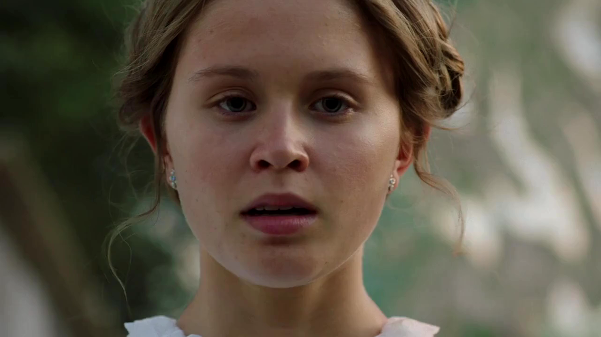
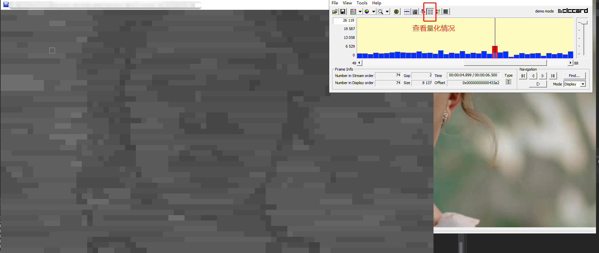
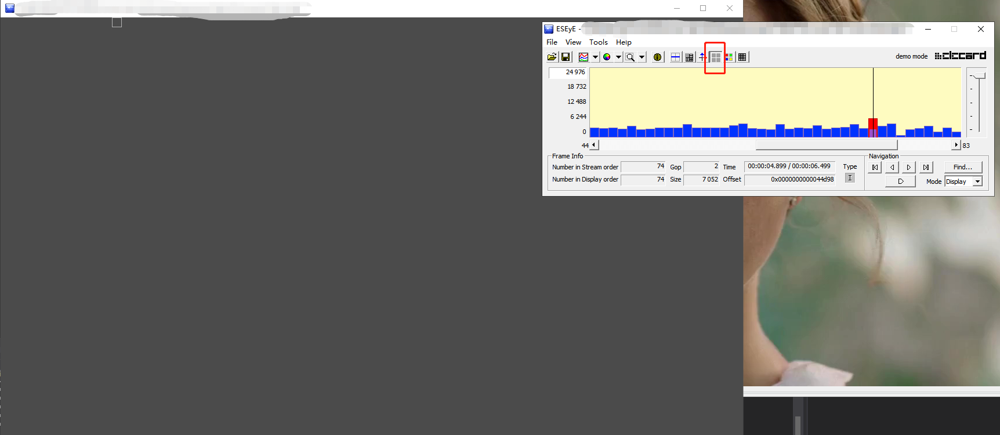
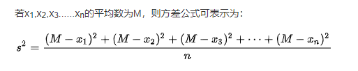
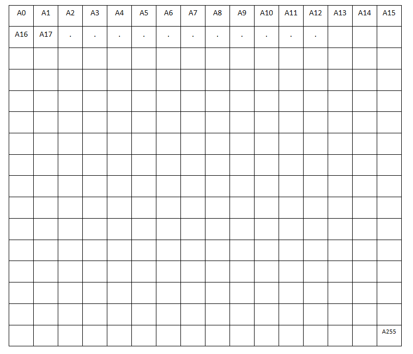

# Adaptive Quantization

## 前言

**下面摘取《The first in-depth technical analysis of VP8》中的一段话**

《[The first in-depth technical analysis of VP8](https://x264dev.multimedia.cx/archives/377)》 https://www.eefocus.com/czzheng/blog/11-09/230788_01edc.html(原文的链接失效了)

> ### **Quantization**
>
> **For quantization, the core process is basically the same among all MPEG-like video formats, and VP8 is no exception.** The primary ways that video formats tend to differentiate themselves here is by varying quantization scaling factors. There are two ways in which this is primarily done: frame-based offsets that apply to all coefficients or just some portion of them, and macroblock-level offsets. VP8 primarily uses the former; in a scheme much less flexible than H.264′s custom quantization matrices, it allows for adjusting the quantizer of luma DC, luma AC, chroma DC, and so forth, separately. The latter (macroblock-level quantizer choice) can, in theory, be done using its “segmentation map” features, albeit very hackily and not very efficiently.
>
> 
>
> VP8 在这里犯的致命错误是没有将宏块级量化作为 VP8 的核心特性。利用宏块级量化的算法被称为“自适应量化”，对于具有竞争力的视觉质量绝对至关重要。我在 x264 中[实现基于方差的自适应量化](https://git.videolan.org/?p=x264.git;a=commitdiff;h=dc4f40ce74c996a1e15021b82ab71ebcb8652d0b)（[之前](https://doom10.org/compare/parkrun_psnr.png)、[之后](https://doom10.org/compare/parkrun_ssim.png)）至今仍是 x264 历史上最大的视觉质量增益。编码器比较一次又一次地表明，没有自适应量化的编码器根本无法竞争。
>
> **The killer mistake that VP8 has made here is not making macroblock-level quantization a core feature of VP8. Algorithms that take advantage of macroblock-level quantization are known as “adaptive quantization” and are absolutely critical to competitive visual quality. My [implementation of variance-based adaptive quantization](https://git.videolan.org/?p=x264.git;a=commitdiff;h=dc4f40ce74c996a1e15021b82ab71ebcb8652d0b) ([before](https://doom10.org/compare/parkrun_psnr.png), [after](https://doom10.org/compare/parkrun_ssim.png)) in x264 still stands to this day as the single largest visual quality gain in x264 history. Encoder comparisons have showed over and over that encoders without adaptive quantization simply cannot compete.**
>
> Thus, while adaptive quantization is possible in VP8, the only way to implement it is to define one segment map for every single quantizer that one wants and to code the segment map index for every macroblock. This is inefficient and cumbersome; even the relatively suboptimal MPEG-style delta quantizer system would be a better option. Furthermore, only 4 segment maps are allowed, for a maximum of 4 quantizers per frame.
>
> **Verdict on Quantization: Lack of well-integrated adaptive quantization is going to be a killer when the time comes to implement psy optimizations. Overall, much worse.**


**可见自适应量化的重要性**


**下面是x264 AQ作者写的一段话， 原文链接：https://mailman.videolan.org/pipermail/x264-devel/2012-July/009403.html**

> ```
> The (very rough) intuitive justification works something like this.
> 
> Imagine every macroblock has just one frequency coefficient.  This
> coefficient can be big or small.
> 
> If a macroblock's coefficient is 1.4, it gets quantized to 1.  That's
> an error of 28.5%.
> 
> If a macroblock's coefficient is 9.4, it gets quantized to 9.  That's
> an error of 4.3%.
> 
> Clearly, larger coefficients are coded more precisely than smaller
> ones when using a linear quantizer.  Visually, it is obvious this is
> somewhat wrong; just because a detail is 10 times higher-contrast in
> block X than block Y doesn't mean block Y should be completely
> decimated.
> 
> One solution to this would be to use a nonlinear quantizer like in
> AAC.  Obviously this is not possible without changing the H.264 spec,
> and would also be much slower.  Turns out that it's actually not that
> useful from my own testing -- this is because large coefficients in a
> block tend to mask small coefficients.  If you have a few big ones,
> there's no point in coding the small ones with tons of precision.
> 
> Since quantizer in H.264 is exponential, using log2(variance) to
> change QP is equivalent to using (variance) to change quantizer step
> size.  Therefore:
> 
> qp += log(variance)*C
> qp = qp + log(variance) * C
> e^qp = e^(qp + log(variance) * C)
> qscale = qscale * e^(log(variance)*C)
> qscale = qscale * variance^C
> qscale *= variance^C
> 
> The constant C was decided through wild guessing and experimentation
> and is based on nothing in particular.
> 
> As it happens, SSIM basically is PSNR weighted by variance in a
> similar fashion, albeit less explicitly so.
> ```


大致意思：假设有两个系数，值分别是1.4和9.4，如果两个都采用一样的量化等级，1.4量化成1，9.4量化成9，两者的损失比分别是28.5%(0.4/1.4)和4.3%(0.4/9.4)。将单个系数引申到NxN的矩阵(即宏块残差值)也是同样的道理，残差值大的和小的如果采用相同的量化等级，那么残差小的精度损失会更大，具体表现出现就是整幅画面的画质不均衡，从而主观感觉会稍差。 而如果对残差小的宏块采用小的量化等级，残差大的宏块采用大的量化等级，那么两者的精度损失差能控制在一定范围内，这样整体画面的画质能更均衡主观上会更好些。


**其实上面那句话就已经简述了x264中AQ算法的核心内容：复杂宏块使用大的QP，简单宏块使用小的QP**


## 开启/关闭自适应量化效果比较

下面这张图是原始的YUV图片



x264中可以通过x264_param_t的rc.i_aq_mode来开启关闭AQ，有四种选项

- X264_AQ_NONE ； // 关闭AQ

- X264_AQ_VARIANCE

- X264_AQ_AUTOVARIANCE

- X264_AQ_AUTOVARIANCE_BIASED

  

**x264中开启AQ的效果图：**




**x264中关闭AQ的效果图：**




上述两幅图的左边灰色图片部分为宏块的量化程度，灰色程度越深表明量化程度越高；

可以看出没有开启AQ的话宏块的QP都是一样的，而开启AQ的话宏块的QP是不一样的，而且有一个稍明显的“人物轮廓出来”，这部分取决于编码器的自适应量化算法，下面会对其进行介绍


## X264基于方差的自适应量化

**“复杂宏块使用大的QP，简单宏块使用小的QP”**

上面这句话其实隐藏了一个问题，即“**如何衡量当前宏块的复杂程度？**”

x264有自己的计算方法即通过像素值**方差** (不是残差的方差，是原始像素的方差)，**方差越大宏块复杂度越高，反之则越低**


### 方差公式




### X264宏块像素方差计算

下图是一张16x16宏块的图，**里面存储的是原始的像素值，而不是残差值**，包含A0，A1，A2.....A255，一共256个像素点



假设（A0 + A1 + A2 + .....  + A255）/ 256 = m     ------------- (1)

方差s² = [ (A0 - m)² +(A1 - m)² + (A2 - m)² + (A3 - m)² + .....  + (A255 - m)² ] / 256； ----------（2）

将(2)展开就是 256 * s² =  (A0² + A1² +A2² + ... + A255²) + 256m² - 2m(A0 + A1 + A2 + ... + A255);  -------（3）

即 **256 * s² =  (A0² + A1² +A2² + ... + A255²) + 256m² - 512m² = (A0² + A1² +A2² + ... + A255²) - 256m²；----- (4)**

**上述公式(4)就是我们计算得到的方差**


下面我们换种其他方式来计算方法(**这也是x264计算的方法**)：

设 sum = A0 + A1 + A2 + ..... + A255 = 256m；

sqr = A0² + A1² + A2² + ...... + A255²；

设 x = (sqr -  (sum * sum / 256 ))； 这里将sqr和sum带入再计算

x = （A0² + A1² + A2² + ...... + A255²)  － (A0 + A1 + A2 + ..... + A255)*(A0 + A1 + A2 + ..... + A255) /256;  -----(5)

x = (A0² + A1² + A2² + ...... + A255²）- 256m * 256m / 256； ------(6)

**x = (A0² + A1² + A2² + ...... + A255²）- 256m²  ------(7)**

**对比(4)和(7)发现x 就等于 256*s²**， *所以通过上面的方法也能得到方差，而且计算过程会更简单点*


### 宏块的能量值

**“方差越大，宏块复杂度越高，量化等级就越大”**

这里我们不这么表述，用“能量值”代替“复杂度”，即**“方差越大，宏块能量值越大，量化等级就越大”**


**宏块能量值与方法什么关系呢？**其实宏块能量就等于亮度块的方差 + 色度块的方差


## 源码解析

x264中通过**x264_adaptive_quant_frame**进行宏块的自适应量化，此函数在x264_encoder_encode中被调用

```c++
void x264_adaptive_quant_frame( x264_t *h, x264_frame_t *frame, float *quant_offsets )
{
    /* Initialize frame stats */
    for( int i = 0; i < 3; i++ )
    {
        frame->i_pixel_sum[i] = 0;
        frame->i_pixel_ssd[i] = 0;
    }

    /* Degenerate cases */
    if( h->param.rc.i_aq_mode == X264_AQ_NONE || h->param.rc.f_aq_strength == 0 )
    {
        /*
        	如果没开启AQ或者aq_strength为0，则不进行宏块自适应量化
        	quant_offsets是调用方传下来的值，如果不为NULL，会根据这个值做宏块的QP偏移
        */
        /* Need to init it anyways for MB tree */
        if( h->param.rc.i_aq_mode && h->param.rc.f_aq_strength == 0 )
        {
            if( quant_offsets )
            {
                // 如果quant_offsets不为空，会根据quant_offsets中的值设置宏块QP的偏移
                for( int mb_xy = 0; mb_xy < h->mb.i_mb_count; mb_xy++ )
                    frame->f_qp_offset[mb_xy] = frame->f_qp_offset_aq[mb_xy] = quant_offsets[mb_xy];
                if( h->frames.b_have_lowres )
                    for( int mb_xy = 0; mb_xy < h->mb.i_mb_count; mb_xy++ )
                        frame->i_inv_qscale_factor[mb_xy] = x264_exp2fix8( frame->f_qp_offset[mb_xy] );
            }
            else
            {
                // 否则宏块QP的偏移都为0
                memset( frame->f_qp_offset, 0, h->mb.i_mb_count * sizeof(float) );
                memset( frame->f_qp_offset_aq, 0, h->mb.i_mb_count * sizeof(float) );
                if( h->frames.b_have_lowres )
                    for( int mb_xy = 0; mb_xy < h->mb.i_mb_count; mb_xy++ )
                        frame->i_inv_qscale_factor[mb_xy] = 256;
            }
        }
        /* Need variance data for weighted prediction */
        if( h->param.analyse.i_weighted_pred )
        {
            for( int mb_y = 0; mb_y < h->mb.i_mb_height; mb_y++ )
                for( int mb_x = 0; mb_x < h->mb.i_mb_width; mb_x++ )
                    ac_energy_mb( h, mb_x, mb_y, frame );
        }
        else
            return;
    }
    /* Actual adaptive quantization */
    else
    {
        /* 
        	开启AQ
        	x264中AQ的模式有4中：X264_AQ_NONE、X264_AQ_VARIANCE、X264_AQ_AUTOVARIANCE、X264_AQ_AUTOVARIANCE_BIASED
        	其中X264_AQ_NONE是关闭AQ，后面三种都是开启AQ
        	对于X264_AQ_VARIANCE的aq强度使用配置的f_aq_strength， 而后两种的aq强度会根据宏块qp偏移的情况适当调节；且计算QP offset的公式也不一样
        */
        /* constants chosen to result in approximately the same overall bitrate as without AQ.
         * FIXME: while they're written in 5 significant digits, they're only tuned to 2. */
        float strength;
        float avg_adj = 0.f;
        float bias_strength = 0.f;

        if( h->param.rc.i_aq_mode == X264_AQ_AUTOVARIANCE || h->param.rc.i_aq_mode == X264_AQ_AUTOVARIANCE_BIASED )
        {
            // 如果aq_mode为X264_AQ_AUTOVARIANCE或者X264_AQ_AUTOVARIANCE_BIASED
            float bit_depth_correction = 1.f / (1 << (2*(BIT_DEPTH-8)));
            float avg_adj_pow2 = 0.f;
            // 遍历所有16x16的宏块
            for( int mb_y = 0; mb_y < h->mb.i_mb_height; mb_y++ )
                for( int mb_x = 0; mb_x < h->mb.i_mb_width; mb_x++ )
                {
                    // 计算当前宏块的能量值energy
                    uint32_t energy = ac_energy_mb( h, mb_x, mb_y, frame );
                    // 通过powf()计算得到当前宏块的qp偏移值
                    float qp_adj = powf( energy * bit_depth_correction + 1, 0.125f );
                    frame->f_qp_offset[mb_x + mb_y*h->mb.i_mb_stride] = qp_adj; // 存储
                    avg_adj += qp_adj;
                    avg_adj_pow2 += qp_adj * qp_adj;
                }
            avg_adj /= h->mb.i_mb_count;
            avg_adj_pow2 /= h->mb.i_mb_count;
            strength = h->param.rc.f_aq_strength * avg_adj; // 得到aq强度
            avg_adj = avg_adj - 0.5f * (avg_adj_pow2 - 14.f) / avg_adj;
            bias_strength = h->param.rc.f_aq_strength;
        }
        else
            strength = h->param.rc.f_aq_strength * 1.0397f; // 如果aq_mode为X264_AQ_VARIANCE
		
        // 遍历所有16x16宏块
        for( int mb_y = 0; mb_y < h->mb.i_mb_height; mb_y++ )
            for( int mb_x = 0; mb_x < h->mb.i_mb_width; mb_x++ )
            {
                float qp_adj;
                int mb_xy = mb_x + mb_y*h->mb.i_mb_stride;
                if( h->param.rc.i_aq_mode == X264_AQ_AUTOVARIANCE_BIASED )
                {
                    qp_adj = frame->f_qp_offset[mb_xy];
                    qp_adj = strength * (qp_adj - avg_adj) + bias_strength * (1.f - 14.f / (qp_adj * qp_adj));
                }
                else if( h->param.rc.i_aq_mode == X264_AQ_AUTOVARIANCE )
                {
                    qp_adj = frame->f_qp_offset[mb_xy];
                    qp_adj = strength * (qp_adj - avg_adj);
                }
                else
                {
                    // 如果是X264_AQ_VARIANCE，计算当前宏块的能量值
                    uint32_t energy = ac_energy_mb( h, mb_x, mb_y, frame );
                    // 通过log(ac_energy_mb)计算得到当前宏块的qp_offset
                    qp_adj = strength * (x264_log2( X264_MAX(energy, 1) ) - (14.427f + 2*(BIT_DEPTH-8)));
                }
                // 如果quant_offsets不为null，会额外加上一个偏移值
                if( quant_offsets )
                    qp_adj += quant_offsets[mb_xy];
				// 存储qp_offset
                frame->f_qp_offset[mb_xy] =
                frame->f_qp_offset_aq[mb_xy] = qp_adj;
                if( h->frames.b_have_lowres )
                    frame->i_inv_qscale_factor[mb_xy] = x264_exp2fix8(qp_adj);
            }
    }

    /* Remove mean from SSD calculation */
    for( int i = 0; i < 3; i++ )
    {
        uint64_t ssd = frame->i_pixel_ssd[i];
        uint64_t sum = frame->i_pixel_sum[i];
        int width  = 16*h->mb.i_mb_width  >> (i && CHROMA_H_SHIFT);
        int height = 16*h->mb.i_mb_height >> (i && CHROMA_V_SHIFT);
        frame->i_pixel_ssd[i] = ssd - (sum * sum + width * height / 2) / (width * height);
    }
}
```


**计算宏块能量值**

```c++
static NOINLINE uint32_t ac_energy_mb( x264_t *h, int mb_x, int mb_y, x264_frame_t *frame )
{
    /* This function contains annoying hacks because GCC has a habit of reordering emms
     * and putting it after floating point ops.  As a result, we put the emms at the end of the
     * function and make sure that its always called before the float math.  Noinline makes
     * sure no reordering goes on. */
    uint32_t var;
    x264_prefetch_fenc( h, frame, mb_x, mb_y );
    if( h->mb.b_adaptive_mbaff )
    {
        // 隔行
        /* We don't know the super-MB mode we're going to pick yet, so
         * simply try both and pick the lower of the two. */
        uint32_t var_interlaced, var_progressive;
        var_interlaced   = ac_energy_plane( h, mb_x, mb_y, frame, 0, 0, 1, 1 );
        var_progressive  = ac_energy_plane( h, mb_x, mb_y, frame, 0, 0, 0, 0 );
        if( CHROMA444 )
        {
            var_interlaced  += ac_energy_plane( h, mb_x, mb_y, frame, 1, 0, 1, 1 );
            var_progressive += ac_energy_plane( h, mb_x, mb_y, frame, 1, 0, 0, 0 );
            var_interlaced  += ac_energy_plane( h, mb_x, mb_y, frame, 2, 0, 1, 1 );
            var_progressive += ac_energy_plane( h, mb_x, mb_y, frame, 2, 0, 0, 0 );
        }
        else if( CHROMA_FORMAT )
        {
            var_interlaced  += ac_energy_plane( h, mb_x, mb_y, frame, 1, 1, 1, 1 );
            var_progressive += ac_energy_plane( h, mb_x, mb_y, frame, 1, 1, 0, 0 );
        }
        var = X264_MIN( var_interlaced, var_progressive );
    }
    else
    {
        // 计算亮度块的能量值
        var  = ac_energy_plane( h, mb_x, mb_y, frame, 0, 0, PARAM_INTERLACED, 1 );
        if( CHROMA444 )
        {
            // 计算色度块的能量值
            var += ac_energy_plane( h, mb_x, mb_y, frame, 1, 0, PARAM_INTERLACED, 1 );
            var += ac_energy_plane( h, mb_x, mb_y, frame, 2, 0, PARAM_INTERLACED, 1 );
        }
        else if( CHROMA_FORMAT )
            var += ac_energy_plane( h, mb_x, mb_y, frame, 1, 1, PARAM_INTERLACED, 1 ); // 计算色度块的能量值
    }
    x264_emms();
    return var; // 返回当前宏块的能量值
}
```


**ac_energy_plane**

```c++
static ALWAYS_INLINE uint32_t ac_energy_plane( x264_t *h, int mb_x, int mb_y, x264_frame_t *frame, int i, int b_chroma, int b_field, int b_store )
{
    int height = b_chroma ? 16>>CHROMA_V_SHIFT : 16;
    int stride = frame->i_stride[i];
    int offset = b_field
        ? 16 * mb_x + height * (mb_y&~1) * stride + (mb_y&1) * stride
        : 16 * mb_x + height * mb_y * stride;
    stride <<= b_field;
    if( b_chroma )
    {
        // 计算色度块
        ALIGNED_ARRAY_64( pixel, pix,[FENC_STRIDE*16] );
        int chromapix = h->luma2chroma_pixel[PIXEL_16x16];
        int shift = 7 - CHROMA_V_SHIFT;

        h->mc.load_deinterleave_chroma_fenc( pix, frame->plane[1] + offset, stride, height );
        return ac_energy_var( h->pixf.var[chromapix]( pix,               FENC_STRIDE ), shift, frame, 1, b_store )
             + ac_energy_var( h->pixf.var[chromapix]( pix+FENC_STRIDE/2, FENC_STRIDE ), shift, frame, 2, b_store );
    }
    else  // 计算亮度块
        return ac_energy_var( h->pixf.var[PIXEL_16x16]( frame->plane[i] + offset, stride ), 8, frame, i, b_store );
}
```


**h->pixf.var是一个函数指针数组**，在编码器初始化调用x264_pixel_init时这些函数会进行初始化

```c++
void x264_pixel_init( int cpu, x264_pixel_function_t *pixf )
{
    // ... 省略
    pixf->var[PIXEL_16x16] = pixel_var_16x16;
    pixf->var[PIXEL_8x16]  = pixel_var_8x16;
    pixf->var[PIXEL_8x8]   = pixel_var_8x8;
    // ... 省略
}
```

pixel_var_16x16、pixel_var_8x16、pixel_var_8x8是通过宏进行声明的，代码如下：

```c++
#define PIXEL_VAR_C( name, w, h ) \   
static uint64_t name( pixel *pix, intptr_t i_stride ) \
{                                             \
    uint32_t sum = 0, sqr = 0;                \
    for( int y = 0; y < h; y++ )              \
    {                                         \
        for( int x = 0; x < w; x++ )          \
        {                                     \
            sum += pix[x];                    \
            sqr += pix[x] * pix[x];           \
        }                                     \
        pix += i_stride;                      \
    }                                         \
    return sum + ((uint64_t)sqr << 32);       \
}

PIXEL_VAR_C( pixel_var_16x16, 16, 16 )
PIXEL_VAR_C( pixel_var_8x16,   8, 16 )
PIXEL_VAR_C( pixel_var_8x8,    8,  8 )
```

这里以**pixel_var_16x16**为例，将其展开后代码如下：

```c++
static uint64_t pixel_var_16x16( pixel *pix, intptr_t i_stride ) 
{                      
    /*
         16x16宏块
         a0   a1   a2   a3 .......   a15
         a16
         a31
         .
         .
         .
         a240 a241  ......           a255
    
    */
    uint32_t sum = 0, sqr = 0;                
    for( int y = 0; y < 16; y++ )              
    {                                         
        for( int x = 0; x < 16; x++ )          
        {                                     
            sum += pix[x];                    
            sqr += pix[x] * pix[x];           
        }                                     
        pix += i_stride;                      
    }
    /*
    	经过上述运算 
    	sum = a0 + a1 + a2 +a3 + ..... + a255
    	sqr = a0² + a1² + a2² + a3² + ... + a255²
    	将sqr的值保留在高32位，sum保留在低32位，return
    */
    return sum + ((uint64_t)sqr << 32);       
}
```


**ac_energy_var**

```c++
static ALWAYS_INLINE uint32_t ac_energy_var( uint64_t sum_ssd, int shift, x264_frame_t *frame, int i, int b_store )
{
    /* 此处的sum_ssd就是上述pixel_var_16x16返回的值 */
    uint32_t sum = sum_ssd;  // 取出 sum = a0 + a1 + a2 +a3 + ..... + a255
    uint32_t ssd = sum_ssd >> 32; // 取出 ssd = a0² + a1² + a2² + a3² + ... + a255²
    if( b_store )
    {
        frame->i_pixel_sum[i] += sum;
        frame->i_pixel_ssd[i] += ssd;
    }
    /* 
    如果当前块是亮度块shift等于8,色度块等于6,这里以亮度块为例
    
    ssd - sum*sum >> 8 --------(1)
    a0² + a1² + a2² + ... + a255² - (a0 + a1 +a2 ... + a255)²/256  ------------（2）
    设a0+a1+a2+...+a255 = 256m，带入（2）中
    得到：a0² + a1² + a2² + ... + a255² - 256m²  ----(3)
    公式(3)刚好是方差的计算公式(见上文“X264宏块像素方差计算”推导的公式(4))
    */
    return ssd - ((uint64_t)sum * sum >> shift);
}
```

