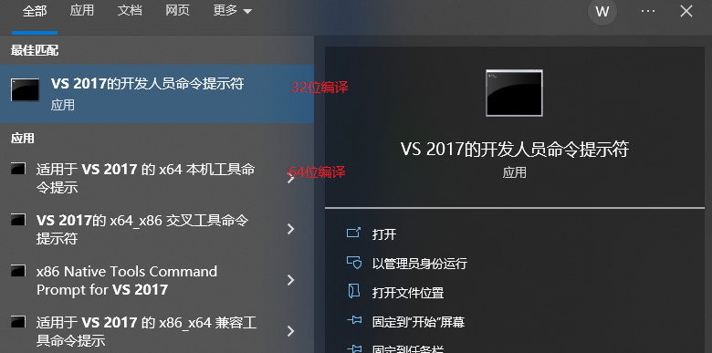
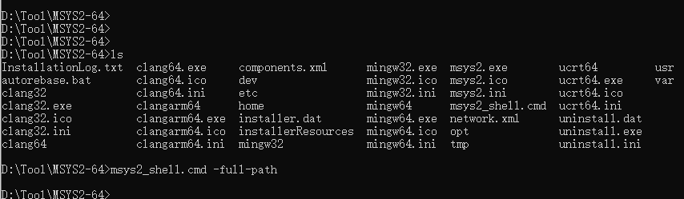

## Windows MSVC编译x264

Ref：https://www.roxlu.com/2016/057/compiling-x264-on-windows-with-msvc

#### 1、下载msys2

https://www.msys2.org/


打开MYSY2应用(或者打开msys2_shell.cmd)，运行如下命令

```shell
pacman -Sy pacman
pacman -Syu   # 运行完这行命令之后MSYS2窗口回退出，重新打开
pacman -Su

pacman -S yasm
pacman -S make
```


#### 2、下载x264源码

http://git.videolan.org/git/x264.git 

或者https://github.com/mirror/x264


#### 3、打开VS2017的命令行工具 VS2017 x64 Native Tools Command Prompt




进入到msys2的msys2_shell.cmd所在目录下，**运行：msys2_shell.cmd  -full-path命令**




此时会重新打开一个MSYS窗口，此窗口下进入到x264源码所在根目录(configure文件的那个目录)


运行： **(需要通过怕CC=cl指定使用MSVC的cl编译器)**

```shell
mkdir bin
CC=cl ./configure --prefix=./bin --enable-static
make
make install
```

完成之后lib、include、bin就会生成到当前的bin目录下