## 前言

#### 变换编码的基本概念

绝大多数图像都有一个共同的特征：平坦区域和内容变化缓慢的区域占据一幅图像的大部分，而细节区域和内容突变区域则占小部分。也可以说，图像中直流或者低频占绝大部分，而高频区占一小部分。空间域的图像变换到频域/变换域，会产生相关性很小的一些变换系数，并可对其进行压缩编码，即所谓的变换编码。

变换中有一类叫做正交变换，可用于图像编码。自1968年利用快速傅里叶变换(FFT)进行图像编码以来，出现了许多正交变化的编码方式，如K-L变换、离散余弦变换(DCT)等。其中K-L的编码性能最为理想，但缺乏快速算法，且变换矩阵随图像而异，不同图像需要计算不同的变换矩阵，因而只用来参考比较。DCT编码性能最接近K-L变换，略次之而已，但具有快速算法，广泛应用于图像编码。**H264中就是使用DCT变换**


#### 量化

量化主要目的时为了进一步压缩码率，让经过变换编码后的残差经过量化后的值能够更加“聚集”，有助于后续的熵编码


## DCT整数变换与量化

由于浮点数的计算比较复杂，**H264使用的是DCT整数变换**，整数编码是牺牲很小的质量换取更快的编码。在图像编码中，变换和量化在原理上是两个独立的过程。**但在H264中这两个过程是强相关的**。

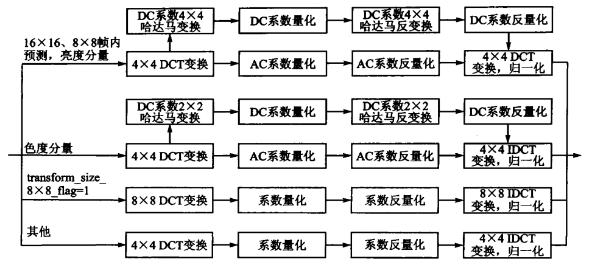


### DCT整数变换原理推导

这里就直接贴图了，内容来自《新一代视频压缩编码标准-H264/AVC》

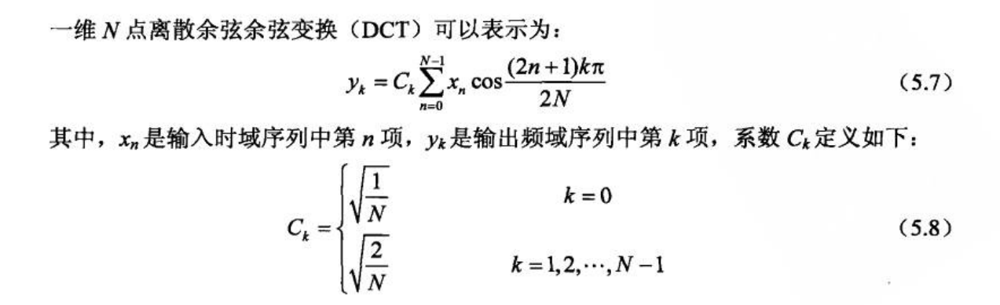


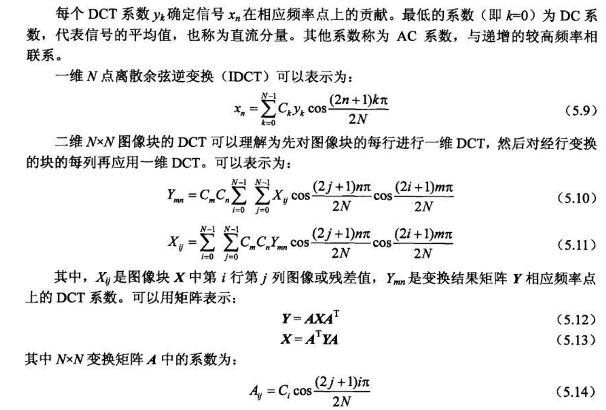

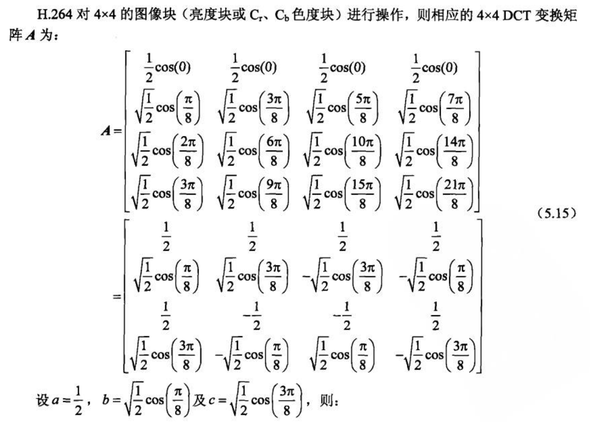

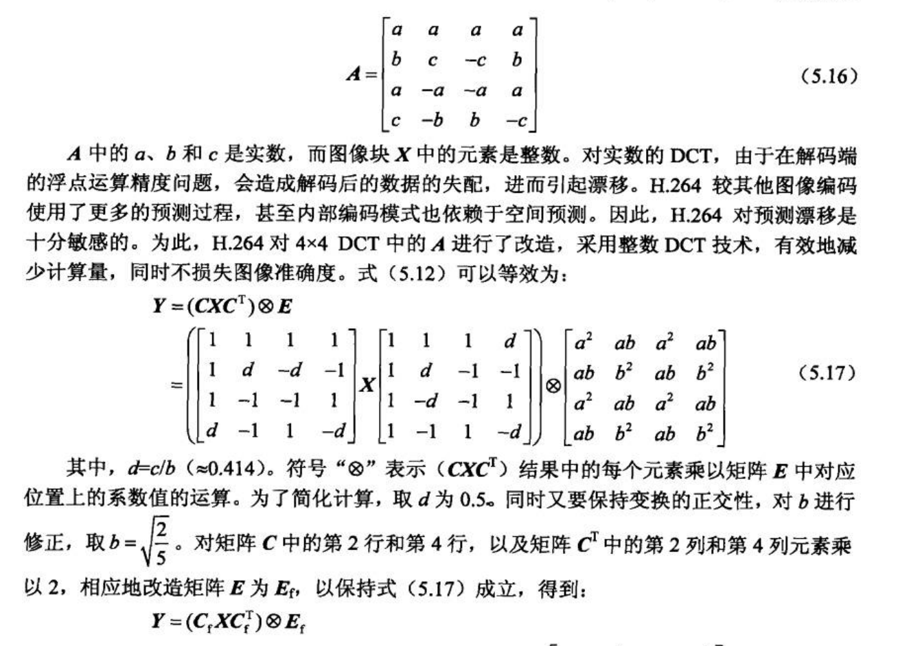


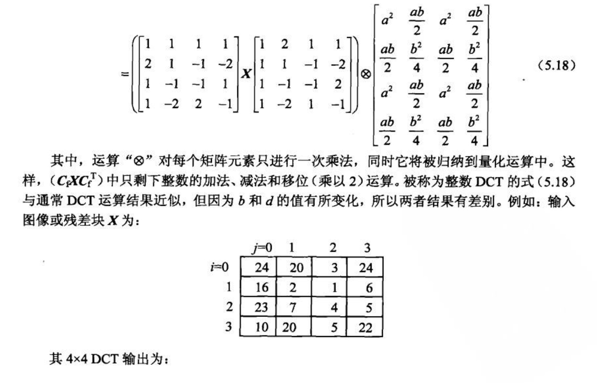


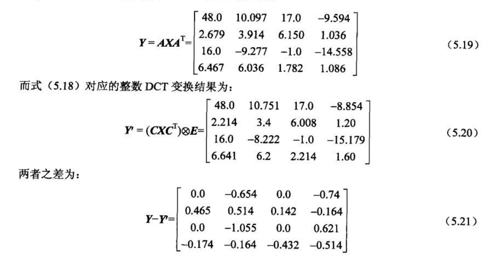


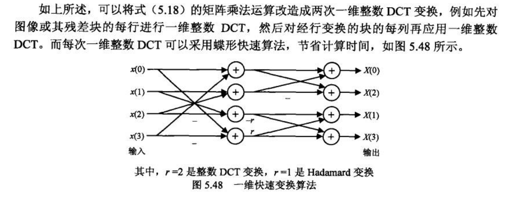

#### 蝶形运算介绍

结合公式(5.18)，**Y = CXC' ⊗ E**， 由于⊗ E的计算被放到量化中进行，整数DCT变换只进行其中**CXCt**的计算。

这里先看下矩阵C与矩阵X的运算：

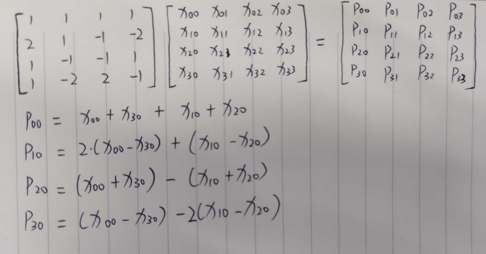

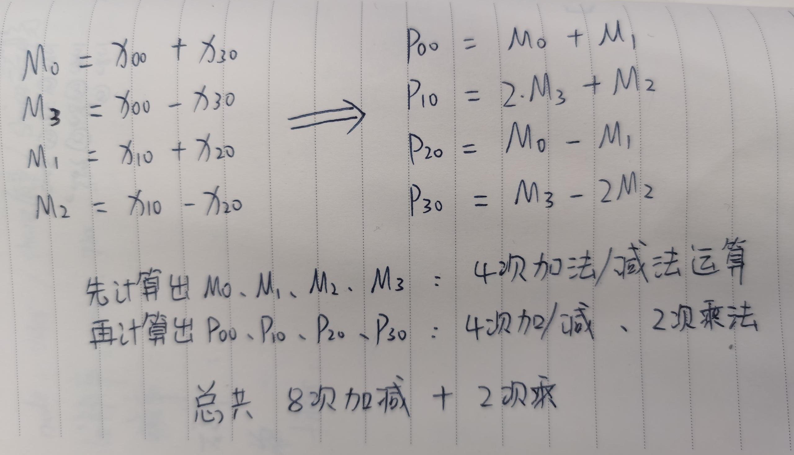

**H264中的蝶形运算实际上就是较少重复项的计算**

未使用蝶形运算是CX的第一列值P00、P10、P20、P30需要经过**12次加减法+4次乘法**(其中与1相乘不算在内)，使用蝶形运算则计算量降为**8次加减法 + 2次乘法**


### 量化

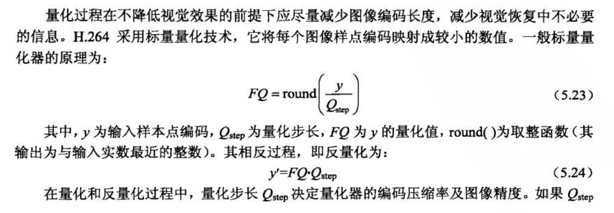


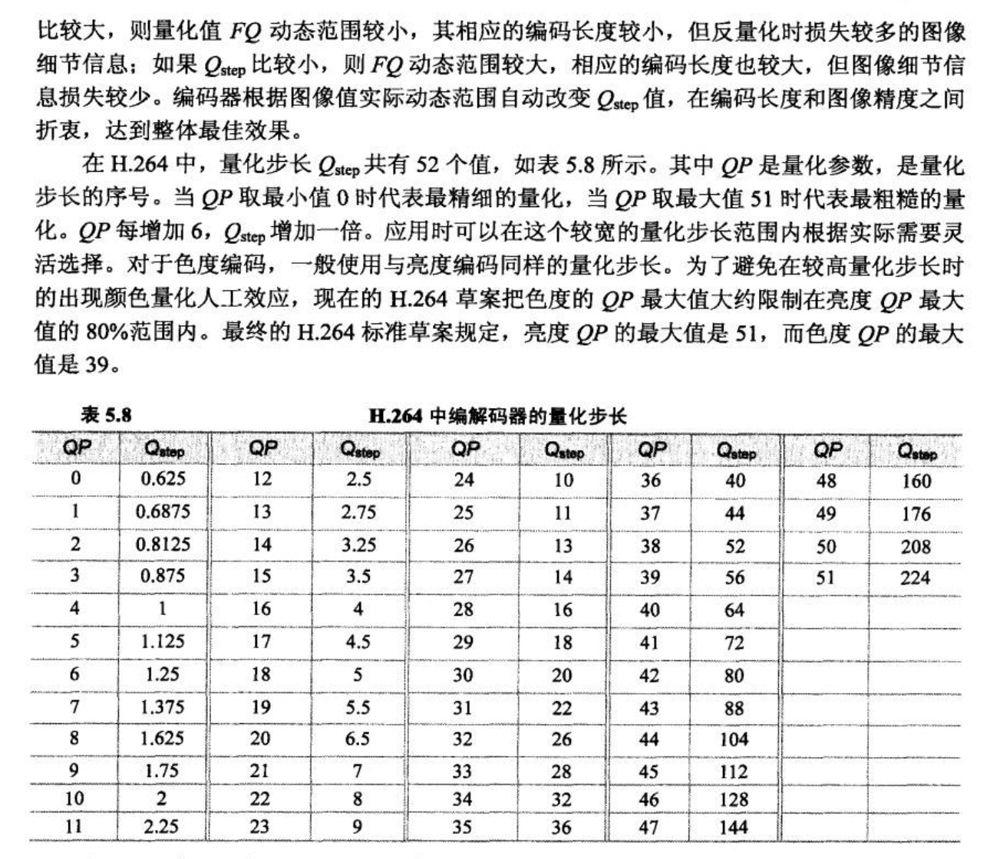


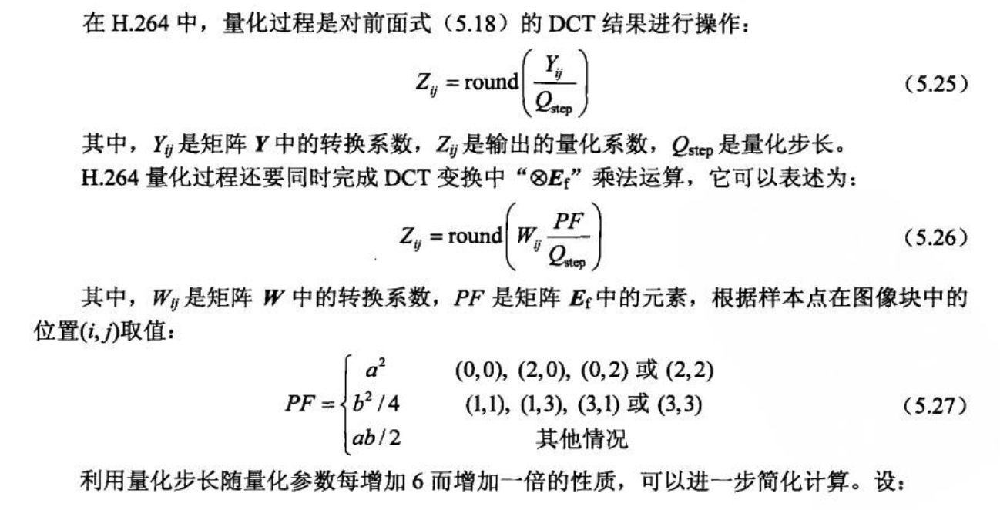


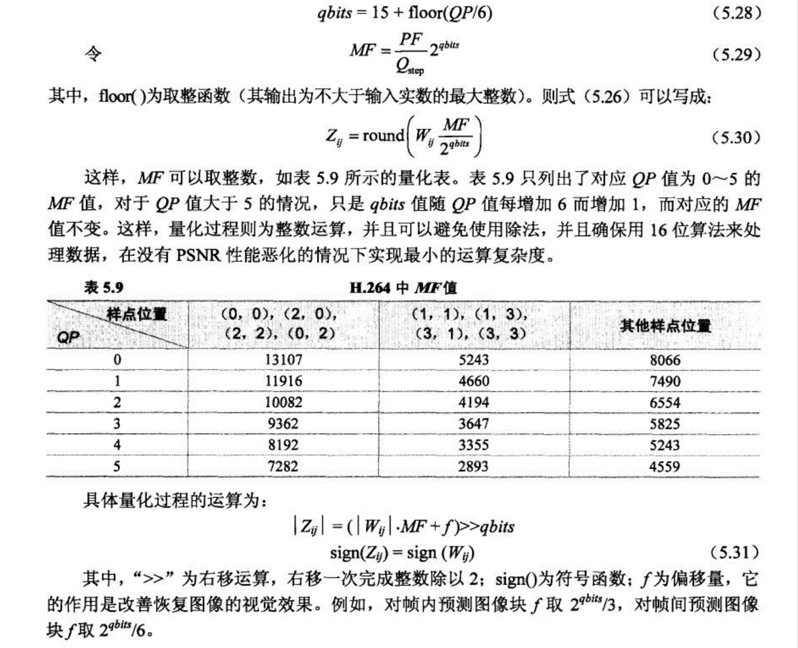


## 源码分析

本章节我们就直接分析i16x16宏块编码中的变换量化


#### 整数变换

```c++
/* 截取部分代码 */
static void mb_encode_i16x16( x264_t *h, int p, int i_qp )
{
    // ......
	// DCT变换
    h->dctf.sub16x16_dct( dct4x4, p_src, p_dst );

    // ......
 	
    for( int i8x8 = 0; i8x8 < 4; i8x8++ )
    {
        // 量化
        nz = h->quantf.quant_4x4x4( &dct4x4[i8x8*4], h->quant4_mf[i_quant_cat][i_qp], h->quant4_bias[i_quant_cat][i_qp] );
        if( nz )
        {
            block_cbp = 0xf;
            FOREACH_BIT( idx, i8x8*4, nz )
            {
                // Zigzag扫描
                h->zigzagf.scan_4x4( h->dct.luma4x4[16*p+idx], dct4x4[idx] );
                // 反量化
                h->quantf.dequant_4x4( dct4x4[idx], h->dequant4_mf[i_quant_cat], i_qp );
                if( decimate_score < 6 ) decimate_score += h->quantf.decimate_score15( h->dct.luma4x4[16*p+idx] );
                h->mb.cache.non_zero_count[x264_scan8[16*p+idx]] = 1;
            }
        }
    }

    // .....
}
```


```c++
static void sub8x8_dct( dctcoef dct[4][16], pixel *pix1, pixel *pix2 )
{
    // 将8x8分为4块4x4，调用sub4x4_dct进行DCT变换
    sub4x4_dct( dct[0], &pix1[0], &pix2[0] );
    sub4x4_dct( dct[1], &pix1[4], &pix2[4] );
    sub4x4_dct( dct[2], &pix1[4*FENC_STRIDE+0], &pix2[4*FDEC_STRIDE+0] );
    sub4x4_dct( dct[3], &pix1[4*FENC_STRIDE+4], &pix2[4*FDEC_STRIDE+4] );
}

static void sub16x16_dct( dctcoef dct[16][16], pixel *pix1, pixel *pix2 )
{
    // 将16x16分为4块8x8，分别调用sub8x8_dct进行DCT变换
    sub8x8_dct( &dct[ 0], &pix1[0], &pix2[0] );
    sub8x8_dct( &dct[ 4], &pix1[8], &pix2[8] );
    sub8x8_dct( &dct[ 8], &pix1[8*FENC_STRIDE+0], &pix2[8*FDEC_STRIDE+0] );
    sub8x8_dct( &dct[12], &pix1[8*FENC_STRIDE+8], &pix2[8*FDEC_STRIDE+8] );
}
```


**sub4x4_dct**

```c++
/* 4x4宏块的DCT变换 */
static void sub4x4_dct( dctcoef dct[16], pixel *pix1, pixel *pix2 )
{
    dctcoef d[16];
    dctcoef tmp[16];
	// 计算残差，结果保留到d[16]中
    pixel_sub_wxh( d, 4, pix1, FENC_STRIDE, pix2, FDEC_STRIDE );
	
    /*
    	对计算得到的残差进行DCT变换(蝶形运算), 结果保存到dct[16]中
    	Y = CXC'
     */
	// 先计算计算CX的值，结果为P
    for( int i = 0; i < 4; i++ )
    {
        // 计算临时值
        int s03 = d[i*4+0] + d[i*4+3];  // M0
        int s12 = d[i*4+1] + d[i*4+2];  // M1
        int d03 = d[i*4+0] - d[i*4+3];  // M3
        int d12 = d[i*4+1] - d[i*4+2];  // M2
		
        tmp[0*4+i] =   s03 +   s12;  // P0i
        tmp[1*4+i] = 2*d03 +   d12;  // P1i
        tmp[2*4+i] =   s03 -   s12;  // P2i
        tmp[3*4+i] =   d03 - 2*d12;  // P3i
    }
	// 再计算Y = PC', 同理
    for( int i = 0; i < 4; i++ )
    {
        int s03 = tmp[i*4+0] + tmp[i*4+3];
        int s12 = tmp[i*4+1] + tmp[i*4+2];
        int d03 = tmp[i*4+0] - tmp[i*4+3];
        int d12 = tmp[i*4+1] - tmp[i*4+2];

        dct[i*4+0] =   s03 +   s12;
        dct[i*4+1] = 2*d03 +   d12;
        dct[i*4+2] =   s03 -   s12;
        dct[i*4+3] =   d03 - 2*d12;
    }
}
```


结合上文的公式5.18 **Y = CXC' ⊗ E**，  sub4x4_dct已经将**CXC'**执行完了，DCT变换环节就结束了，而矩阵E的运算会放到后续的量化


#### 量化

```c++
/* 
	coef为变换后的残差
	mf为MF矩对应某个位置的值，但x264中MF具体的值与上文表5.9中的值有点不太一样
	f为偏移量，但x264中f具体的值也与上文提到的不太一样
*/
#define QUANT_ONE( coef, mf, f ) \
{ \
    if( (coef) > 0 ) \
        (coef) = (f + (coef)) * (mf) >> 16; \
    else \
        (coef) = - ((f - (coef)) * (mf) >> 16); \
    nz |= (coef); \
}

static int quant_4x4x4( dctcoef dct[4][16], udctcoef mf[16], udctcoef bias[16] )
{
    int nza = 0;
    for( int j = 0; j < 4; j++ )
    {
        int nz = 0;
        for( int i = 0; i < 16; i++ ) // 对16个残差进行量化
            QUANT_ONE( dct[j][i], mf[i], bias[i] );
        nza |= (!!nz)<<j;
    }
    return nza;
}
```


量化的具体实现代码为**宏定义QUANT_ONE**， **可以看出来它的实现和上文推导出来的公式5.31有点不太一样**

5.31的公式为：

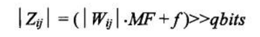

而x264代码实现为：**Z = ( (W + f) * MF ) >> 16**; 

其中W两者表示的都是一样都是DCT整数变换之后的残差

而MF的值 x264是与 (>>qbits)做了个合并，变成直接>>16，所以X264中MF的值是与上面的表5.9不太一样的，f也是一样做了个合并

**MF和f的值再x264_cqm_init中能够确定，可以直接将这些值print出来就能明白了**，结果是公式5.31计算出来的一样

```c++
// 截取部分代码，x264_cqm_init在创建编码器x264_encoder_open中就会被调用
static const uint16_t quant4_scale[6][3] =
{
    /* 值与上表5.9的对应 */
    { 13107, 8066, 5243 },
    { 11916, 7490, 4660 },
    { 10082, 6554, 4194 },
    {  9362, 5825, 3647 },
    {  8192, 5243, 3355 },
    {  7282, 4559, 2893 },
};

#define SHIFT(x,s) ((s)<=0 ? (x)<<-(s) : ((x)+(1<<((s)-1)))>>(s))
#define DIV(n,d) (((n) + ((d)>>1)) / (d))

int x264_cqm_init( x264_t *h )
{
    // ......
    for( int q = 0; q < 6; q++ )
    {
        for( int i = 0; i < 16; i++ )
        {
            int j = (i&1) + ((i>>2)&1);
            def_dequant4[q][i] = dequant4_scale[q][j];
            // 与表5.9的值保持一致
            def_quant4[q][i]   =   quant4_scale[q][j];
        }
        for( int i = 0; i < 64; i++ )
        {
            int j = quant8_scan[((i>>1)&12) | (i&3)];
            def_dequant8[q][i] = dequant8_scale[q][j];
            def_quant8[q][i]   =   quant8_scale[q][j];
        }
    }
    
    for( int q = 0; q < 6; q++ )
    {
        for( int i_list = 0; i_list < 4; i_list++ )
            for( int i = 0; i < 16; i++ )
            {
                /*
                	H264标准支持非一致性量化，即不同位置上的变换系数量化步长可以不一样
                	如果没使用非一致性量化，sps->scaling_list中的值都是16
                	所以quant4_mf的值还是与表5.9的值保持一样
                */
                quant4_mf[i_list][q][i] = DIV(def_quant4[q][i] * 16, h->sps->scaling_list[i_list][i]);
            }
        for( int i_list = 0; i_list < num_8x8_lists; i_list++ )
            for( int i = 0; i < 64; i++ )
            {
                quant8_mf[i_list][q][i] = DIV(def_quant8[q][i] * 16, h->sps->scaling_list[4+i_list][i]);
            }
    }
    for( int q = 0; q <= QP_MAX_SPEC; q++ )
    {
        int j;
        for( int i_list = 0; i_list < 4; i_list++ )
            for( int i = 0; i < 16; i++ )
            {
                h->unquant4_mf[i_list][q][i] = (1ULL << (q/6 + 15 + 8)) / quant4_mf[i_list][q%6][i];
                /*
                	x264真正使用到的MF的值， MF = (PF/Qstep) * 2^16
                	在量化是直接将(MF >> 16)结果就能得到公式5.26
                 */
                h->quant4_mf[i_list][q][i] = j = SHIFT(quant4_mf[i_list][q%6][i], q/6 - 1);
                if( !j )
                {
                    min_qp_err = X264_MIN( min_qp_err, q );
                    continue;
                }
                // round to nearest, unless that would cause the deadzone to be negative
                // quant4_bias为x264使用的偏移值f，这个值与deadzone有关
                h->quant4_bias[i_list][q][i] = X264_MIN( DIV(deadzone[i_list]<<10, j), (1<<15)/j );
                h->quant4_bias0[i_list][q][i] = (1<<15)/j;
                if( j > 0xffff && q > max_qp_err && (i_list == CQM_4IY || i_list == CQM_4PY) )
                    max_qp_err = q;
                if( j > 0xffff && q > max_chroma_qp_err && (i_list == CQM_4IC || i_list == CQM_4PC) )
                    max_chroma_qp_err = q;
            }
        // ......
    }
}
```


## 参考引用

🐱‍🏍《新一代视频压缩编码标准 - H264/AVC》

🐱‍🏍《深入理解视频编解码技术 -  基于H.264标准及参考模型》

🐱‍🏍 https://github.com/mirror/x264
